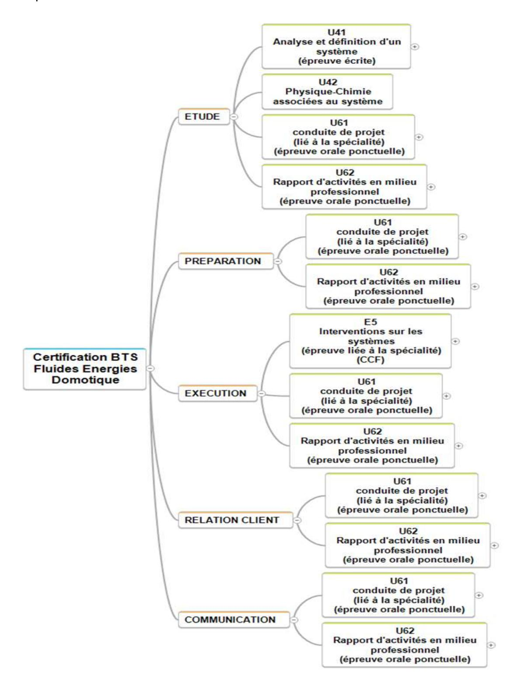

# BREVET DE TECHNICIEN SUPÉRIEUR

# **FLUIDES ENERGIES DOMOTIQUE**

*Option Génie climatique et fluidique (GCF)*

*Option Froid et conditionnement d'air (FCA)*

*Option Domotique et bâtiments communicants (DBC)*

**2014**

# **Sommaire**

| I. a. Référentiel                  | des activités professionnelles                |            |
|------------------------------------|-----------------------------------------------|------------|
| 1-                                 | Les métiers5                                  |            |
| 2-                                 | Les taches professionnelles                   |            |
| 2.1                                | Liste des tâches professionnelles9            |            |
| 2.2                                | Niveaux d'implication dans l'activité10       |            |
| 2.3                                | Les détails des tâches11                      |            |
| I .b. Référentiel de certification |                                               |            |
| 1-                                 | Les compétences                               |            |
| 1.1                                | Liste des compétences26                       |            |
| 1.2                                | Les détails de compétences27                  |            |
| 1.3                                | Les relations taches – compétences36       |            |
| 2-                                 | Savoirs associés aux compétences              |            |
| 2.1                                | Spécification des niveaux d'acquisition et    |            |
|                                    | de maîtrise des savoirs et des savoir-faire37 |            |
| 2.2                                | Les savoirs38                                 |            |
| 2.3                                | Les relations compétences –                   | savoirs 79 |
|                                    |                                               |            |
|                                    |                                               |            |

# **ANNEXE II : MODALITÉS DE CERTIFICATION**

**ANNEXE I : REFERENTIELS DU DIPLÔME**

| II. a. Unités constitutives du diplôme 81                                                            |  |
|---------------------------------------------------------------------------------------------------------|--|
| II .b. Conditions d'obtention de dispenses d'unités90                                                |  |
| II. c. Règlement d'examen92                                                                          |  |
| II .d. Définition des épreuves ponctuelles et des situations d'évaluation en cours de formation94 |  |
|                                                                                                         |  |

# **ANNEXE III : ORGANISATION DE LA FORMATION**

|      | III. a. Grille horaire de la formation115 |  |
|------|-------------------------------------------|--|
| III. | b. Stage en milieu professionnel117       |  |

# **ANNEXE IV : TABLEAUX DES CORRESPONDANCES ENTRE EPREUVES**

| IV.1 Les correspondances BTS FED et BTS FEE 121      |  |
|------------------------------------------------------|--|
| IV.2 Les correspondances BTS FED et BTS Domotique122 |  |

# ANNEXE I RÉFÉRENTIELS DU DIPLÔME

# **ANNEXE I. a. Référentiel des activités professionnelles**

# **1- Les métiers :**

Le titulaire du brevet de technicien supérieur « Fluides Énergies Domotique » (FED) est un technicien supérieur de bureau d'étude, de mise en service. Le technicien supérieur doit mener son travail de manière autonome et assurer in fine des responsabilités d'encadrement et de coordination.

C'est un technicien supérieur qualifié qui exerce ses compétences sous la direction hiérarchique d'un chargé d'affaires, chef de chantier, directeur technique, responsable bureau d'études (BE), gérant ou chef d'agence…

Il possède des connaissances techniques et économiques couvrant le déroulement d'une affaire, de la conception à la mise en service. Il doit être conscient des conséquences techniques et financières de ses choix et aussi des problèmes qui peuvent survenir sur les installations.

Il participe à l'étude technique, au chiffrage, à la réalisation (tout particulièrement dans des petites entreprises) et à l'exploitation d'un système.

Il s'adapte aux technologies et réglementations qui évoluent rapidement dans le domaine des fluides, de l'efficacité énergétique, de la récupération d'énergie, de la gestion technique.

Le technicien supérieur doit également avoir le sens du contact, savoir communiquer, car il est amené à négocier avec les clients, les fournisseurs, à rencontrer les utilisateurs, les autres corps d'état et collaborer avec les architectes lors des réunions de chantier.

Il contribuera à favoriser les comportements éco responsables de tous les acteurs qui l'entourent.

Ce métier polyvalent est constamment en évolution, le technicien supérieur peut multiplier des expériences diversifiées tout au long de sa carrière. Il peut à travers toutes les expériences vécues devenir un spécialiste référent. Au cours de sa carrière, ses compétences doivent lui permettre d'évoluer dans la hiérarchie de l'entreprise (chargé d'affaire), de créer ou reprendre une société.

Suivant leurs fonctions dans l'entreprise d'exécution ou le bureau d'étude technique (BET), les techniciens supérieurs seront amenés à réaliser les activités qui suivent.

## Activités d'études techniques :

- concevoir des installations,
- dimensionner et définir des équipements avec des outils informatiques,
- chiffrer,
- choisir le matériel dont les caractéristiques seront les mieux adaptées aux besoins des clients, du produit ou à la résolution des problèmes techniques rencontrés,
- répondre à des appels d'offres, évaluer des équipements.

# Activités d'intervention:

- mettre en service des systèmes,
- contrôler des travaux,
- diagnostiquer et analyser des dysfonctionnements,
- mettre en service et optimiser les installations,
- conseiller les clients,
- exécuter éventuellement des opérations de maintenance ciblées.

# Activités d'organisation:

- réaliser un planning d'intervention,
- établir des commandes de matériel,
- participer aux réunions et suivis de chantier,
- rédiger des rapports ou des comptes rendus techniques,
- rédiger un dossier de réalisation, et un dossier des ouvrages exécutés (DOE).

# **Poursuite des études :**

Les étudiants peuvent à l'issue de cette formation poursuivre les études en licences professionnelles, en classes préparatoires « Adaptation Techniciens Supérieurs » (ATS) ou en écoles d'ingénieurs.

# **Métiers «génie climatique et fluidique»**

Le champ d'activité du technicien supérieur est essentiellement centré sur les installations CVC (chauffage, ventilation, climatisation) et sanitaire dans le bâtiment.

# **Les compétences requises :**

Il devra maîtriser différents domaines tels que l'énergie thermique, l'hydraulique, l'aéraulique, l'acoustique, la maintenance, l'électrotechnique, la régulation, la gestion de l'énergie et les réglementations.

Parallèlement au suivi technique d'une opération, il participe à sa gestion. La relation avec le client est essentielle, il doit avoir le sens du contact, du service, savoir négocier et communiquer. Le technicien supérieur doit être aussi capable de s'adapter aux évolutions technologies,

réglementaires et normatives dans les domaines :

- de l'efficacité énergétique,
- des énergies renouvelables,
- de la récupération d'énergie,
- de la réhabilitation des bâtiments anciens,
- de la gestion technique,
- des réglementations environnementales présentes et à venir.

#### **Emploi :**

Le jeune titulaire d'un brevet de technicien supérieur est embauché au niveau ETAM dans le cadre des conventions collectives.

Les entreprises qui recrutent majoritairement ces étudiants opèrent dans divers secteurs :

- bureaux d'études techniques (BET),
- entreprises d'installation et/ou de maintenance,
- fournisseurs et/ou fabricants d'équipements
- collectivités territoriales,
- sociétés productrices d'énergie.

# **Métiers du « froid et du conditionnement d'air »**

Les applications du froid sont multiples et variées depuis la conservation des produits alimentaires aux processus de transformation et d'élaboration de produits : industries métallurgiques, textiles, de la plasturgie, de la santé, du confort dans les grands ensembles.

Le champ d'activité du technicien supérieur est essentiellement centré sur la chaine du froid et le traitement de l'air (froid commercial, industriel et le conditionnement d'air). Il s'agit de maintenir un produit périssable à une température appropriée de la production à la consommation et aussi de maintenir une ambiance souhaitée suivant les besoins d'un processus industriel. Il évolue dans un secteur où le développement durable est un souci constant, et participe à la mise en œuvre de solutions techniques qui prennent en compte l'environnement et l'importance des économies d'énergie.

# **Les compétences requises :**

Le technicien supérieur intervient à tous les stades d'une affaire de la conception à la réalisation jusqu'à la maintenance de l'équipement. Il doit ainsi dimensionner, définir et représenter les installations en utilisant des outils informatiques, réaliser les schémas de principe, chiffrer, planifier et contrôler les travaux d'installation, mettre en service et optimiser les équipements.

Il sera également amené à conseiller les clients : des commerçants de l'alimentaire, des restaurateurs, des collectivités, mais aussi des industriels, des services hospitaliers, des professions libérales.

#### **Emploi :**

Le jeune titulaire d'un brevet de technicien supérieur peut travailler dans les domaines suivants.

- bureaux d'études techniques (BET) et entreprises,
- entreprises d'installation et/ou de maintenance,
- fournisseurs et/ou fabricants d'équipements,
- collectivités territoriales,
- sociétés productrices d'énergie.

# **Métiers de la « domotique et bâtiments communicants »**

Le technicien supérieur en « domotique et bâtiments communicants » est un spécialiste des automatismes et des réseaux de communication du bâtiment.

Son métier consiste à concevoir, installer, programmer et mettre en service des solutions techniques dans l'habitat et les bâtiments professionnels (tertiaires), en répondant le mieux possible aux besoins des clients. Il a aussi vis-à-vis de ces derniers un rôle de conseil et de formation à l'utilisation de la solution installée.

Ces solutions techniques « domotique » ou « gestion technique des bâtiments » (GTB) sont bâties autour de systèmes d'automatismes communicants et de postes de supervision qui permettent de gérer l'ensemble des équipements comme par exemple le chauffage, la climatisation, l'eau, l'éclairage, les volets roulants ou les systèmes d'alarme.

Ces solutions techniques ont pour objectifs principaux :

- de gérer les énergies et d'améliorer les performances énergétiques des bâtiments (y compris par l'utilisation des énergies renouvelables),
- d'améliorer le confort des utilisateurs (télécommande de stores, adaptation automatique des niveaux d'éclairage d'une salle, etc.), la sécurité des personnes (alarmes incendie, etc.), la sûreté des biens (vidéosurveillance, etc.),
- de faciliter la vie des personnes fragilisées (handicap, vieillesse, maladie) dans leur logement, à travers des solutions d'automatismes et des infrastructures de transmission de l'information.

Le métier du technicien supérieur en « domotique et bâtiments communicants » s'élargit aujourd'hui au-delà des bâtiments avec les nouvelles applications de la gestion de l'énergie : les « réseaux électriques intelligents » (ou smart grids) et les « villes intelligentes » (ou smart cities).

#### **Compétences requises :**

Le technicien supérieur est capable de couvrir techniquement toutes les différentes étapes d'une affaire, de la conception à la mise en service.

Il possède également une bonne maîtrise des techniques commerciales pour comprendre les besoins des clients, puis leur faire des propositions adaptées. Il sait aussi faire des devis et argumenter pour défendre sa solution auprès de ceux-ci en s'appuyant sur ses connaissances techniques.

Afin de rester un spécialiste des techniques innovantes en termes d'automatismes du bâtiment, il devra rester en veille constante sur l'évolution des techniques pour mettre à jour ses connaissances.

#### **Emploi :**

Les secteurs qui recrutent majoritairement ces étudiants opèrent dans diverses activités :

- bureaux d'études techniques (BET),
- entreprises d'installation et/ou de maintenance,
- fournisseurs et/ou fabricants d'équipements,
- collectivités territoriales.

# **2- Tâches professionnelles**

# **2.1 Liste des tâches professionnelles :**

| FONCTION      | Tâches professionnelles                                                                                                       |  |  |
|---------------|-------------------------------------------------------------------------------------------------------------------------------|--|--|
|               | T 1 : Analyser le CCTP ou le cahier des charges                                                                            |  |  |
|               | T 2 : Élaborer une solution technique                                                                                      |  |  |
|               | T 3 : Évaluer l'impact environnemental                                                                                     |  |  |
|               | T 4 : Concevoir et définir l'installation                                                                                  |  |  |
| ETUDE         | T 5 : Consulter les fournisseurs                                                                                           |  |  |
|               | T 6 : Comparer et sélectionner des matériels en fonction des caractéristiques technico-économiques et environnementales |  |  |
|               | T 7 : Établir un devis quantitatif et estimatif                                                                            |  |  |
|               | T 8 : Effectuer un diagnostic de dysfonctionnement d'une installation ou d'un système existant en régime établi         |  |  |
|               | T 9 : Préparer une consultation                                                                                               |  |  |
|               | T 10 : Établir les commandes                                                                                               |  |  |
| PREPARATION   | T 11 : Préparer les documents nécessaires à la réalisation                                                                 |  |  |
|               | T 12 : Organiser la gestion des déchets                                                                                    |  |  |
|               | T 13 : Définir et superviser les opérations de maintenance                                                                 |  |  |
|               | T 14 : Analyser le bilan financier d'une opération                                                                         |  |  |
|               | T 15 : Réaliser la mise en service d'une installation                                                                      |  |  |
| EXECUTION     | T 16 : Préparer la réception d'une installation                                                                            |  |  |
|               | T 17 : Gérer, vérifier les commandes                                                                                    |  |  |
|               | T 18 : Participer au suivi et à la gestion du chantier                                                                        |  |  |
|               | T 19 : Appliquer un plan de prévention des risques.                                                                        |  |  |
| RELATION      | T 20 : Assurer la relation client et/ou utilisateur.                                                                       |  |  |
| CLIENT        | T 21 : Élaborer, présenter et négocier la proposition commerciale                                                          |  |  |
|               | T 22 : Assurer la relation avec sa hiérarchie                                                                              |  |  |
| COMMUNICATION | T 23 : Participer à la représentation de l'entreprise                                                                      |  |  |
|               | T 24 : Participer à la promotion de l'entreprise                                                                           |  |  |
|               | T 25 : Encadrer, gérer une équipe                                                                                          |  |  |

# **2.2 Niveaux d'implication dans l'activité :**

Dans les fiches de présentation des activités professionnelles suivantes, le niveau d'implication peut être défini comme un indicateur de niveau d'intervention et d'autonomie dans la réalisation de celles-ci par le technicien supérieur titulaire de ce diplôme.

Une échelle à quatre niveaux a été retenue :

# - Niveau 1 ■□□□ *Participe*

Qualifie la capacité à comprendre, par l'intermédiaire d'un exposé ou d'une lecture de dossier, la nature d'une activité ne relevant pas de sa compétence, et à en interpréter les résultats.

# - Niveau 2 ■■□□ *Fait sous contrôle*

Qualifie la capacité à (n') assurer (qu') une partie de l'activité, au sein et avec l'aide d'une équipe, sous l'autorité d'un chef de projet.

Elle implique de s'informer et de communiquer avec les autres membres de l'équipe.

# - Niveau 3 ■■■□ *Fait en autonomie*

Qualifie la capacité à réaliser, en autonomie, tout ou partie de l'activité pour les situations les plus courantes.

Cette capacité suppose :

- une maîtrise (totale ou partielle) des aspects techniques de l'activité,
- les facultés à s'informer, à communiquer (rendre compte et argumenter) et à s'organiser.

# - Niveau 4 ■■■■ *Transfère*

Qualifie la capacité à maîtriser sur les plans techniques, procéduraux et décisionnels une activité.

Cette capacité de maîtrise d'œuvre implique :

- la faculté à certifier l'adéquation entre les buts et les résultats,
- l'animation et l'encadrement d'une équipe,
- la prise en toute responsabilité de décisions éventuelles,
- le transfert de compétences.

# **2.3 Les détails des tâches :**

# **ETUDE**

# **T 1: Analyser le CCTP ou le cahier des charges**

#### *Conditions d'exercice :*

*Sur un projet de construction neuve*

*Ressources disponibles :*

- *DCE,*
- *CCTP.*

# *Sur une construction existante*

# *Ressources disponibles :*

- *cahier des charges,*
- *recueil des besoins,*
- *état des lieux de l'existant.*

# *Contexte d'intervention :*

*Construction neuve ou interventions sur construction existante.*

#### *Autonomie :*

*Participe fait sous contrôle fait en autonomie transfère*

# **Résultats attendus :**

Les besoins et les attentes du client sont identifiés.

Les prescriptions du CCTP sont en cohérence avec les attentes et les besoins.

L'état des lieux est vérifié et éventuellement complété.

Les intervenants et leurs limites de prestations sont identifiés

# **T 2 : Élaborer une solution technique**

# *Conditions d'exercice :*

#### *Sur un projet de construction neuve*

*Ressources disponibles :*

- *DCE,*
- *CCTP,*
- *les partenaires de l'entreprise.*

# *Sur une construction existante*

*Ressources disponibles :*

- *cahier des charges,*
- *recueil des besoins,*
- *état des lieux de l'existant (audit, diagnostics, dossiers d'ouvrages exécutés DOE),*
- *les partenaires de l'entreprise.*

# *Contexte d'intervention :*

*Construction neuve ou interventions sur construction existante.*

# *Autonomie :*

*Participe fait sous contrôle fait en autonomie transfère*

### **Résultats attendus :**

Les énergies et les informations disponibles localement sont identifiées et prises en compte.

La relation énergies-enveloppe-fluides-processus au sein des systèmes est optimisée.

Les règlementations sont respectées.

L'analyse fonctionnelle est effectuée, la solution de principe est traduite (schémas de principe, diagrammes des flux, architecture de la commande).

Les consommations sont estimées.

Des variantes et/ou améliorations sont proposées à partir du CCTP ou de l'installation existante. Les temps de retour (\*\*\*) sont évalués.

**T 3 : Évaluer l'impact environnemental**

# *Conditions d'exercice :*

*Les solutions techniques sont connues et parfaitement définies.*

# *Contexte d'intervention :*

*Construction neuve ou sur construction existante.*

*Autonomie :*

*Participe fait sous contrôle fait en autonomie transfère*

# *Résult***ats attendus** *:*

L'analyse du cycle de vie (ACV) de tout ou partie du système (\*\*\*) est faite.

Le bilan carbone est fait.

Les nuisances sonores sont déterminées.

Les déchets sont identifiés.

Les déchets et les effluents sont listés, classifiés et quantifiés. Les procédures de traitement sont précisées.

# **ETUDE**

# **T 4 : Concevoir et définir l'installation**

# *Conditions d'exercice :*

*Les plans architecte sont donnés.*

*Les schémas de principe sont fournis.*

*Les conditions de fonctionnement (les usages) sont définies.*

# *Contexte d'intervention :*

*Construction neuve ou sur construction existante.*

*Autonomie :*

*Participe fait sous contrôle fait en autonomie transfère*

# **Résultats attendus** *:*

Les grandeurs physiques sont déterminées.

La proposition, formalisée dans un document exploitable, est conforme aux exigences de durabilité, de performance énergétique, d'accessibilité aux équipements.

Le cahier des charges est pris en compte ainsi que les données techniques des fabricants.

Les composants sont spécifiés.

La configuration logicielle est réalisée.

Les plans d'implantation et les schémas d'installation sont élaborés.

Les réglementations et l'impact sur l'environnement sont pris en compte.

**T 5 : Consulter les fournisseurs**

#### *Conditions d'exercice :*

*Les performances et les caractéristiques des matériels sont définies.*

*La liste des fournisseurs à consulter est fournie.*

# *Contexte d'intervention :*

*Construction neuve ou sur construction existante.*

*Autonomie :*

*Participe fait sous contrôle fait en autonomie transfère*

## **Résultats attendus :**

L'organisation de la consultation est précisée (critères de sélection des fournisseurs consultés). Une feuille de consultation est rédigée, précise, elle fera apparaître notamment les disponibilités et les délais de livraison.

La demande de documents, utiles à la prise de décision, est faite.

Les résultats sont synthétisés et hiérarchisés pour une prise de décision.

La banque de données interne est alimentée.

# **ETUDE**

# **T 6 : Comparer et sélectionner des matériels en fonction des caractéristiques technico-économiques et environnementales**

# *Conditions d'exercice :*

*Les performances et les caractéristiques des matériels sont définies.*

*Les contraintes environnementales (architecture, environnement immédiat…) et règlementaires sont connues.*

*Les banques de données sont disponibles.*

*Retour des consultations fournisseurs.*

# *Contexte d'intervention :*

*Construction neuve ou sur construction existante.*

*Autonomie :*

*Participe fait sous contrôle fait en autonomie transfère*

## **Résultats attendus :**

La performance globale est optimisée : technique, économique, environnementale.

Les contraintes du chantier et de la maintenance sont prises en compte.

L'ergonomie de la solution et sa facilité d'utilisation sont prises en compte.

# **T 7 : Établir un devis quantitatif et estimatif**

## *Conditions d'exercice :*

*La nomenclature des matériels est donnée.*

*Les plans sont donnés.*

*L'état d'avancement du projet est précisé.*

*DPGF : décomposition du prix globale et forfaitaire (si elle existe).*

*Base de données de prix.*

# *Contexte d'intervention :*

*Construction neuve ou sur construction existante.*

*Autonomie :*

*Participe fait sous contrôle fait en autonomie transfère*

### **Résultats attendus :**

Le devis est fait sur tout ou partie de l'installation.

Les éléments constitutifs du devis sont connus et renseignés.

La méthode d'estimation est adaptée à l'état d'avancement du projet.

Les besoins en « heures x personnes » sont quantifiés.

# **ETUDE**

# **T 8 : Effectuer un diagnostic de dysfonctionnement d'une installation ou d'un système existant en régime établi.**

# *Conditions d'exercice :*

*L'installation et son dossier technique sont donnés.*

*Le dossier de maintenance est donné.*

*Les procédures sont données.*

*Des méthodes d'analyse de causes sont connues.*

# *Contexte d'intervention/*

*Construction existante.*

# *Autonomie :*

*Participe fait sous contrôle fait en autonomie transfère*

# **Résultats attendus :**

Les performances du système en régime établi sont comparées aux performances attendues.

La mise en œuvre des méthodes permet d'analyser le dysfonctionnement et en donner les causes. À partir de la synthèse des relevés et/ou d'une analyse des résultats, une ou plusieurs propositions d'amélioration sont faites.

Les non conformités avec la réglementation sont signalées.

Un rapport est rédigé à l'attention de la hiérarchie.

# **PRÉPARATION**

# **T 9 : Préparer une consultation**

# *Conditions d'exercice :*

*Ressources disponibles :*

- *dossier d'exécution, plans, schémas, nomenclature,*
- *plan général de coordination et sécurité et protection de la santé (PGC et PSPS),*
- *devis, commandes,*
- *calendrier, plan de charges et d'affectation des moyens,*
- *partenaires habituels de l'entreprise.*

# *Contexte d'intervention :*

*Construction neuve ou sur construction existante.*

*Autonomie :*

*Participe fait sous contrôle fait en autonomie transfère*

# **Résultats attendus** *:*

L'organisation de la consultation est précisée (critères de sélection précisés).

Une extraction des données est réalisée.

Le périmètre des prestations est défini clairement.

Les schémas et/ou les plans sont collectés.

Les résultats sont synthétisés et hiérarchisés pour une prise de décision.

La banque de données interne est alimentée.

# **PRÉPARATION**

**T 10 : Établir les commandes**

# *Conditions d'exercice :*

*Ressources disponibles :*

- *dossier d'exécution, plans, schémas, nomenclatures,*
- *devis quantitatif, estimatif, calendrier d'exécution.*

# *Contexte d'intervention :*

*Construction neuve ou sur construction existante.*

*Autonomie :*

*Participe fait sous contrôle fait en autonomie transfère*

## **Résultats attendus :**

Les quantités sont établies en prenant en compte l'état des stocks.

Les documents nécessaires aux commandes de prestations et/ou de fournitures sont rédigés.

Les délais et modalités de livraison sont précisées et conformes au calendrier d'exécution.

# **PRÉPARATION**

# **T 11 : Préparer les documents nécessaires à la réalisation**

# *Conditions d'exercice :*

*Ressources disponibles :*

- *dossier d'exécution, plans, schémas, nomenclature,*
- *procédures et documents de l'entreprise et des fournisseurs,*
- *les contraintes des chantiers et environnementales.*

# *Contexte d'intervention :*

*Construction neuve ou sur construction existante.*

*Autonomie :*

*Participe fait sous contrôle fait en autonomie transfère*

# **Résultats attendus :**

Les documents décrivent l'organisation du chantier et les opérations de réalisation.

Le calendrier d'intervention est établi à l'aide des ressources données.

Le nombre et la qualification des intervenants sont précisés.

La faisabilité des opérations de maintenance est prise en compte.

Les habilitations et les autorisations règlementaires nécessaires à l'intervention sont identifiées.

(risques électriques, manipulation des fluides frigorigènes, soudure, CACES®…).

Les nuisances environnementales sont identifiées et prises en compte dans l'organisation du chantier.

# **PRÉPARATION**

# **T 12 : Organiser la gestion des déchets**

# *Conditions d'exercice :*

*Ressources disponibles :*

- *mémoire technique,*
- *nomenclature des déchets,*
- *les procédures de stockage, de confinement, d'évacuation et de traitement,*
- *la règlementation en vigueur.*

# *Contexte d'intervention*

*Construction neuve ou sur construction existante.*

*Autonomie :*

*Participe fait sous contrôle fait en autonomie transfère*

# **Résultats attendus :**

Les déchets sont listés et classifiés.

La liste des opérations de stockage, de confinement, d'évacuation et de traitement (sans oublier la restitution) est établie.

Les procédures spécifiques sont prises en compte.

Les prestataires sont identifiés.

Les autorisations sont demandées.

Les habilitations sont vérifiées.

# **EXECUTION**

# **T 13 : Définir et superviser les opérations de maintenance**

# *Conditions d'exercice :*

*Le système.*

*Le contrat ou la demande de maintenance.*

*Le dossier d'ouvrages exécutés (DOE).*

*Le DUIO (document unique d'intervention sur l'ouvrage).*

*Le dossier de plans.*

# *Contexte d'intervention :*

*Construction neuve ou sur construction existante.*

*Autonomie :*

*Participe fait sous contrôle fait en autonomie transfère*

# **Résultats attendus :**

Les procédures sont définies.

La mise en œuvre de la maintenance préventive est définie.

Les performances attendues sont définies.

Les consignes de sécurité sont précisées.

Les documents de suivi sont vérifiés.

Un rapport est rédigé.

# **EXECUTION**

# **T 14 : Analyser le bilan financier d'une opération**

# *Conditions d'exercice :*

*Le devis quantitatif et estimatif.*

*Le bilan MO.*

*La liste des factures.*

*L'état des situations travaux (y compris travaux supplémentaires).*

# *Contexte d'intervention :*

*Construction neuve ou sur construction existante.*

*Autonomie :*

*Participe fait sous contrôle fait en autonomie transfère*

# **Résultats attendus :**

Les écarts sont analysés tout au long de l'opération.

Les ratios sont établis.

Un rapport est rédigé.

# **EXECUTION**

# **T 15 : Réaliser la mise en service d'une installation**

### *Conditions d'exercice :*

*L'installation ou une partie d'installation complexe.*

*Les documents d'exécution.*

*Les conditions nominales de fonctionnement.*

*Les notices techniques des matériels installés.*

# *Contexte d'intervention :*

*Construction neuve ou sur construction existante.*

# *Autonomie :*

*Participe fait sous contrôle fait en autonomie transfère*

# **Résultats attendus :**

La chronologie des opérations de mise en service de l'installation est respectée.

Les paramétrages sont effectués.

L'installation fonctionne en conformité avec le cahier des charges et ses avenants.

Les performances contractuelles sont atteintes.

Les procédures de vérification sont correctement mises en œuvre.

Les valeurs de réglage sont optimisées dans le respect des prescriptions du constructeur et de la réglementation.

Le cahier de suivi et/ou de mise en service est renseigné.

Les documents règlementaires sont renseignés ou préparés.

# **EXECUTION**

.

# **T 16 : Préparer la réception d'une installation**

# *Conditions d'exercice :*

*L'installation ou une partie d'installation complexe mise en service.*

*Les documents d'exécution.*

*Les conditions nominales de fonctionnement.*

*Les notices techniques des matériels installés.*

*Le DUIO (document unique d'intervention sur l'ouvrage).*

*Le contrat d'entretien/maintenance.*

# *Contexte d'intervention :*

*Construction neuve ou sur construction existante.*

# *Autonomie :*

*Participe fait sous contrôle fait en autonomie transfère*

# **Résultats attendus :**

Les documents nécessaires sont collectés (exemples : fiches d'auto contrôle).

Le dossier d'ouvrages exécutés (DOE) est établi.

Les documents et les plans sont à jour et structurés.

Les formes numériques sont privilégiées.

**EXECUTION**

**T 17 : Gérer, vérifier les commandes**

*Conditions d'exercice :*

*Le planning d'exécution.*

*Les délais de livraison.*

*Les bons de commande.*

*Les matériels et espaces à disposition.*

*Contexte d'intervention :*

*Construction neuve ou sur construction existante.*

*Autonomie :*

.

*Participe fait sous contrôle fait en autonomie transfère*

**Résultats attendus :**

Un contrôle des commandes est réalisé.

Les fournitures livrées sont conformes à la commande.

# **EXECUTION**

**T 18 : Participer au suivi et à la gestion du chantier.**

### *Conditions d'exercice :*

*Le CCTP ou le contrat.*

*Le planning d'exécution et tous corps d'état.*

*Les devis quantitatif et estimatif.*

*La liste des commandes.*

*Le suivi MO.*

# *Contexte d'intervention :*

*Construction neuve ou sur construction existante.*

*Autonomie :*

*Participe fait sous contrôle fait en autonomie transfère*

### **Résultats attendus :**

La conformité des prestations est vérifiée.

Ses limites de prestations ont été prises en compte.

Les éventuels aléas sont communiqués à la hiérarchie et des solutions sont proposées.

Les données relatives à l'avancement du chantier sont transmises.

**EXECUTION**

**T 19 : Appliquer un plan de prévention des risques.**

*Conditions d'exercice/*

*Le PPR.*

*Contexte d'intervention :*

*Construction neuve ou sur construction existante.*

*Autonomie :*

*Participe fait sous contrôle fait en autonomie transfère*

**Résultats attendus :**

La communication avec le coordonnateur est assurée.

Les situations de risques sont identifiées.

Les procédures de prévention sont prévues, mises en œuvre et contrôlées.

Les personnels concernés sont informés.

**RELATION CLIENT**

**T 20 : Assurer la relation client et/ou utilisateur.**

#### *Conditions d'exercice :*

*Le DUIE.*

*Le DOE.*

*Le contrat de maintenance.*

# *Contexte d'intervention :*

*Construction neuve ou sur construction existante.*

#### *Autonomie :*

*Participe fait sous contrôle fait en autonomie transfère*

# **Résultats attendus :**

Les paramètres et réglages de l'installation sont analysés et validés avec le client.

Les informations sur le fonctionnement et/ou la conduite de l'installation sont explicitées au client et/ou à l'utilisateur avec un vocabulaire adapté à son interlocuteur.

Les documents remis au client et/ou à l'utilisateur sont commentés.

Un compte rendu auprès de sa hiérarchie est fait.

Le client et/ou utilisateur est informé des mesures prévues pour assurer la continuité de service.

Le client et/ou l'utilisateur est informé des interventions prévues et des éventuelles interruptions de service.

L'intérêt d'un contrat d'entretien/maintenance est explicité.

# **RELATION CLIENT**

**T 21 : Élaborer, présenter et négocier la proposition commerciale.**

# *Conditions d'exercice :*

*Le CCTP ou les besoins du client.*

*L'étude technique et financière.*

# *Contexte d'intervention*

*Construction neuve ou sur construction existante.*

*Autonomie :*

*Participe fait sous contrôle fait en autonomie transfère*

# **Résultats attendus :**

L'argumentation est pertinente au regard des attentes du client et au regard du contenu du dossier. Le dossier commercial est élaboré.

Le vocabulaire et les supports commerciaux sont adaptés à l'interlocuteur.

Les marges de négociation définies sont respectées.

**COMMUNICATION**

**T 22 : Assurer la relation avec sa hiérarchie**

*Conditions d'exercice :*

*Le problème est identifié, posé.*

*Contexte d'intervention :*

*Construction neuve ou sur construction existante.*

*Autonomie :*

*Participe fait sous contrôle fait en autonomie transfère*

**Résultats attendus :**

Les propositions formulées sont pertinentes et adaptées à la situation rencontrée.

**COMMUNICATION**

**T 23 : Participer à la représentation de l'entreprise**

*Conditions d'exercice :*

*Le dossier d'accueil du nouveau salarié.*

*Contexte d'intervention :*

*Construction neuve ou sur construction existante.*

*Autonomie :*

*Participe fait sous contrôle fait en autonomie transfère*

**Résultats attendus :**

L'argumentation visant à positionner l'entreprise sur ses marchés et dans son environnement économique est pertinente en référence aux valeurs de l'entreprise (éthique, positionnement concurrentiel, politique salariale).

**COMMUNICATION**

**T 24 : Participer à la promotion de l'entreprise**

# *Conditions d'exercice :*

*L'environnement économique.*

*Les marchés.*

*Les offres de l'entreprise (produits, services).*

*Contexte d'intervention :*

*Construction neuve ou sur construction existante.*

*Autonomie :*

*Participe fait sous contrôle fait en autonomie transfère*

**Résultats attendus :**

L'identification des points forts et faibles de l'entreprise est faite.

Des trames de supports de communication sont proposées et adaptées à la clientèle ciblée.

# **COMMUNICATION**

**T 25 : Encadrer, gérer une équipe**

# *Conditions d'exercice :*

*Le positionnement du technicien supérieur.*

*Les informations et consignes à transmettre (informations techniques, sociales, prévention, etc.).*

# *Contexte d'intervention :*

*Construction neuve ou sur construction existante.*

*Autonomie :*

*Participe fait sous contrôle fait en autonomie transfère*

# **Résultats attendus :**

Les informations et consignes de la hiérarchie sont explicitées aux membres de l'équipe (informations techniques, sociales, prévention, etc.).

Les informations pour les intervenants concernés par l'opération sont communiquées.

Les membres de l'équipe assurent le travail correspondant à la demande.

# **ANNEXE I.b. Référentiel de certification**

# **1- Les compétences**

# **1-1 Liste des compétences**

|   |                                  | C1  | Analyser les besoins d'un client                                                    |
|---|----------------------------------|-----|-------------------------------------------------------------------------------------|
|   |                                  | C2  | Analyser un système                                                                 |
| A | CONCEVOIR et DEFINIR             | C3  | Concevoir des solutions technologiques                                              |
|   |                                  | C4  | Décoder et élaborer des plans et des schémas                                     |
|   |                                  | C5  | Appliquer les règlementations en vigueur                                            |
|   |                                  | C6  | Mettre en œuvre des outils de pilotage                                              |
|   |                                  | C7  | Réaliser des essais, des mesures                                                    |
| B | METTRE EN SERVICE - OPTIMISER | C8  | Vérifier, adapter les performances d'un système                                  |
| C | CONDUIRE UN PROJET               | C9  | Déterminer des prix ou des coûts aux différentes phases d'avancement d'un projet |
|   |                                  | C10 | Organiser et suivre le projet, animer une équipe                                 |
|   |                                  | C11 | Établir et mettre à jour un planning                                                |
|   |                                  | C12 | Recueillir et traiter l'information                                              |
| D | COMMUNIQUER                      | C13 | Écouter, dialoguer argumenter                                                       |
|   |                                  | C14 | Élaborer et utiliser un support de communication                                 |
|   |                                  |     |                                                                                     |
| E | ASSURER LA RELATION              | C15 | Négocier                                                                            |
|   | CLIENT                           | C16 | Élaborer une offre commerciale                                                      |

# **1-2 Les détails de compétences**

# **A - CONCEVOIR ET DEFINIR**

| C1                                                                                         | Analyser les besoins d'un client                                                                              |                                                                                                                                                                                                                      |
|--------------------------------------------------------------------------------------------|---------------------------------------------------------------------------------------------------------------|----------------------------------------------------------------------------------------------------------------------------------------------------------------------------------------------------------------------|
| Données                                                                                    | Compétences détaillées                                                                                        | Critères et/ou indicateurs de performance                                                                                                                                                                            |
| Expression initiale du besoin du client formulée sous forme écrite ou orale    | C1-1 Traduire le besoin du client et l'exprimer fonctionnellement                                    | Les données recueillies et exprimées sont utiles et suffisantes à la définition du besoin. L'analyse fonctionnelle du besoin est réalisée Le cahier de charges est élaboré et/ou complété et/ou modifié. |
|                                                                                            | C1-2 Exprimer les contraintes                                                                              | Les contraintes règlementaires, environnementales et économiques sont identifiées.                                                                                                                             |
| C2                                                                                         | Analyser un système                                                                                           |                                                                                                                                                                                                                      |
| Données                                                                                    | Compétences détaillées                                                                                        | Critères et/ou indicateurs de performance                                                                                                                                                                            |
| Tout ou partie d'une installation. Schémas, plans. Documentation constructeur… | C2-1 Identifier les composants et l'architecture structurelle et fonctionnelle du système C2-2 | Les fonctions principales des composants sont identifiées. Les relations entre les différents composants sont identifiées. L'analyse fonctionnelle est faite. Les énergies sont identifiées.          |
|                                                                                            | Identifier les chaines d'énergie et d'information                                                          | Les réseaux sont caractérisés. La chaine d'énergie est identifiée et/ou schématisée. La chaine d'information est identifiée et/ou schématisée.                                                           |
|                                                                                            | C2-3 Décrire le fonctionnement du système                                                               | Les différents modes de fonctionnement sont explicités. Les paramètres de fonctionnement sont repérés.                                                                                                      |

| C3                                                                                                                                                                                                      | Concevoir des solutions technologiques                                                                                                                   |                                                                                                                                                                                                                                                                                                                                                                                                                                                                                                 |
|---------------------------------------------------------------------------------------------------------------------------------------------------------------------------------------------------------|----------------------------------------------------------------------------------------------------------------------------------------------------------|-------------------------------------------------------------------------------------------------------------------------------------------------------------------------------------------------------------------------------------------------------------------------------------------------------------------------------------------------------------------------------------------------------------------------------------------------------------------------------------------------|
| Données                                                                                                                                                                                                 | Compétences détaillées                                                                                                                                   | Critères et/ou indicateurs de performance                                                                                                                                                                                                                                                                                                                                                                                                                                                    |
| Les informations relatives aux constructeurs. Les notes de calculs. Les plans, les schémas. Le cahier des charges. Documents contractuels. Document règlementaires. | C3-1 Choisir les éléments d'un système ou d'une installation C3-2 Comparer et proposer une ou des solution(s) technique(s). C3-3 | Le choix du composant est adapté. Les paramètres de sélection sont précisés, une consultation des fournisseurs est réalisée. Le cahier des charges est pris en compte. Le et/ou les schémas de principe sont élaborés. Les critères de comparaison sont spécifiés et hiérarchisés (on n'oubliera pas en particulier, techniques, économiques, environnementales, normatifs). La solution préconisée est justifiée. Les données d'entrée sont identifiées et |
| Ressources numériques.                                                                                                                                                                               | Dimensionner tout ou partie du système en privilégiant les outils informatiques                                                                 | quantifiées. Les méthodes de calcul sont adaptées au problème et respectent les normes et/ou les codes en vigueur. Les notes de calculs sont fournies et justifiées. Les hypothèses de dimensionnement et/ou de réglage sont spécifiées et justifiées.                                                                                                                                                                                                                     |
| C4                                                                                                                                                                                                      | Décoder et élaborer des plans et des schémas                                                                                                             |                                                                                                                                                                                                                                                                                                                                                                                                                                                                                                 |
| Données                                                                                                                                                                                                 | Compétences détaillées                                                                                                                                   | Critères et/ou indicateurs de performance                                                                                                                                                                                                                                                                                                                                                                                                                                                    |
| Documents contractuels. Documents                                                                                                                                                                 | C4-1 Élaborer des schémas et/ou un synoptique                                                                                                      | Les moyens utilisés sont adaptés (DAO, main levée). Les schémas sont exploitables.                                                                                                                                                                                                                                                                                                                                                                                                        |
| règlementaires. Ressources numériques.                                                                                                                                                            | C4-2 Compléter ou réaliser un plan                                                                                                                 | Les moyens utilisés sont adaptés (DAO et CAO). La réalisation des plans respecte les chartes graphiques. Les plans permettent de définir avec précision les implantations, le passage des réseaux et les réservations. Le ou les plans d'implantation des composants sont réalisés.                                                                                                                                                                                     |
|                                                                                                                                                                                                         | C4-3 Décoder les plans                                                                                                                                | Les informations des plans supports sont comprises et prises en compte.                                                                                                                                                                                                                                                                                                                                                                                                                      |

| C5                                                                                                                  | Appliquer les règlementations en vigueur                                |                                                                                 |
|---------------------------------------------------------------------------------------------------------------------|-------------------------------------------------------------------------|---------------------------------------------------------------------------------|
| Données                                                                                                             | Compétences détaillées                                                  | Critères et/ou indicateurs de performance                                    |
| Réglementations et normes en vigueur. Recommandation des organismes de contrôle. Règles de l'art. | C5-1 Recueillir les documents réglementaires adéquats             | Les propositions réglementaires sont justifiées.                             |
|                                                                                                                     | C5-2 Extraire les éléments réglementaires concernant le projet | Les procédures réglementaires sont respectées.                               |
|                                                                                                                     | C5-3 Remplir les documents réglementaires officiels               | Les documents utilisés sont adaptés à la réglementation et à l'installation. |

# **B - METTRE EN SERVICE – OPTIMISER**

| C6                                                                                              | Mettre en œuvre des outils de pilotage                                             |                                                                                                                                                                                                                                                  |
|-------------------------------------------------------------------------------------------------|------------------------------------------------------------------------------------|--------------------------------------------------------------------------------------------------------------------------------------------------------------------------------------------------------------------------------------------------|
| Données                                                                                         | Compétences détaillées                                                             | Critères et/ou indicateurs de performance                                                                                                                                                                                                        |
| Outils numériques.                                                                              | Programmer, paramétrer, configurer un système de traitement de l'information | Les outils numériques donnés sont maîtrisés. La démarche utilisée est adaptée au travail. Le fonctionnement obtenu est conforme au cahier des charges et au souhait du client. La notice d'utilisation est élaborée et expliquée. |
| C7                                                                                              | Réaliser des essais, des mesures                                                   |                                                                                                                                                                                                                                                  |
| Données                                                                                         | Compétences détaillées                                                             | Critères et/ou indicateurs de performance                                                                                                                                                                                                        |
| Une installation, un équipement avec son dossier technique.                               | C7-1 Analyser un dossier                                                        | Les documents sélectionnés sont utiles à la réalisation des essais.                                                                                                                                                                           |
| (schémas de câblage, paramètres d'installation etc.). Fiches techniques                | C7-2 Identifier les normes et les réglementations à prendre en compte     | Les documents choisis sont en adéquation avec l'essai ou le contrôle à réaliser.                                                                                                                                                              |
| constructeurs. Matériels appropriés                                                          | C7-3 Respecter les procédures                                                   | la démarche suit le protocole.                                                                                                                                                                                                                   |
| (pompe à vide, matériel de mesure, pompe à épreuve,                                       | C7-4 Conduire les essais, les mesures                                        | Le matériel utilisé est mis en œuvre correctement. Les règles de sécurité sont respectées.                                                                                                                                                 |
| matériels spécifiques de test courant faible (Voix Données                                | C7-5 Choisir et utiliser des appareils de mesure                             | Les matériels utilisés sont adaptés et utilisés correctement.                                                                                                                                                                                 |
| Images), etc.). Logiciels appropriés une fiche de procédure d'essai/d'intervention. | C7-6 Interpréter les résultats                                                  | Les résultats et les écarts par rapport aux résultats attendus sont analysés et interprétés. Leur précision est appréciée.                                                                                                              |

| C8                                                         | Vérifier, adapter les performances d'un système                      |                                                                                                                                                   |
|------------------------------------------------------------|----------------------------------------------------------------------|---------------------------------------------------------------------------------------------------------------------------------------------------|
| Données                                                    | Compétences détaillées                                               | Critères et/ou indicateurs de performance                                                                                                      |
| Les rapports d'exploitation sont communiqués. Les | C8-1 Établir une procédure de vérification des performances | la progression dans la démarche est logique et scientifiquement cohérente.                                                                     |
| consommations sont connues. Les dérives sont         | C8-2 Choisir les mesures et/ou paramètres appropriés           | Les mesures et/ou paramètres choisis sont pertinents.                                                                                       |
| données. Le dossier technique du système.         | C8-3 Analyser les résultats                                       | les écarts entre les valeurs contractuelles et les valeurs mesurées sont identifiés (valeurs constructeurs, rendement …) et interprétés. |
|                                                            | C8-4 Concevoir une action corrective                           | la ou les solutions proposées permettent l'amélioration du système.                                                                            |

# **C - CONDUIRE UN PROJET**

| C9                                                                                                                                                                                            | Déterminer des prix ou des coûts aux différentes phases d'avancement d'un projet         |                                                                                                                                                      |
|-----------------------------------------------------------------------------------------------------------------------------------------------------------------------------------------------|---------------------------------------------------------------------------------------------|------------------------------------------------------------------------------------------------------------------------------------------------------|
| Données                                                                                                                                                                                       | Compétences détaillées                                                                      | Critères et/ou indicateurs de performance                                                                                                            |
| Les documentations fournisseurs. Le dossier technique.                                                                                                                            | C9-1 Déterminer une enveloppe financière pour la totalité ou une partie du projet. | La méthode d'estimation est adaptée. la méthode d'élaboration des prix de vente est maîtrisée. Les temps unitaires sont pris en compte.     |
| Le cahier des charges. Les notes descriptives du                                                                                                                                     | C9-2 Établir des devis quantitatif                                                    | Le devis est décomposé et précis.                                                                                                                    |
| projet. Le relevé du site. Les méthodes d'estimation des coûts. Logiciel de calcul de devis. Les offres commerciales des fournisseurs et/ou des sous-traitants. | C9-3 Effectuer un bilan coût réel / devis pour retour d'expérience                 | La différence entre devis et coût réel est analysée, expliquée et exploitée.                                                                      |
| C10                                                                                                                                                                                           | Organiser et suivre un projet, animer une équipe                                            |                                                                                                                                                      |
| Données                                                                                                                                                                                       | Compétences détaillées                                                                      | Critères et/ou indicateurs de performance                                                                                                            |
| Le dossier de l'offre soumission. Le dossier                                                                                                                                            | C10-1 Suivre et évaluer l'avancement des travaux et les plans d'actions            | Les interventions sont planifiées pour le respect du calendrier. Les ressources nécessaires sont mobilisées.                                   |
| d'exécution de l'installation. Le plan particulier                                                                                                                                      | associées.                                                                                  | Les retards ou difficultés sont discutés afin de trouver des mesures correctives.                                                                 |
| de sécurité et de protection de la santé. Le planning des                                                                                                                            | C10-2 Organiser et conduire une réunion                                               | Les délais des actions à réaliser sont réalistes et accessibles (crédibilité). La réunion est préparée et permet un échange d'informations. |
| interventions.                                                                                                                                                                                | C10-3 Transmettre des consignes                                                       | La situation est bien exposée (les problèmes techniques, réglementaires, etc.).                                                                   |
|                                                                                                                                                                                               | C10-4 Gérer les autorisations et habilitations des intervenants                    | Les tâches sont définies et le personnel bien identifié.                                                                                          |

# **D - COMMUNIQUER**

| C11                                                                                  | Établir et mettre à jour un planning                                     |                                                                                                                                                                                                                                      |
|--------------------------------------------------------------------------------------|--------------------------------------------------------------------------|--------------------------------------------------------------------------------------------------------------------------------------------------------------------------------------------------------------------------------------|
| Données                                                                              | Compétences détaillées                                                   | Critères et/ou indicateurs de performance                                                                                                                                                                                            |
| Le calendrier des travaux du dossier étudié. Le phasage du chantier.     | C11-1 Exploiter une planification existante                        | La durée et les dates importantes du chantier sont repérées. Les contraintes sont identifiées et prises en compte (interface, chemin critique, etc.). La planification est formalisée.                                |
| Une base de données (ratios, temps unitaire). Logiciel de planification. | C11-2 Élaborer le calendrier de travaux d'exécution des tâches. | L'enclenchement et l'imbrication des tâches du second œuvre sont compatibles et cohérentes avec le calendrier de travaux.                                                                                                      |
| C12                                                                                  | Recueillir et traiter l'information                                      |                                                                                                                                                                                                                                      |
| Données                                                                              | Compétences détaillées                                                   | Critères et/ou indicateurs de performance                                                                                                                                                                                            |
| Documents contractuels, règlementaires,                                        | C12-1 Identifier les documents d'un dossier                        | Les documents manquants sont repérés. Le rôle de chaque document est connu.                                                                                                                                                       |
| techniques et commerciaux                                                         | C12-2 Extraire les informations.                                      | Les informations extraites sont pertinentes et répondent à la demande. Les informations sont classées de façon méthodique. Le document est structuré.                                                                    |
|                                                                                      | C12-3 Rédiger un compte rendu et/ou une synthèse                   | Les informations sont exactes. La terminologie et le langage sont adaptés à la situation professionnelle. Les références aux sources sont précisées et claires. Le document est exploitable par les destinataires. |

| C13                                                                                                         | Écouter, dialoguer argumenter                                                                                          |                                                                                                                                                                                                                  |
|-------------------------------------------------------------------------------------------------------------|------------------------------------------------------------------------------------------------------------------------|------------------------------------------------------------------------------------------------------------------------------------------------------------------------------------------------------------------|
| Données                                                                                                     | Compétences détaillées                                                                                                 | Critères et/ou indicateurs de performance                                                                                                                                                                        |
| Dans le cadre d'échanges et contacts avec la clientèle, avec son                                | C13-1 Prendre rendez-vous efficacement                                                                           | Tous les objectifs sont clairement identifiés .                                                                                                                                                                  |
| équipe et ses collaborateurs, avec des fournisseurs, avec                                          | C13-2 Écouter et prendre en compte les différents protagonistes                                               | La reformulation est correcte.                                                                                                                                                                                   |
| sa hiérarchie                                                                                               | C13-3 Adapter son discours                                                                                          | Le dialogue est courtois, respectueux.                                                                                                                                                                           |
|                                                                                                             | C13-4 Choisir des arguments                                                                                         | Les arguments sont pertinents.                                                                                                                                                                                   |
| C14                                                                                                         | Élaborer et utiliser un support de communication                                                                       |                                                                                                                                                                                                                  |
| Données                                                                                                     | Compétences détaillées                                                                                                 | Critères et/ou indicateurs de performance                                                                                                                                                                        |
| Contexte de la situation de communication. Cible et objectifs. Système de gestion du fichier | C14-1 Positionner l'entreprise et ses offres dans le contexte économique, concurrentiel et environnemental | Le métier de l'entreprise et ses activités sont identifiées. Les principaux partenaires et concurrents de l'entreprise sont identifiés et connus (leurs domaines d'activités et leurs offres).    |
| client.                                                                                                     | C14-2 Choisir et proposer des actions de promotion adaptées à un objectif commercial                       | Un plan de communication est élaboré. Le calcul de rentabilité d'une action de promotion est effectué. Les propositions sont adaptées à la cible visée.                                              |
|                                                                                                             | C14-3 Élaborer un support de communication et/ou de promotion                                                 | Le support de communication retenu ou élaboré est adapté au contexte tant sur la forme (type, durée, lisibilité) que le fond (contenu ciblé).                                                           |
|                                                                                                             | C14-4 Présenter le support de communication et/ou de promotion                                                | Les principaux messages du support sont exploités. Le plan de l'exposé est présenté. La durée de l'exposé est respectée. Le format du message est respecté. Le contenu de l'exposé est suffisant. |

# **E - ASSURER LA RELATION CLIENT**

| C15                                                                                                                                                                              | Négocier                                                        |                                                                                                                                                                                                                                                                                                                                                                                                                              |
|----------------------------------------------------------------------------------------------------------------------------------------------------------------------------------|-----------------------------------------------------------------|------------------------------------------------------------------------------------------------------------------------------------------------------------------------------------------------------------------------------------------------------------------------------------------------------------------------------------------------------------------------------------------------------------------------------|
| Données                                                                                                                                                                          | Compétences détaillées                                          | Critères et/ou indicateurs de performance                                                                                                                                                                                                                                                                                                                                                                                    |
| Une situation mettant en présence les divers intervenants impliqués dans une opération du domaine professionnel (technique ou commercial). Données | C15-1 Analyser le contexte de la situation de négociation | Les informations nécessaires sur le Prospect/Client, ou l'interlocuteur sont rassemblées. La préparation de négociation est structurée (étapes, arguments) : - les arguments sont pertinents et hiérarchisés en support des choix et/ou orientations techniques proposés, - l e plan de négociation est structuré pour assurer sa crédibilité, - le rapport de force est bien évalué. |
| quanti/qualitatives sur le client ou son représentant (lien avec les données issues de la                                                                            | C15-2 Mettre en œuvre une stratégie                       | La conduite de la négociation est bien menée pour trouver des accords équilibrés. Les objections sont anticipées.                                                                                                                                                                                                                                                                                                      |
| compétence « découvrir le besoin du client »).                                                                                                                          | C15-3 Rédiger un document                                    | Rédaction du compte rendu de la négociation exploitable par la hiérarchie.                                                                                                                                                                                                                                                                                                                                                |
| C16                                                                                                                                                                              | Élaborer une offre commerciale                                  |                                                                                                                                                                                                                                                                                                                                                                                                                              |
| Données                                                                                                                                                                          | Compétences détaillées                                          | Critères et/ou indicateurs de performance                                                                                                                                                                                                                                                                                                                                                                                    |
| Analyse du besoin client. Système de gestion du fichier                                                                                                                 | C16-1 Extraire les documents techniques                   | Les documents techniques extraits correspondent aux besoins du client.                                                                                                                                                                                                                                                                                                                                                 |
| client. Devis quantitatifs et estimatifs.                                                                                                                                  | C16-2 Réaliser un argumentaire commercial                 | Les arguments sont convaincants et pertinents. La solution préconisée est valorisée par rapport au besoin du client et au regard de la concurrence.                                                                                                                                                                                                                                                              |

# 1.3 LES RELATIONS TACHES COMPETENCES

|                         |                    | adaba                                                                                                                                                                                                                                                                                                                                                                                                                                                                                                                                                                                                                                                                                                                                                                                                                                                                                                                                                                                                                                                                                                                                                                                                                                                                                                                                                                                                                                                                                                                                                                                                                                                                                                                                                                                                                                                                                                                                                                                                                                                                                                                         |                                  |                     |                                        |                                              |                                          |                                                      |                                  |                                                 |                                                 |                                     |                                  |                                          |                                         |                                   |                                                      |              |                                    |
|-------------------------|--------------------|-------------------------------------------------------------------------------------------------------------------------------------------------------------------------------------------------------------------------------------------------------------------------------------------------------------------------------------------------------------------------------------------------------------------------------------------------------------------------------------------------------------------------------------------------------------------------------------------------------------------------------------------------------------------------------------------------------------------------------------------------------------------------------------------------------------------------------------------------------------------------------------------------------------------------------------------------------------------------------------------------------------------------------------------------------------------------------------------------------------------------------------------------------------------------------------------------------------------------------------------------------------------------------------------------------------------------------------------------------------------------------------------------------------------------------------------------------------------------------------------------------------------------------------------------------------------------------------------------------------------------------------------------------------------------------------------------------------------------------------------------------------------------------------------------------------------------------------------------------------------------------------------------------------------------------------------------------------------------------------------------------------------------------------------------------------------------------------------------------------------------------|----------------------------------|---------------------|----------------------------------------|----------------------------------------------|------------------------------------------|------------------------------------------------------|----------------------------------|-------------------------------------------------|-------------------------------------------------|-------------------------------------|----------------------------------|------------------------------------------|-----------------------------------------|-----------------------------------|------------------------------------------------------|--------------|------------------------------------|
|                         | Z                  | T 25 : Encadrer, gérer une équipe                                                                                                                                                                                                                                                                                                                                                                                                                                                                                                                                                                                                                                                                                                                                                                                                                                                                                                                                                                                                                                                                                                                                                                                                                                                                                                                                                                                                                                                                                                                                                                                                                                                                                                                                                                                                                                                                                                                                                                                                                                                                                          |                                  |                     |                                        |                                              |                                          |                                                      |                                  |                                                 |                                                 |                                     | ×                                |                                          | ×                                       | ×                                 |                                                      |              |                                    |
|                         | COMMUNICATION      | A 24 : Participer à la promotion de l'entreprise                                                                                                                                                                                                                                                                                                                                                                                                                                                                                                                                                                                                                                                                                                                                                                                                                                                                                                                                                                                                                                                                                                                                                                                                                                                                                                                                                                                                                                                                                                                                                                                                                                                                                                                                                                                                                                                                                                                                                                                                                                                                           |                                  |                     |                                        |                                              |                                          |                                                      |                                  |                                                 |                                                 |                                     |                                  |                                          | ×                                       | ×                                 | X                                                    |              |                                    |
|                         | NMMO               | F Z T . Participer à la restriciper de représentation de l'active l'active l'active l'active l'active l'active l'active l'active l'active l'active l'active l'active l'active l'active l'active l'active l'active l'active l'active l'active l'active l'active l'active l'active l'active l'active l'active l'active l'active l'active l'active l'active l'active l'active l'active l'active l'active l'active l'active l'active l'active l'active l'active l'active l'active l'active l'active l'active l'active l'active l'active l'active l'active l'active l'active l'active l'active l'active l'active l'active l'active l'active l'active l'active l'active l'active l'active l'active l'active l'active l'active l'active l'active l'active l'active l'active l'active l'active l'active l'active l'active l'active l'active l'active l'active l'active l'active l'active l'active l'active l'active l'active l'active l'active l'active l'active l'active l'active l'active l'active l'active l'active l'active l'active l'active l'active l'active l'active l'active l'active l'active l'active l'active l'active l'active l'active l'active l'active l'active l'active l'active l'active l'active l'active l'active l'active l'active l'active l'active l'active l'active l'active l'active l'active l'active l'active l'active l'active l'active l'active l'active l'active l'active l'active l'active l'active l'active l'active l'active l'active l'active l'active l'active l'active l'active l'active l'active l'active l'active l'active l'active l'active l'active l'active l'active l'active l'active l'active l'active l'active l'active l'active l'active l'active l'active l'active l'active l'active l'active l'active l'active l'active l'active l'active l'active l'active l'active l'active l'active l'active l'active l'active l'active l'active l'active l'active l'active l'active l'active l'active l'active l'active l'active l'active l'active l'active l'active l'active l'active l'active l'active l'active l'active l'active l'active l'active l'active l'active l'active l'active l'active |                                  |                     |                                        |                                              |                                          |                                                      |                                  | ×                                               |                                                 |                                     |                                  |                                          | ×                                       | ×                                 | X                                                    | ×            |                                    |
|                         | ຽ                  | oeve noiatier la relation avec eidrarchie                                                                                                                                                                                                                                                                                                                                                                                                                                                                                                                                                                                                                                                                                                                                                                                                                                                                                                                                                                                                                                                                                                                                                                                                                                                                                                                                                                                                                                                                                                                                                                                                                                                                                                                                                                                                                                                                                                                                                                                                                                                                                  | ×                                |                     |                                        | Х                                            |                                          |                                                      |                                  |                                                 |                                                 |                                     | Х                                |                                          | Х                                       | Х                                 |                                                      |              |                                    |
|                         | ION NT          | négocier la proposition commerciale                                                                                                                                                                                                                                                                                                                                                                                                                                                                                                                                                                                                                                                                                                                                                                                                                                                                                                                                                                                                                                                                                                                                                                                                                                                                                                                                                                                                                                                                                                                                                                                                                                                                                                                                                                                                                                                                                                                                                                                                                                                                                        | ×                                |                     |                                        | Х                                            |                                          |                                                      |                                  |                                                 | X                                               | ٧                                   |                                  |                                          | X                                       | Х                                 |                                                      | ×            | X                                  |
|                         | RELATION CLIENT | T 20 : Assurer la relation client et/ou utilisateur. T 21 : Elaborer, presenter et                                                                                                                                                                                                                                                                                                                                                                                                                                                                                                                                                                                                                                                                                                                                                                                                                                                                                                                                                                                                                                                                                                                                                                                                                                                                                                                                                                                                                                                                                                                                                                                                                                                                                                                                                                                                                                                                                                                                                                                                                                      |                                  |                     |                                        | х                                            |                                          |                                                      |                                  | ×                                               |                                                 |                                     |                                  |                                          | ×                                       | ×                                 |                                                      |              | ×                                  |
|                         | E .                | prévention des risques.                                                                                                                                                                                                                                                                                                                                                                                                                                                                                                                                                                                                                                                                                                                                                                                                                                                                                                                                                                                                                                                                                                                                                                                                                                                                                                                                                                                                                                                                                                                                                                                                                                                                                                                                                                                                                                                                                                                                                                                                                                                                                                       |                                  |                     |                                        |                                              | ×                                        |                                                      | ×                                | ×                                               |                                                 |                                     | ×                                |                                          | ×                                       | ×                                 |                                                      |              |                                    |
|                         |                    | la gestion du chantier                                                                                                                                                                                                                                                                                                                                                                                                                                                                                                                                                                                                                                                                                                                                                                                                                                                                                                                                                                                                                                                                                                                                                                                                                                                                                                                                                                                                                                                                                                                                                                                                                                                                                                                                                                                                                                                                                                                                                                                                                                                                                                        |                                  |                     |                                        |                                              |                                          |                                                      |                                  |                                                 |                                                 |                                     |                                  | ×                                        | ×                                       | ×                                 |                                                      | ×            | ×                                  |
|                         | z                  | commandes T 18 : Participer au suivi et à                                                                                                                                                                                                                                                                                                                                                                                                                                                                                                                                                                                                                                                                                                                                                                                                                                                                                                                                                                                                                                                                                                                                                                                                                                                                                                                                                                                                                                                                                                                                                                                                                                                                                                                                                                                                                                                                                                                                                                                                                                                                                  |                                  |                     |                                        |                                              |                                          |                                                      |                                  |                                                 | ×                                               | ٧                                   |                                  |                                          | ×                                       |                                   |                                                      |              | ×                                  |
| S                       | EXECUTION          | d'une installation Gérer, vérifier les                                                                                                                                                                                                                                                                                                                                                                                                                                                                                                                                                                                                                                                                                                                                                                                                                                                                                                                                                                                                                                                                                                                                                                                                                                                                                                                                                                                                                                                                                                                                                                                                                                                                                                                                                                                                                                                                                                                                                                                                                                                                                     |                                  |                     |                                        |                                              |                                          | ×                                                    | ×                                | ×                                               |                                                 |                                     |                                  |                                          | ×                                       |                                   |                                                      |              |                                    |
| ELLE                    | XEC                | service d'une installation T 16 : Préparer la réception                                                                                                                                                                                                                                                                                                                                                                                                                                                                                                                                                                                                                                                                                                                                                                                                                                                                                                                                                                                                                                                                                                                                                                                                                                                                                                                                                                                                                                                                                                                                                                                                                                                                                                                                                                                                                                                                                                                                                                                                                                                                    |                                  |                     |                                        |                                              | ×                                        | ×                                                    | ×                                | ×                                               |                                                 |                                     | X                                |                                          | ×                                       |                                   |                                                      |              |                                    |
| TACHES PROFESSIONNELLES | _                  | financier d'une opération T 15 : Réaliser la mise en                                                                                                                                                                                                                                                                                                                                                                                                                                                                                                                                                                                                                                                                                                                                                                                                                                                                                                                                                                                                                                                                                                                                                                                                                                                                                                                                                                                                                                                                                                                                                                                                                                                                                                                                                                                                                                                                                                                                                                                                                                                                       |                                  | ×                   |                                        |                                              |                                          |                                                      |                                  |                                                 | ×                                               | ,                                   |                                  |                                          | ×                                       |                                   |                                                      |              | ×                                  |
| FESSI                   |                    | opérations de maintenance T 14 : Analyser le bilan                                                                                                                                                                                                                                                                                                                                                                                                                                                                                                                                                                                                                                                                                                                                                                                                                                                                                                                                                                                                                                                                                                                                                                                                                                                                                                                                                                                                                                                                                                                                                                                                                                                                                                                                                                                                                                                                                                                                                                                                                                                                         |                                  | _                   |                                        |                                              | ١                                        |                                                      |                                  | ١                                               | _                                               | `                                   | (                                | ١                                        |                                         |                                   |                                                      |              | _                                  |
| PRO                     |                    | déchets T 13 : Définir et superviser les                                                                                                                                                                                                                                                                                                                                                                                                                                                                                                                                                                                                                                                                                                                                                                                                                                                                                                                                                                                                                                                                                                                                                                                                                                                                                                                                                                                                                                                                                                                                                                                                                                                                                                                                                                                                                                                                                                                                                                                                                                                                                   |                                  |                     |                                        |                                              | ×                                        |                                                      | ^                                | ×                                               |                                                 |                                     | ×                                | ×                                        | ×                                       |                                   |                                                      |              |                                    |
| CHES                    | NOI                | nécessaires à la réalisation ce Drganiser la gestion des                                                                                                                                                                                                                                                                                                                                                                                                                                                                                                                                                                                                                                                                                                                                                                                                                                                                                                                                                                                                                                                                                                                                                                                                                                                                                                                                                                                                                                                                                                                                                                                                                                                                                                                                                                                                                                                                                                                                                                                                                                                                   |                                  |                     |                                        |                                              | ×                                        |                                                      | ×                                |                                                 |                                                 |                                     |                                  |                                          | ×                                       |                                   |                                                      |              |                                    |
| TA                      | ARAT               | T 11 : Préparer les documents                                                                                                                                                                                                                                                                                                                                                                                                                                                                                                                                                                                                                                                                                                                                                                                                                                                                                                                                                                                                                                                                                                                                                                                                                                                                                                                                                                                                                                                                                                                                                                                                                                                                                                                                                                                                                                                                                                                                                                                                                                                                                                 |                                  |                     |                                        |                                              | X                                        |                                                      |                                  |                                                 |                                                 |                                     |                                  |                                          | ×                                       |                                   |                                                      |              |                                    |
|                         | PREPARATION        | consultation T 10 : Etablir les commandes                                                                                                                                                                                                                                                                                                                                                                                                                                                                                                                                                                                                                                                                                                                                                                                                                                                                                                                                                                                                                                                                                                                                                                                                                                                                                                                                                                                                                                                                                                                                                                                                                                                                                                                                                                                                                                                                                                                                                                                                                                                                                  |                                  |                     |                                        |                                              |                                          |                                                      |                                  |                                                 | ×                                               | •                                   |                                  |                                          | ×                                       |                                   |                                                      |              | ×                                  |
|                         |                    | evistant en régime établi T 9 : Préparer une                                                                                                                                                                                                                                                                                                                                                                                                                                                                                                                                                                                                                                                                                                                                                                                                                                                                                                                                                                                                                                                                                                                                                                                                                                                                                                                                                                                                                                                                                                                                                                                                                                                                                                                                                                                                                                                                                                                                                                                                                                                                               |                                  |                     | ×                                      |                                              |                                          |                                                      |                                  |                                                 |                                                 |                                     |                                  | ×                                        | ×                                       |                                   |                                                      |              | ×                                  |
|                         |                    | quantitatif et estimatif 1 8 : Errectuer un diagnostic de dysfonctionnement d'une\ninstallation ou d'un système                                                                                                                                                                                                                                                                                                                                                                                                                                                                                                                                                                                                                                                                                                                                                                                                                                                                                                                                                                                                                                                                                                                                                                                                                                                                                                                                                                                                                                                                                                                                                                                                                                                                                                                                                                                                                                                                                                                                                                                                               |                                  | ×                   |                                        |                                              | ×                                        | ×                                                    | ×                                | ×                                               |                                                 |                                     |                                  |                                          | ×                                       |                                   |                                                      |              |                                    |
|                         |                    | environnementales T 7: Etablir un devis                                                                                                                                                                                                                                                                                                                                                                                                                                                                                                                                                                                                                                                                                                                                                                                                                                                                                                                                                                                                                                                                                                                                                                                                                                                                                                                                                                                                                                                                                                                                                                                                                                                                                                                                                                                                                                                                                                                                                                                                                                                                                    |                                  |                     |                                        |                                              |                                          |                                                      |                                  |                                                 | X                                               | ۲                                   |                                  |                                          | ×                                       |                                   |                                                      |              | ×                                  |
|                         | 36                 | 1 6: Comparer et selectionner et des matériels en fonction des caractéristiques technico- économiques et                                                                                                                                                                                                                                                                                                                                                                                                                                                                                                                                                                                                                                                                                                                                                                                                                                                                                                                                                                                                                                                                                                                                                                                                                                                                                                                                                                                                                                                                                                                                                                                                                                                                                                                                                                                                                                                                                                                                                                                                             |                                  |                     | ×                                      |                                              |                                          |                                                      |                                  | ×                                               | Χ                                               | 4                                   |                                  |                                          | ×                                       |                                   |                                                      |              | ×                                  |
|                         | ETUDE              | T 5: Consulter les fournisseurs                                                                                                                                                                                                                                                                                                                                                                                                                                                                                                                                                                                                                                                                                                                                                                                                                                                                                                                                                                                                                                                                                                                                                                                                                                                                                                                                                                                                                                                                                                                                                                                                                                                                                                                                                                                                                                                                                                                                                                                                                                                                                            |                                  |                     |                                        |                                              | ×                                        |                                                      |                                  |                                                 | ×                                               | <                                   |                                  | ×                                        | ×                                       | ×                                 |                                                      | ×            | ×                                  |
|                         |                    | T 4: Concevoir et définir l'installation                                                                                                                                                                                                                                                                                                                                                                                                                                                                                                                                                                                                                                                                                                                                                                                                                                                                                                                                                                                                                                                                                                                                                                                                                                                                                                                                                                                                                                                                                                                                                                                                                                                                                                                                                                                                                                                                                                                                                                                                                                                                                   |                                  | ×                   | ×                                      |                                              | ×                                        | ×                                                    |                                  |                                                 |                                                 |                                     |                                  |                                          | ×                                       |                                   |                                                      |              |                                    |
|                         |                    | T 3: Evaluer l'impact environnemental                                                                                                                                                                                                                                                                                                                                                                                                                                                                                                                                                                                                                                                                                                                                                                                                                                                                                                                                                                                                                                                                                                                                                                                                                                                                                                                                                                                                                                                                                                                                                                                                                                                                                                                                                                                                                                                                                                                                                                                                                                                                                      |                                  |                     | ×                                      |                                              | ×                                        |                                                      | ×                                | ×                                               |                                                 |                                     |                                  |                                          | ×                                       |                                   |                                                      |              | ×                                  |
|                         |                    | T 2: Elaborer une solution technique                                                                                                                                                                                                                                                                                                                                                                                                                                                                                                                                                                                                                                                                                                                                                                                                                                                                                                                                                                                                                                                                                                                                                                                                                                                                                                                                                                                                                                                                                                                                                                                                                                                                                                                                                                                                                                                                                                                                                                                                                                                                                       |                                  | ×                   | ×                                      | Х                                            |                                          |                                                      |                                  |                                                 |                                                 |                                     |                                  |                                          | ×                                       | ×                                 |                                                      |              | ×                                  |
|                         |                    | T 1: Analyser le CCTP ou le cahier des charges                                                                                                                                                                                                                                                                                                                                                                                                                                                                                                                                                                                                                                                                                                                                                                                                                                                                                                                                                                                                                                                                                                                                                                                                                                                                                                                                                                                                                                                                                                                                                                                                                                                                                                                                                                                                                                                                                                                                                                                                                                                                             | ×                                | ×                   | ×                                      |                                              |                                          |                                                      |                                  | ×                                               |                                                 |                                     |                                  |                                          | ×                                       |                                   |                                                      |              | ×                                  |
|                         |                    | -1 0133 -1                                                                                                                                                                                                                                                                                                                                                                                                                                                                                                                                                                                                                                                                                                                                                                                                                                                                                                                                                                                                                                                                                                                                                                                                                                                                                                                                                                                                                                                                                                                                                                                                                                                                                                                                                                                                                                                                                                                                                                                                                                                                                                                    |                                  |                     |                                        |                                              |                                          |                                                      |                                  | e e                                          | S                                               |                                     |                                  |                                          |                                         |                                   | uo                                                   |              |                                    |
|                         |                    |                                                                                                                                                                                                                                                                                                                                                                                                                                                                                                                                                                                                                                                                                                                                                                                                                                                                                                                                                                                                                                                                                                                                                                                                                                                                                                                                                                                                                                                                                                                                                                                                                                                                                                                                                                                                                                                                                                                                                                                                                                                                                                                               |                                  |                     | ,,                                     | hémas                                        | ı.                                       | ə                                                    |                                  | systèn                                          | fférent                                         |                                     |                                  |                                          |                                         |                                   | unicati                                              |              |                                    |
|                         |                    |                                                                                                                                                                                                                                                                                                                                                                                                                                                                                                                                                                                                                                                                                                                                                                                                                                                                                                                                                                                                                                                                                                                                                                                                                                                                                                                                                                                                                                                                                                                                                                                                                                                                                                                                                                                                                                                                                                                                                                                                                                                                                                                               |                                  |                     | giques                                 | des sc                                       | vigue                                    | riques                                               |                                  | un,p s                                          | aux di                                          | ation                               |                                  | 20                                       |                                         |                                   | comm                                                 |              |                                    |
|                         |                    |                                                                                                                                                                                                                                                                                                                                                                                                                                                                                                                                                                                                                                                                                                                                                                                                                                                                                                                                                                                                                                                                                                                                                                                                                                                                                                                                                                                                                                                                                                                                                                                                                                                                                                                                                                                                                                                                                                                                                                                                                                                                                                                               | lient                            |                     | chnolc                                 | ans et                                       | ons en                                   | numé:                                                | sance                            | nance                                           | coûts                                           | e opér                              | be                               | olannir                                  | ation                                   | ter                               | ort de                                               |              | ciale                              |
|                         |                    |                                                                                                                                                                                                                                                                                                                                                                                                                                                                                                                                                                                                                                                                                                                                                                                                                                                                                                                                                                                                                                                                                                                                                                                                                                                                                                                                                                                                                                                                                                                                                                                                                                                                                                                                                                                                                                                                                                                                                                                                                                                                                                                               | o'un'b                           | ۵.                  | ons te                                 | des pla                                      | entatio                                  | outils                                               | des m                            | perfon                                          | on des                                          | ıt d'un                             | ne équi                          | nr nn p                                  | infom                                   | gumer.                            | ddns u                                               |              | mmen                               |
|                         |                    |                                                                                                                                                                                                                                                                                                                                                                                                                                                                                                                                                                                                                                                                                                                                                                                                                                                                                                                                                                                                                                                                                                                                                                                                                                                                                                                                                                                                                                                                                                                                                                                                                                                                                                                                                                                                                                                                                                                                                                                                                                                                                                                               | esoins                           | ystèm               | s solut                                | aborer                                       | règlen                                   | vre de                                               | ssais,                           | ter les                                         | s prix                                          | cemer                               | mer u                            | tre à jo                                 | aiter                                   | guer a                            | liseru                                               |              | offre co                           |
|                         |                    |                                                                                                                                                                                                                                                                                                                                                                                                                                                                                                                                                                                                                                                                                                                                                                                                                                                                                                                                                                                                                                                                                                                                                                                                                                                                                                                                                                                                                                                                                                                                                                                                                                                                                                                                                                                                                                                                                                                                                                                                                                                                                                                               | r les b                          | er un s             | oir de                                 | r et éla                                     | er les                                   | en œu                                                | r des e                          | , adap                                          | iner de                                         | d'avar                              | er, ani                          | et met                                   | lir et tı                               | , dialo                           | r et uti                                             | 'n           | r une (                            |
|                         |                    |                                                                                                                                                                                                                                                                                                                                                                                                                                                                                                                                                                                                                                                                                                                                                                                                                                                                                                                                                                                                                                                                                                                                                                                                                                                                                                                                                                                                                                                                                                                                                                                                                                                                                                                                                                                                                                                                                                                                                                                                                                                                                                                               | Analyser les besoins d'un client | Analyser un système | Concevoir des solutions technologiques | Décoder et élaborer des plans et des schémas | Appliquer les règlementations en vigueur | Mettre en œuvre des outils numériques de pilotage | Réaliser des essais, des mesures | Vérifier, adapter les performances d'un système | Déteminer des prix ou des coûts aux différentes | phases d'avancement d'une opération | C10 Organiser, animer une équipe | C11 Etablir et mettre à jour un planning | C12 Recueillir et traiter l'information | couter                            | C14 Elaborer et utiliser un support de communication | Jégocie      | labore                             |
|                         |                    |                                                                                                                                                                                                                                                                                                                                                                                                                                                                                                                                                                                                                                                                                                                                                                                                                                                                                                                                                                                                                                                                                                                                                                                                                                                                                                                                                                                                                                                                                                                                                                                                                                                                                                                                                                                                                                                                                                                                                                                                                                                                                                                               | C1                               | C2                  | 8                                      | C4                                           | C5 A                                     | 0 90                                              | C7 R                             | 80                                              | ا ق                                             |                                     | C10 C                            | C11 E                                    | C12 R                                   | C13 Ecouter, dialoguer argumenter | C14 E                                                | C15 Négocier | C16 Elaborer une offre commerciale |
|                         |                    |                                                                                                                                                                                                                                                                                                                                                                                                                                                                                                                                                                                                                                                                                                                                                                                                                                                                                                                                                                                                                                                                                                                                                                                                                                                                                                                                                                                                                                                                                                                                                                                                                                                                                                                                                                                                                                                                                                                                                                                                                                                                                                                               |                                  |                     |                                        | _                                            |                                          | N.                                                   | , ,                              | <u>.                                    </u>    | 2                                               | 5                                   |                                  |                                          |                                         |                                   |                                                      |              |                                    |
|                         |                    |                                                                                                                                                                                                                                                                                                                                                                                                                                                                                                                                                                                                                                                                                                                                                                                                                                                                                                                                                                                                                                                                                                                                                                                                                                                                                                                                                                                                                                                                                                                                                                                                                                                                                                                                                                                                                                                                                                                                                                                                                                                                                                                               | Concevoir et DEFINIR          |                     |                                        | METTRE EN                                    | SERVICE -                                | OPIIIMISEK                                           | CONDUIRE UN PROJET            |                                                 | NOJE                                            |                                     |                                  | COMMUNIQUER                              |                                         | ASSURER LA                        | RELATION                                             |              |                                    |
|                         |                    |                                                                                                                                                                                                                                                                                                                                                                                                                                                                                                                                                                                                                                                                                                                                                                                                                                                                                                                                                                                                                                                                                                                                                                                                                                                                                                                                                                                                                                                                                                                                                                                                                                                                                                                                                                                                                                                                                                                                                                                                                                                                                                                               | Cong                             |                     |                                        | ME                                           | , 기                                   | Š                                                    | COND                             |                                                 | _                                               | L                                   | - 5                              |                                          |                                         | ASS                               | Æ                                                    |              |                                    |
|                         |                    |                                                                                                                                                                                                                                                                                                                                                                                                                                                                                                                                                                                                                                                                                                                                                                                                                                                                                                                                                                                                                                                                                                                                                                                                                                                                                                                                                                                                                                                                                                                                                                                                                                                                                                                                                                                                                                                                                                                                                                                                                                                                                                                               |                                  |                     | ٨                                      |                                              |                                          | c                                                    | Ω                                |                                                 |                                                 | ပ                                   |                                  |                                          |                                         | 2                                 |                                                      | L            | ш                                  |

# **2- Savoirs associés aux compétences**

# **2.1 Spécification des niveaux d'acquisition et de maîtrise des savoirs et des savoir-faire :**

Le degré d'approfondissement de chaque savoir ou savoir-faire identifié lors de la description des compétences terminales est un élément clé pour l'élaboration des séquences d'enseignement en BTS.

La prise en compte de ces niveaux d'acquisition et de maîtrise est déterminante pour la construction de la formation.

Quatre niveaux taxonomiques ont été retenus :

| CONTENUS                                                                                                                                                                                                                                                                                                                                                                                                                                                | Indicateur de niveau d'acquisition et de maîtrise des savoirs et des savoir-faire | 1 | 2 | 3 | 4 |
|---------------------------------------------------------------------------------------------------------------------------------------------------------------------------------------------------------------------------------------------------------------------------------------------------------------------------------------------------------------------------------------------------------------------------------------------------------|--------------------------------------------------------------------------------------------|---|---|---|---|
| Le contenu est relatif à l'appréhension d'une vue d'ensemble d'un sujet : les réalités sont montrées sous certains aspects, de manière partielle ou globale.                                                                                                                                                                                                                                                                                   | Niveau D'INFORMATION                                                                    |   |   |   |   |
| Le contenu est relatif à l'acquisition de moyens d'expression et de communication : définir, utiliser les termes composant la discipline. II s'agit de maîtriser un savoir. Ce niveau englobe le niveau précédent.                                                                                                                                                                                      | Niveau D'EXPRESSION                                                                     |   |   |   |   |
| Le contenu est relatif à la maîtrise de procédés et d'outils d'étude ou d'action : utiliser, manipuler des règles ou des ensembles de règles (algorithme), des principes, en vue d'un résultat à atteindre. II s'agit de maîtriser un savoir-faire. Ce niveau englobe, de fait, les deux niveaux précédents.                                                                                                  | Niveau de la MAITRISE D'OUTILS                                                          |   |   |   |   |
| Le contenu est relatif à la maîtrise d'une méthodologie de pose et de résolution de problèmes : assembler, organiser les éléments d'un sujet, identifier les relations, raisonner à partir de ces relations, décider en vue d'un but à atteindre. II s'agit de maîtriser une démarche induire, déduire, expérimenter, se documenter. Ce niveau englobe, de fait, les trois niveaux précédents. | Niveau de la MAITRISE METHODOLOGIQUE                                                 |   |   |   |   |

# **2.2 LES SAVOIRS**

# **S1 Culture générale et expression**

L'enseignement du français dans les sections de techniciens supérieurs se réfère aux dispositions de l'arrêté du 17 janvier 2005 (BOEN n° 7 du 17 février 2005) fixant les objectifs, les contenus de l'enseignement et le référentiel de capacités du domaine de la culture générale et expression pour le brevet de technicien supérieur.

# **S2 Anglais**

L'enseignement des langues vivantes dans les sections de techniciens supérieurs se réfère aux dispositions de l'arrêté du 22 juillet 2008 (BOESR n° 32 du 28 août 2008) fixant les objectifs, les contenus de l'enseignement et le référentiel de capacités du domaine des langues vivantes pour le brevet de technicien supérieur.

# **S3 Mathématiques**

L'enseignement des mathématiques dans les sections de techniciens supérieurs **« Fluides Énergies Domotique »** se réfère aux dispositions figurant aux annexes I et II de l'arrêté du 4 juin 2013 fixant les objectifs, contenus de l'enseignement et référentiel des capacités du domaine des mathématiques pour le brevet de technicien supérieur.

Ces dispositions sont précisées pour ce BTS de la façon suivante :

#### **I – Lignes directrices**

#### *Objectifs spécifiques à la section*

*L'étude de phénomènes continus* issus des sciences physiques et de la technologie constitue un des objectifs essentiels de la formation des techniciens supérieurs en Énergies et Domotique Associée. Ils sont décrits mathématiquement par des fonctions obtenues le plus souvent comme solutions d'équations différentielles.

*Une vision géométrique* des problèmes doit imprégner l'ensemble de l'enseignement car les méthodes de la géométrie jouent un rôle capital en analyse et dans leurs domaines d'intervention : apports du langage géométrique et des modes de représentation.

Enfin la *connaissance de quelques méthodes statistiques* pour contrôler la qualité d'un équipement est essentielle à un technicien supérieur en Énergies et domotique associée.

#### *Organisation des contenus*

C'est en fonction de ces objectifs que l'enseignement des mathématiques est conçu ; il peut s'organiser autour de *cinq pôles* :

- une étude des *fonctions usuelles*, c'est-à-dire exponentielles, puissances et logarithme dont la maîtrise est nécessaire à ce niveau ;
- la résolution *d'équations différentielles* dont on a voulu marquer l'importance, en relation avec les problèmes d'évolution et de commande ;
- la résolution de *problèmes géométriques* rencontrés dans les divers enseignements, y compris en conception assistée par ordinateur ;
- une initiation au *calcul des probabilités*, suivie de notions de *statistique inférentielle* débouchant sur la construction des tests statistiques les plus simples utilisés en contrôle de qualité ;

– une valorisation des *aspects numériques et graphiques* pour l'ensemble du programme, une initiation à quelques méthodes élémentaires de *l'analyse numérique* et l'utilisation à cet effet des *moyens informatiques* appropriés : calculatrice programmable à écran graphique, ordinateur muni d'un tableur, de logiciels de calcul formel, de géométrie ou d'application (modélisation, simulation, programmation…).

#### *Organisation des études*

L'horaire est de 2 heures en division entière + 1 heure de travaux dirigés en première année et de 2 heures en division entière + 1 heure de travaux dirigés en seconde année.

## **2. Programme**

Le programme de mathématiques est constitué des modules suivants :

- Fonctions d'une variable réelle, à l'exception du paragraphe « Courbes paramétrées ».
- Calcul intégral.
- Équations différentielles.
- Statistique descriptive.
- Probabilités 1.
- Probabilités 2, à l'exception du paragraphe « Exemples de processus aléatoires ».
- Statistique inférentielle.
- Configurations géométriques.
- Calcul vectoriel, à l'exception du paragraphe « Produit vectoriel ».

# **S4 Sciences physiques et chimiques**

## **Préambule**

L'enseignement de la physique-chimie en STS **fluide énergie domotique**, s'appuie sur la formation scientifique acquise dans le second cycle. Il vise à renforcer la maîtrise de la démarche scientifique afin de donner à l'étudiant l'autonomie nécessaire pour réaliser les tâches professionnelles qui lui seront proposées dans son futur métier et agir en citoyen responsable. Cet enseignement vise l'acquisition ou le renforcement chez les futurs techniciens supérieurs des connaissances des modèles physiques et des capacités à les mobiliser dans le cadre de leur exercice professionnel. Il doit lui permettre de faire face aux évolutions technologiques qu'il rencontrera dans sa carrière et s'inscrire dans le cadre d'une formation tout au long de la vie.

Les compétences propres à la démarche scientifique doivent permettre à l'étudiant de prendre des décisions éclairées et d'agir de manière autonome et adaptée. Ces compétences nécessitent la maîtrise de capacités qui dépassent largement le cadre de l'activité scientifique :

- confronter ses représentations avec la réalité ;
- observer en faisant preuve de curiosité ;
- mobiliser ses connaissances, rechercher, extraire et organiser l'information utile fournie par une situation, une expérience ou un document ;
- raisonner, démontrer, argumenter, exercer son esprit d'analyse.

Le programme de physique-chimie est organisé en deux parties :

- dans la première partie sont décrites les compétences que la pratique de la démarche expérimentale permet de développer. Ces compétences et les capacités associées seront exercées et mises en œuvre dans des situations variées tout au long des deux années en s'appuyant sur les domaines étudiés décrits dans la deuxième partie du programme. Leur acquisition doit donc faire l'objet d'une programmation et d'un suivi dans la durée ;
- dans la deuxième partie sont décrites les connaissances et capacités qui sont organisées en deux colonnes : à la première colonne « notions et contenus » correspond une ou plusieurs « capacités exigibles » de la deuxième colonne. Celle-ci met ainsi en valeur les éléments clefs constituant le socle de connaissances et de capacités dont l'assimilation par tous les étudiants est requise.

Le programme indique les objectifs de formation à atteindre pour tous les étudiants. Il ne représente en aucun cas une progression imposée. Le professeur doit organiser son enseignement en respectant quatre grands principes directeurs :

- la mise en activité des élèves : l'acquisition des connaissances et des capacités sera d'autant plus efficace que les étudiants auront effectivement mis en œuvre ces capacités. La démarche expérimentale et l'approche documentaire permettent cette mise en activité. Le professeur peut mettre en œuvre d'autres activités allant dans le même sens ;
- la mise en contexte des connaissances et des capacités : le questionnement scientifique, prélude à la construction des notions et concepts, se déploiera à partir d'objets technologiques, de procédés simples ou complexes, relevant du domaine professionnel de la section. Pour dispenser son enseignement, le professeur s'appuie sur la pratique professionnelle ;
- une adaptation aux besoins des étudiants : un certain nombre des capacités exigibles du programme relèvent des programmes de lycées et sont donc déjà maîtrisées par les étudiants. La progression doit donc tenir compte des acquis des étudiants ;
- une nécessaire mise en cohérence des différents enseignements scientifiques et technologiques : la progression en physique-chimie doit être articulée avec celles mises en œuvre dans les enseignements de mathématiques et de sciences et techniques industrielles.

Le professeur peut être amené à présenter des notions en relation avec des projets d'étudiants ou avec leurs stages, notions qui ne figurent pas explicitement au programme. Ces situations sont l'occasion pour les étudiants de mobiliser les capacités visées par la formation dans un contexte nouveau et d'en conforter la maîtrise. Les connaissances complémentaires ainsi acquises ne sont pas exigibles pour l'examen.

# **La démarche expérimentale**

Les activités expérimentales mises en œuvre dans le cadre d'une démarche scientifique mobilisent les compétences qui figurent dans le tableau ci-dessous. Des capacités associées sont explicitées afin de préciser les contours de chaque compétence : elles ne constituent pas une liste exhaustive et peuvent parfois relever de plusieurs domaines de compétences.

Les compétences doivent être acquises à l'issue de la formation en STS, le niveau d'exigence étant naturellement à mettre en perspective avec celui des autres composantes du programme de la filière concernée. Elles nécessitent d'être régulièrement mobilisées par les étudiants et sont évaluées en s'appuyant, par exemple, sur l'utilisation de grilles d'évaluation. Cela nécessite donc une programmation et un suivi dans la durée.

L'ordre de présentation de celles-ci ne préjuge pas d'un ordre de mobilisation de ces compétences lors d'une séance ou d'une séquence.

| Compétence                                  | Capacités (liste non exhaustive)                                                                                                                                                                                                                                                                                                                               |
|---------------------------------------------|----------------------------------------------------------------------------------------------------------------------------------------------------------------------------------------------------------------------------------------------------------------------------------------------------------------------------------------------------------------|
| S'approprier                                | - Comprendre la problématique du travail à réaliser. - Adopter une attitude critique vis-à-vis de l'information. - Rechercher, extraire et organiser l'information en lien avec la problématique. - Connaître le vocabulaire, les symboles et les unités mises en œuvre.                                                            |
| Analyser                                    | - Choisir un protocole/dispositif expérimental. - Représenter ou compléter un schéma de dispositif expérimental. - Formuler une hypothèse. - Proposer une stratégie pour répondre à la problématique. - Mobiliser des connaissances dans le domaine disciplinaire.                                                               |
| Réaliser                                    | - Organiser le poste de travail. - Régler le matériel/ le dispositif choisi ou mis à sa disposition. - Mettre en œuvre un protocole expérimental. - Effectuer des relevés expérimentaux. - Manipuler avec assurance dans le respect des règles de sécurité. - Connaître le matériel, son fonctionnement et ses limites. |
| Valider                                     | - Critiquer un résultat, un protocole ou une mesure. - Exploiter et interpréter des observations, des mesures. - Valider ou infirmer une information, une hypothèse, une propriété, une loi … - Utiliser les symboles et unités adéquats. - Analyser des résultats de façon critique.                                            |
| Communiquer                                 | - Rendre compte d'observations et des résultats des travaux réalisés. - Présenter, formuler une conclusion. - Expliquer, représenter, argumenter, commenter.                                                                                                                                                                                 |
| Être autonome, faire preuve d'initiative | - Élaborer une démarche et faire des choix. - Organiser son travail. - Traiter les éventuels incidents rencontrés.                                                                                                                                                                                                                              |

Concernant la compétence « Communiquer », la rédaction d'un compte-rendu écrit constitue un objectif de la formation. Les activités expérimentales sont aussi l'occasion de travailler l'expression orale lors d'un point de situation ou d'une synthèse finale. Le but est de poursuivre la préparation

des étudiants de STS à la présentation des travaux et projets qu'ils auront à conduire et à exposer au cours de leur formation et, plus généralement, dans le cadre de leur métier. L'utilisation d'un cahier de laboratoire, au sens large du terme en incluant par exemple le numérique, peut constituer un outil efficace d'apprentissage.

Concernant la compétence « Être autonome, faire preuve d'initiative », elle est par nature transversale et participe à la définition du niveau de maîtrise des autres compétences. Le recours à des activités s'appuyant sur les questions ouvertes est particulièrement adapté pour former les élèves à l'autonomie et l'initiative.

Pour pratiquer une démarche expérimentale autonome et raisonnée, les étudiants doivent posséder de solides connaissances et capacités dans le domaine des mesures et des incertitudes : celles-ci interviennent aussi bien en amont au moment de l'analyse du protocole, du choix des instruments de mesure…, qu'en aval lors de la validation et de l'analyse critique des résultats obtenus. Les notions explicitées ci-dessous sont celles abordées dans les programmes du cycle terminal des filières S, STI2D et STL du lycée.

Les capacités exigibles doivent être maîtrisées par le technicien supérieur en "fluide énergie environnement".

|                                            | Erreurs et incertitudes                                                                                                                                                                                                                                                                                                                                                                                                                                                                                                                                                                         |
|--------------------------------------------|-------------------------------------------------------------------------------------------------------------------------------------------------------------------------------------------------------------------------------------------------------------------------------------------------------------------------------------------------------------------------------------------------------------------------------------------------------------------------------------------------------------------------------------------------------------------------------------------------|
| Notions et contenus                        | Capacités exigibles                                                                                                                                                                                                                                                                                                                                                                                                                                                                                                                                                                             |
| Erreurs et notions associées               |  Identifier les différentes sources d'erreurs (de limites à la précision) lors d'une mesure : variabilité du phénomène et de l'acte de mesure (facteurs liés à l'opérateur, aux instruments…).                                                                                                                                                                                                                                                                                                                                                                                  |
| Incertitudes et notions associées          |  Évaluer les incertitudes associées à chaque source d'erreurs.  Comparer le poids des différentes sources d'erreurs  Évaluer l'incertitude de répétabilité à l'aide d'une formule d'évaluation fournie.  Évaluer l'incertitude d'une mesure unique obtenue à l'aide d'un instrument de mesure.  Évaluer, à l'aide d'une formule fournie, l'incertitude d'une mesure obtenue lors de la réalisation d'un protocole dans lequel interviennent plusieurs sources d'erreurs.                                                                      |
| Expression et acceptabilité du résultat |  Maîtriser l'usage des chiffres significatifs et l'écriture scientifique. Associer l'incertitude à cette écriture.  Exprimer le résultat d'une opération de mesure par une valeur issue éventuellement d'une moyenne, et une incertitude de mesure associée à un niveau de confiance.  Évaluer la précision relative.  Déterminer les mesures à conserver en fonction d'un critère donné.  Commenter le résultat d'une opération de mesure en le comparant à une valeur de référence.  Faire des propositions pour améliorer la démarche. |

**Pour les savoirs qui suivent, le professeur de Sciences physiques et chimiques doit organiser les activités pédagogiques pour une acquisition progressive des capacités, coordonnées avec les enseignements professionnels.**

| États de la matière                                                                                                                       |                                                                                                                                                                                                                                                                                                                                                                                                                                                                                                                                                                                                                                                                                                                                                                                        |
|-------------------------------------------------------------------------------------------------------------------------------------------|----------------------------------------------------------------------------------------------------------------------------------------------------------------------------------------------------------------------------------------------------------------------------------------------------------------------------------------------------------------------------------------------------------------------------------------------------------------------------------------------------------------------------------------------------------------------------------------------------------------------------------------------------------------------------------------------------------------------------------------------------------------------------------------|
| Notions et contenus                                                                                                                       | Capacités exigibles                                                                                                                                                                                                                                                                                                                                                                                                                                                                                                                                                                                                                                                                                                                                                                    |
| 1. Structure de la matière                                                                                                                |                                                                                                                                                                                                                                                                                                                                                                                                                                                                                                                                                                                                                                                                                                                                                                                        |
| Atome                                                                                                                                     | Connaitre la composition d'un atome. Connaitre les constituants du noyau. A X Utiliser le symbole pour déterminer la composition d'un atome.                                                                                                                                                                                                                                                                                                                                                                                                                                                                                                                                                                                                                            |
| Eléments chimiques : isotopes et ions monoatomiques Structure électronique nombres quantiques La classification périodique | Z Reconnaître des noyaux isotopes. Appliquer les règles du duet et de l'octet pour rendre compte des charges des ions monoatomiques usuels. Exploiter la structure électronique en fonction des nombres quantiques n et l pour retrouver le classement dans le tableau périodique des éléments et identifier la famille. Dénombrer les électrons de la couche externe pour des cas simples. Utiliser la classification périodique des éléments pour retrouver la charge des ions monoatomiques usuels. Décrire l'évolution des propriétés des atomes en fonction de la place occupée dans la classification: masse molaire de l'élément, propriétés chimiques, rayon atomique, énergie d'ionisation, électronégativité. |
| Edifices (molécules, ions) covalents : liaisons covalentes et géométrie                                                             | Mettre en relation la représentation de Lewis et la géométrie des molécules (méthode VSEPR). Pour quelques molécules simples, exploiter la représentation de Lewis de la molécule pour prévoir si la molécule est polaire.                                                                                                                                                                                                                                                                                                                                                                                                                                                                                                                                                    |
| Interaction métallique                                                                                                                    | Décrire la liaison métallique comme un empilement d'ions positifs baignant dans un nuage électronique. Connaitre les ordres de grandeur des distances caractéristiques et des énergies de liaison. Expliquer les propriétés physiques et chimiques des métaux (malléabilité, conductivité électrique et thermique, oxydation des métaux) par la nature de la liaison métallique mise en jeu.                                                                                                                                                                                                                                                                                                                                                                         |
| Interactions faibles                                                                                                                      | Décrire les interactions de Van der Waals et la liaison hydrogène. Connaitre les ordres de grandeur des distances caractéristiques et des énergies de liaison. Associer la présence de ces interactions aux propriétés physiques et chimiques des corps dans quelques cas simples.                                                                                                                                                                                                                                                                                                                                                                                                                                                                                         |
| 2. États de la matière                                                                                                                    |                                                                                                                                                                                                                                                                                                                                                                                                                                                                                                                                                                                                                                                                                                                                                                                        |
| Les trois états de la matière                                                                                                             | Décrire les états solide, liquide, gaz par une approche microscopique. Définir les changements d'état des corps purs : fusion, solidification, vaporisation, liquéfaction, sublimation, condensation. Etudier, sur un exemple, l'effet sur la température de changement d'état lors de l'ajout d'un additif.                                                                                                                                                                                                                                                                                                                                                                                                            |
| 3. Cas particulier des gaz                                                                                                                |                                                                                                                                                                                                                                                                                                                                                                                                                                                                                                                                                                                                                                                                                                                                                                                        |
| Le modèle du gaz parfait                                                                                                                  | Décrire le modèle du gaz parfait. Exploiter l'équation d'état des gaz parfaits dans le cas d'un seul gaz et dans le cas d'un mélange de gaz parfaits.                                                                                                                                                                                                                                                                                                                                                                                                                                                                                                                                                                                                                            |

- **Entrées métier : 1. Traitement de l'eau.**
  - **2. Stockage de l'énergie par changement de phase.**
  - **3. Récupération de calories (chaudière à condensation).**

| La réaction chimique                                                                                                                                                                                                                                                                               |                                                                                                                                                                                                                                                                                                                                                                                                                                                                                                                                                                                                                                                                            |  |  |
|----------------------------------------------------------------------------------------------------------------------------------------------------------------------------------------------------------------------------------------------------------------------------------------------------|----------------------------------------------------------------------------------------------------------------------------------------------------------------------------------------------------------------------------------------------------------------------------------------------------------------------------------------------------------------------------------------------------------------------------------------------------------------------------------------------------------------------------------------------------------------------------------------------------------------------------------------------------------------------------|--|--|
| Notions et contenus                                                                                                                                                                                                                                                                                | Capacités exigibles                                                                                                                                                                                                                                                                                                                                                                                                                                                                                                                                                                                                                                                        |  |  |
| 1. Réaction chimique                                                                                                                                                                                                                                                                               |                                                                                                                                                                                                                                                                                                                                                                                                                                                                                                                                                                                                                                                                            |  |  |
| Masses molaires atomique et moléculaire moléculaire : M (g.mol -1 ) La quantité de matière, son unité : la mole.  Transformation chimique, réaction chimique, équation chimique Réaction chimique : écriture symbolique, réactif limitant, stoechiométrie, avancement, bilan de matière | Calculer une masse molaire moléculaire à partir des masses molaires atomiques.  Connaitre et exploiter les différentes relations permettant de calculer une quantité de matière exprimée en mole.  Distinguer les termes : transformation chimique, réaction chimique, équation chimique.  Dans le cas où une transformation chimique peut être modélisée par une seule réaction chimique :  • écrire l'équation de réaction associée avec les nombres stoechiométriques corrects ;  • réaliser un bilan de matière ;  • identifier le réactif limitant ;  • définir la notion de mélange stœchiométrique.  Étudier expérimentalement l'évolution d'un système siège d'une |  |  |
| 2. Les combustions                                                                                                                                                                                                                                                                                 | transformation chimique.                                                                                                                                                                                                                                                                                                                                                                                                                                                                                                                                                                                                                                                   |  |  |
| Combustions; combustibles; comburants Combustion complète et incomplète Composition des carburants usuels et alternatifs                                                                                                                                                                           | Distinguer carburant et comburant. Écrire et exploiter les équations chimiques des réactions de combustion de carburants (hydrocarbures). Extraire et exploiter des informations sur les carburants alternatifs (composition, mode de fonctionnement). Comparer les rejets en CO 2 .                                                                                                                                                                                                                                                                                                                                                             |  |  |
| Aspects énergétiques associés à la combustion ; ordres de grandeurs Pouvoir calorifique d'un combustible                                                                                                                                                                                           | Vérifier expérimentalement que, lors d'une combustion, le système transfère de l'énergie au milieu extérieur sous forme thermique et estimer la valeur de cette énergie libérée. Évaluer, à l'aide d'une formule fournie, l'énergie libérée lors d'une combustion à pression constante (variation d'enthalpie). Définir et comparer les pouvoirs calorifiques de quelques carburants.                                                                                                                                                                                                                                                                                      |  |  |
| Polluants Protection contre les risques des combustions                                                                                                                                                                                                                                            | Analyser des fiches toxicologiques pour comprendre les effets physiologiques des polluants.  Extraire et exploiter des informations sur les dangers liés aux combustions et les moyens de prévention et de protection.                                                                                                                                                                                                                                                                                                                                                                                                                                                     |  |  |

Entrées métier : Combustion et rendement des chaudières (efficacité énergétique et impact environnemental).

| Chimie des solutions                                                                                                                                                         |                                                                                                                                                                                                                                                                                                                                                                                                                                                                                                                                                                                            |
|------------------------------------------------------------------------------------------------------------------------------------------------------------------------------|--------------------------------------------------------------------------------------------------------------------------------------------------------------------------------------------------------------------------------------------------------------------------------------------------------------------------------------------------------------------------------------------------------------------------------------------------------------------------------------------------------------------------------------------------------------------------------------------|
| Notions et contenus                                                                                                                                                          | Capacités exigibles                                                                                                                                                                                                                                                                                                                                                                                                                                                                                                                                                                        |
| 1. L'eau solvant                                                                                                                                                             |                                                                                                                                                                                                                                                                                                                                                                                                                                                                                                                                                                                            |
| L'eau, solvant polaire et protogène (protique) : moment dipolaire, permittivité relative, liaison hydrogène. Électrolyte fort, électrolyte faible | Expliquer le pouvoir dissociant, ionisant et hydratant de l'eau en lien avec ses propriétés physiques et sa structure moléculaire. Différentier hydratation et hydrolyse. Interpréter la formation des électrolytes et définir les termes d'électrolyte fort et d'électrolyte faible.                                                                                                                                                                                                                                                                                          |
| Propriétés acido-basiques de l'eau : autoprotolyse, produit ionique                                                                                     | Écrire l'équation chimique de la réaction d'autoprotolyse de l'eau et exprimer la constante d'équilibre (produit ionique).                                                                                                                                                                                                                                                                                                                                                                                                                                                           |
| Traitements de base physiques et chimiques : déminéralisation, adoucissement, dégazage                                                                              | Expliquer le principe de fonctionnement d'une résine échangeuse d'ions. Distinguer une eau adoucie d'une eau déminéralisée.                                                                                                                                                                                                                                                                                                                                                                                                                                                          |
| 2. Réactions acide-base                                                                                                                                                      |                                                                                                                                                                                                                                                                                                                                                                                                                                                                                                                                                                                            |
| Ions en solutions                                                                                                                                                            | Identifier un cation et un anion. Savoir qu'une solution aqueuse est globalement neutre. Connaître et exploiter l'expression de la concentration molaire et massique d'une espèce ionique dissoute.                                                                                                                                                                                                                                                                                                                                                                               |
| Théorie de Brönsted : acides forts, bases fortes, acides faibles, bases faibles Le pH d'une solution aqueuse                                               | Identifier un acide (fort/faible) et une base (forte/faible) de Brönsted. Connaitre l'expression du pH d'une solution aqueuse. Connaitre son étendue. Calculer le pH d'une solution aqueuse dans des cas simples (solutions acide et basique).                                                                                                                                                                                                                                                                                                                                 |
| Notion d'équilibre ; couple acide base ; constante d'acidité Ka. Domaines de prédominance                                                                              | Exploiter les diagrammes de prédominance. Identifier l'espèce prédominante d'un couple acide-base connaissant le pH du milieu et le pKa du couple. A l'aide d'un diagramme de répartition obtenu par simulation, déterminer le pourcentage en acide et en base d'un couple acide – base à un pH donné. Écrire l'équation chimique d'une réaction acide-basique et exprimer la constante d'acidité, les couples étant donnés.                                                                                                                  |
| Solutions tampons                                                                                                                                                            | Définir une solution tampon. Extraire et exploiter des informations sur les solutions tampons.                                                                                                                                                                                                                                                                                                                                                                                                                                                                                          |
| 3. Oxydoréducation                                                                                                                                                           |                                                                                                                                                                                                                                                                                                                                                                                                                                                                                                                                                                                            |
| Oxydant, réducteur Couple oxydant/réducteur Réaction d'oxydo-réduction                                                                                                 | Reconnaître une réaction chimique d'oxydoréduction. Identifier l'oxydant, le réducteur, les couples oxydant/réducteur mis en jeu. Écrire l'équation chimique d'une réaction d'oxydoréduction, les couples oxydant/réducteur étant donnés. Établir expérimentalement une classification électrochimique des métaux. Prévoir qualitativement les transformations possibles en exploitant les potentiels standards d'oxydoréduction. Prévoir l'influence du pH, de la formation d'un complexe ou d'un composé peu soluble sur le potentiel d'oxydoréduction. |
| Pile électrochimique Accumulateur (électrolyse)                                                                                                                           | Réaliser une pile électrochimique et interpréter son fonctionnement. Utiliser la relation de Nernst pour calculer la fem d'une pile. Distinguer piles et accumulateurs. Interpréter le fonctionnement d'une pile à combustible.                                                                                                                                                                                                                                                                                                                                                   |

| 4. Analyse des eaux naturelles et industrielles |                                                               |  |  |  |  |
|-------------------------------------------------|---------------------------------------------------------------|--|--|--|--|
| Mesure des teneurs                        | Analyser et interpréter les résultats d'analyse d'une eau.    |  |  |  |  |
| alcalimétrique, acidimétrique, en               | Mesurer un pH                                                 |  |  |  |  |
| dioxyde de carbone, en salinité,                | Mettre en œuvre une démarche expérimentale pour déterminer la |  |  |  |  |
| résistivité, pHmétrique                         | teneur alcalimétrique (TA et TAC), la dureté d'une eau (taux  |  |  |  |  |
| Hydrotimétrie, dureté d'une eau                 | hydrotimétrique ou TH).                                       |  |  |  |  |

**Entrées métier : Traitement de l'eau et pile à combustible.**

| Matériaux                                            |                                                                                                                                                                                                                                                                                                                                                                                                                                                                                                                                                                                                                                                                                                                                                                                                                             |
|------------------------------------------------------|-----------------------------------------------------------------------------------------------------------------------------------------------------------------------------------------------------------------------------------------------------------------------------------------------------------------------------------------------------------------------------------------------------------------------------------------------------------------------------------------------------------------------------------------------------------------------------------------------------------------------------------------------------------------------------------------------------------------------------------------------------------------------------------------------------------------------------|
| Notions et contenus                                  | Capacités exigibles                                                                                                                                                                                                                                                                                                                                                                                                                                                                                                                                                                                                                                                                                                                                                                                                         |
| 1. Matériaux métalliques                             |                                                                                                                                                                                                                                                                                                                                                                                                                                                                                                                                                                                                                                                                                                                                                                                                                             |
| Cristaux métalliques                                 | En utilisant un logiciel de modélisation :  représenter les mailles conventionnelles associées aux structures cubiques à faces centrées (CFC) et cubique centré (CC). Citer un exemple dans chaque cas,  évaluer la dimension de la maille en fonction des valeurs des rayons atomiques,  calculer la masse volumique d'un métal cristallisant dans une structure cristalline de type CC et CFC, les paramètres de la maille étant donnés,  calculer la compacité dans les deux types de structures CC et CFC,  expliquer qualitativement la différence de compacité entre ces deux structures. Citer des exemples montrant l'importance du rôle des défauts cristallins. Expliquer l'importance des dislocations pour la déformation |
| Alliages                                             | plastique des matériaux métalliques. Énoncer la définition d'un alliage. Énoncer la définition d'une solution solide. Distinguer les alliages par substitution et par insertion. Citer des exemples. Citer des alliages du fer et de l'aluminium et leurs utilisations dans                                                                                                                                                                                                                                                                                                                                                                                                                                                                                                                                  |
| 2. Matériaux polymères                               | le domaine professionnel.                                                                                                                                                                                                                                                                                                                                                                                                                                                                                                                                                                                                                                                                                                                                                                                                   |
| Les polymères : généralités                       | Extraire et exploiter des informations sur :  les principaux matériaux polymères utilisés dans la vie quotidienne, leurs modes de production, leurs domaines d'applications,  les avantages et inconvénients de l'utilisation de matériaux polymères.                                                                                                                                                                                                                                                                                                                                                                                                                                                                                                                                          |
| Polymère, copolymère Classification des polymères | Reconnaître le motif. Connaître un ordre de grandeur du degré de polymérisation. Décrire les différents arrangements possibles d'une macromolécule : linéaire (ramifiée, étoile, peigne), tridimensionnelle (réticulation). Citer quelques exemples d'architecture possible pour un copolymère en fonction de la répartition des motifs dans la macromolécule. Rechercher des informations sur l'intérêt de synthétiser des copolymères. Distinguer les polymères thermoplastiques, les polymères thermodurcissables et les élastomères. Extraire et exploiter des informations sur la mise en forme d'un matériau polymère en fonction de la famille auquel il appartient.                                                 |

| Structure des polymères : - état amorphe, - état semi-cristallin 3. Cycle de vie d'un matériau | Extraire et exploiter des informations pour  relier quelques propriétés physiques et chimiques d'un matériau polymère à sa structure microscopique,  identifier quelques paramètres influençant la température de transition vitreuse.                                                                      |
|------------------------------------------------------------------------------------------------------------------|---------------------------------------------------------------------------------------------------------------------------------------------------------------------------------------------------------------------------------------------------------------------------------------------------------------------------------|
| Dégradation d'un matériau métallique                                                                          | Extraire et exploiter des informations sur :  la corrosion des métaux et les méthodes de protection utilisées dans le domaine professionnel (peinture, chromage, anodisation, anode sacrificielle …),  la compatibilité d'un matériau avec le fluide qu'il transporte.                                   |
| Vieillissement d'un matériau polymère                                                                         | Citer quelques facteurs agissant sur la dégradation d'un matériau polymère.                                                                                                                                                                                                                                                  |
| Valorisation des déchets de polymères, Polymère biodégradable                                              | Extraire et exploiter des informations sur les nécessités du retraitement des polymères. Écrire et ajuster une réaction de combustion d'un polymère. Pratiquer une démarche expérimentale pour montrer le caractère biodégradable d'un matériau. Rechercher, extraire et exploiter des informations relatives au |
| Recyclage                                                                                                        | recyclage de certains matériaux utilisés dans le domaine professionnel.                                                                                                                                                                                                                                 |

**Entrées métier : Analyse de la structure moléculaire d'un isolant et d'un conducteur pour** 

**expliquer ses performances énergétiques. Notion d'énergie grise d'un matériau.**

**Pourquoi certains matériau sont recyclables et d'autre pas ?**

**Notion de déchets ultimes.**

| Énergie                                  |                                                                                                                                                                                                                                                                                                                      |  |  |  |
|------------------------------------------|----------------------------------------------------------------------------------------------------------------------------------------------------------------------------------------------------------------------------------------------------------------------------------------------------------------------|--|--|--|
| Notions et contenus                      | Capacités exigibles                                                                                                                                                                                                                                                                                                  |  |  |  |
| 1. Énergie et puissance                  |                                                                                                                                                                                                                                                                                                                      |  |  |  |
| Ressources énergétiques                  | Donner des ordres de grandeurs des puissances mises en jeu dans différents domaines. Citer différentes sources d'énergie et préciser si elles sont renouvelables. Exploiter des données relatives à des ressources énergétiques.                                                          |  |  |  |
| Relation entre puissance et énergie   | Exprimer la relation entre puissance et énergie, l'utiliser dans différents contextes.                                                                                                                                                                                                                            |  |  |  |
| Principe de conservation de l'énergie | Exprimer le principe de conservation de l'énergie, l'appliquer dans différents contextes.                                                                                                                                                                                                                         |  |  |  |
| Bilan énergétique Rendement           | Représenter la chaîne d'énergie de différents systèmes. Déterminer le rendement.                                                                                                                                                                                                                                  |  |  |  |
| 2. Énergie électrique                    |                                                                                                                                                                                                                                                                                                                      |  |  |  |
| Production de l'énergie électrique       | Décrire le principe de production de l'énergie électrique à partir des différentes sources d'énergies (chimique, nucléaire, éolien, lumière, etc.).                                                                                                                                                            |  |  |  |
| Stockage de l'énergie                    | Citer des dispositifs permettant le stockage de l'énergie sous différentes formes : mécanique, chimique, hydraulique, électromagnétique, électrostatique, thermique. Décrire le principe de fonctionnement associé à un dispositif de stockage de l'énergie en exploitant des ressources. |  |  |  |
| Circuit électrique en régime continu  | Calculer et mesurer les différentes grandeurs électriques dans un circuit limité à deux mailles : intensités-tensions-puissances.                                                                                                                                                                              |  |  |  |

**Entrées métier : Bilan thermique et étude d'une facture d'énergie.**

| Capteurs et chaîne de mesures                                                                                                                                                                                                           |                                                                                                                                                                                                                                                                                                                                                                                                                                                                                                            |  |  |  |
|-----------------------------------------------------------------------------------------------------------------------------------------------------------------------------------------------------------------------------------------|------------------------------------------------------------------------------------------------------------------------------------------------------------------------------------------------------------------------------------------------------------------------------------------------------------------------------------------------------------------------------------------------------------------------------------------------------------------------------------------------------------|--|--|--|
| Notions et contenus                                                                                                                                                                                                                     | Capacités exigibles                                                                                                                                                                                                                                                                                                                                                                                                                                                                                        |  |  |  |
| Chaines de mesures                                                                                                                                                                                                                   | Mettre en œuvre expérimentalement des chaines de mesures simples en relation avec les applications métiers                                                                                                                                                                                                                                                                                                                                                                                              |  |  |  |
| Capteurs passifs et actifs Conditionneurs de capteurs.                                                                                                                                                                               | Repérer le capteur sur une chaîne de mesure. Déterminer les grandeurs d'entrée et de sortie d'un capteur. Préciser la nature de la grandeur de sortie. Expliquer le rôle d'un capteur et du conditionneur associé.                                                                                                                                                                                                                                                                             |  |  |  |
| Caractéristiques statique et dynamique Principe de fonctionnement de                                                                                                                                                              | Justifier le choix d'un capteur. Relever les caractéristiques statique et dynamique d'un capteur. Associer les lois de la physique ou de la chimie aux transducteurs                                                                                                                                                                                                                                                                                                                                 |  |  |  |
| quelques capteurs                                                                                                                                                                                                                       | présents dans les principaux capteurs utilisés dans le domaine professionnel en exploitant des ressources.                                                                                                                                                                                                                                                                                                                                                                                              |  |  |  |
| Conversion numérique analogique                                                                                                                                                                                                      | Exploiter la caractéristique sortie/entrée d'un C.N.A (convertisseur numérique-analogique) et une documentation technique pour déterminer les caractéristiques d'un C.N.A : résolution, non linéarité, temps de conversion.                                                                                                                                                                                                                                                     |  |  |  |
| Conversion analogique numérique                                                                                                                                                                                                      | Exploiter la caractéristique sortie/entrée d'un C.A.N (convertisseur analogique-numérique) et une documentation technique pour déterminer les caractéristiques d'un C.A.N : résolution, non linéarité, temps de conversion. Justifier le rôle d'un échantillonneur bloqueur.                                                                                                                                                                                              |  |  |  |
| Contrôle et régulation Boucle de régulation. Schéma fonctionnel, chaînes d'action et de retour, correcteur Grandeurs fonctionnelles : grandeurs réglées, réglantes et perturbatrices. Systèmes stable et instable. | Sur des exemples pratiques associés au domaine professionnel :  identifier, nommer et connaître la fonction des éléments constitutifs d'une boucle de régulation,  établir le schéma fonctionnel d'une boucle de régulation,  identifier les grandeurs fonctionnelles d'une boucle de régulation,  placer les grandeurs fonctionnelles sur un schéma fonctionnel,  citer la définition d'un système stable ou instable. |  |  |  |

**Entrées métier : Capteurs, Régulateurs, Automates (type d'entrées/sorties) : capteur de température (analogique résistif, analogique courant, analogique tension)**

| Distribution de l'énergie électrique         |                                                                                                                                           |  |  |  |
|----------------------------------------------|-------------------------------------------------------------------------------------------------------------------------------------------|--|--|--|
| Notions et contenus                          | Capacités exigibles                                                                                                                       |  |  |  |
| Réseau de distribution                       | Décrire le réseau de distribution de l'énergie électrique. Rôle du transformateur.                                                     |  |  |  |
| Tensions et courants triphasés équilibrés | Caractériser une distribution triphasée : phase, neutre, tensions simples, tensions composées.                                      |  |  |  |
| Puissance active et facteur de puissance  | Mesurer la puissance active consommée par une installation avec ou sans neutre. Mesurer le facteur de puissance d'une installation. |  |  |  |

**Entrées métier : Schéma électrique, étude d'un moto-ventilateur de CTA.**

| Conversion de l'énergie électrique  |                                                                                                                                                        |  |  |
|-------------------------------------|--------------------------------------------------------------------------------------------------------------------------------------------------------|--|--|
| Notions et contenus                 | Capacités exigibles                                                                                                                                    |  |  |
| 1. Convertisseurs statiques         |                                                                                                                                                        |  |  |
| Transformateur                      | Décrire la conversion de puissance réalisée par un transformateur en précisant les relations entre les grandeurs d'entrée et de sortie.          |  |  |
| Redresseur                          | Décrire la conversion de puissance réalisée par un redresseur en précisant les relations entre les grandeurs d'entrée et de sortie.              |  |  |
| Hacheur série                       | Décrire la conversion de puissance réalisée par un hacheur en précisant les relations entre les grandeurs d'entrée et de sortie.                 |  |  |
| Onduleur                            | Décrire la conversion de puissance réalisée par un onduleur en précisant les relations entre les grandeurs d'entrée et de sortie.                |  |  |
| 2. Convertisseurs électromécaniques |                                                                                                                                                        |  |  |
| Machines alternatives               | Décrire la conversion de puissance réalisée par une machine alternative en précisant les relations entre les grandeurs d'entrée et de sortie. |  |  |

**Entrées métier : Pompe à vitesse variable, variation d'éclairage (Lubio de Schneider).**

| Thermodynamique                                                                                                                                                                                                                                                                                                                                                                                       |                                                                                                                                                                                                                                                                                                                                                                                                                                                                                                                                                                                                                                |
|-------------------------------------------------------------------------------------------------------------------------------------------------------------------------------------------------------------------------------------------------------------------------------------------------------------------------------------------------------------------------------------------------------|--------------------------------------------------------------------------------------------------------------------------------------------------------------------------------------------------------------------------------------------------------------------------------------------------------------------------------------------------------------------------------------------------------------------------------------------------------------------------------------------------------------------------------------------------------------------------------------------------------------------------------|
| Notions et contenus                                                                                                                                                                                                                                                                                                                                                                                   | Capacités exigibles                                                                                                                                                                                                                                                                                                                                                                                                                                                                                                                                                                                                            |
| 1.Énergie interne d'un système                                                                                                                                                                                                                                                                                                                                                                        |                                                                                                                                                                                                                                                                                                                                                                                                                                                                                                                                                                                                                                |
| Énergie d'un système aspects macroscopiques et aspect microscopique Vocabulaire et définitions (système, état d'équilibre, variables d'état, divers types de transformations, grandeurs intensives, grandeurs extensives, fonction d'état). Énergie interne U d'un système. U = W + Q. Cas des phases condensées solides/ liquides | Interpréter la température comme une mesure de l'agitation des particules. Interpréter la pression d'un gaz comme résultant des chocs élastiques des particules sur les parois. Reconnaître le caractère intensif ou extensif d'une grandeur. Interpréter la notion de travail lors d'une transformation d'un système à partir des interactions entre les particules constitutives de ce système. Établir un bilan d'énergie lors d'un transfert thermique entre deux systèmes en phase condensée. Mettre en œuvre un protocole expérimental pour déterminer une capacité thermique massique. |
| Cas des gaz parfaits : Énergie cinétique moyenne, capacités thermiques à volume constant et à pression constante Travail des forces de pression lors d'une compression ou d'une détente d'un gaz parfait                                                                                                                                                                   | Associer l'énergie d'un gaz parfait à l'agitation thermique des molécules le constituant. Exploiter la première loi de Joule pour déterminer l'énergie interne d'un gaz parfait Calculer la variation d'énergie interne pour un gaz parfait, les températures initiales et finales étant connues. Calculer le travail et la variation d'énergie interne dans le cas des transformations adiabatiques, isochores isothermes et isobares. Définir le travail de transvasement et le relier à la variation                                                                                             |
| Définition, intérêt Enthalpie de changement d'état. (chaleur latente de changement d'état) Énoncé du second principe Illustration du caractère réversible d'une transformation                                                                                                                                                                                                | d'enthalpie. Établir un bilan d'énergie pour déterminer une température d'équilibre lors d'un changement d'état. Mettre en œuvre un protocole expérimental pour déterminer une énergie mise en jeu lors d'un changement d'état. Interpréter le second principe comme un principe d'évolution permettant de traduire l'irréversibilité des transformations thermodynamiques. (impossibilité du transfert thermique spontané d'une source froide vers une source chaude). Identifier des causes d'irréversibilités.                                            |

### **2. Machines thermiques**

Application du premier principe et du deuxième principe aux machines thermiques cycliques dithermes (moteur, réfrigérateur, pompe à chaleur)

Rendement, efficacité, théorème de Carnot.

Exemples de traitements thermodynamiques de machines thermiques

Décrire le principe de fonctionnement des moteurs et des machines frigorifiques et identifier les transferts d'énergie mis en jeu pour réaliser un bilan énergétique.

Identifier la variation d'enthalpie au travail d'un cycle d'un compresseur fonctionnant de façon adiabatique.

Sur un exemple au choix, construire un diagramme entropique (T,S) et l'utiliser pour calculer les échanges énergétiques.

Établir le rendement théorique d'un cycle de Carnot d'un gaz parfait. Définir et exprimer le rendement ou l'efficacité d'une machine thermique ditherme et donner les coefficients de performances maximaux pour les fonctionnements réversibles.

Distinguer efficacité et coefficient de performance d'une machine thermique pour laquelle ces grandeurs sont définies (pompe à chaleur, …).

Exploiter des informations (simulation, textuelles, graphiques, …) pour décrire une machine réelle au choix en insistant sur la modélisation des transformations.

Identifier sur des exemples, les principales causes d'irréversibilités et donner les conséquences sur le coefficient de performance.

### 3. **Equilibres sous plusieurs phases et changements d'état d'un corps pur**

L'équilibre des phases Pression de vapeur saturante Point critique, point triple Variation d'enthalpie au cours de changements d'état Relation de Clapeyron

Définir les changements d'état des corps purs en associant un changement d'état au niveau macroscopique à l'établissement ou la rupture d'interactions entre entités au niveau microscopique.

Interpréter la discontinuité des propriétés physiques (chaleurs massiques, masses volumiques ou volumes massiques.

Définir la pression de vapeur saturante.

Exploiter les courbes d'équilibre entre les différents états d'un corps pur dans le diagramme (P, T) pour :

- distinguer les différents domaines d'existence et de stabilité des phases dans un diagramme (P,T) en appliquant la règle des phases ;
- reconnaître l'existence d'un palier pour la pression lorsque l'on suit une isotherme dans un diagramme (P, V) ;
- donner les caractéristiques du point triple et celles du point critique ;
- distinguer les notions de vapeur sèche et de vapeur saturante.

Définir l'enthalpie de changement d'état (chaleurs latentes massiques et molaires).

Effectuer un bilan énergétique lors d'un changement d'état en utilisant des tables d'enthalpie des corps purs.

Déterminer expérimentalement la chaleur latente de transition de phase (L) à l'aide de la relation de Clapeyron.

# **4. Mélanges binaires**

Mélanges binaires liquide-vapeur solution idéales et solutions réelles

Notion d'azéotropie

Définir les mélanges binaires idéaux.

Identifier sur un diagramme binaire la présence d'un azéotrope.

Décrire l'allure et étudier les diagrammes isotherme et isobare d'équilibre liquide-vapeur d'un mélange binaire.

Déterminer la composition des phases liquide et gaz pour les différentes parties du diagramme.

Interpréter les courbes d'analyse thermique à l'aide des diagrammes.

Exploiter un diagramme isobare d'équilibre liquide-vapeur pour :

- identifier le composé le plus volatil ;
- caractériser un azéotrope ;
- déduire la composition des premières bulles de vapeur

**Entrées métier : Pompe à chaleur.**

| Transferts thermiques                                                                                                           |                                                                                                                                                                                                                                                                                                                                                                                                                                                                                                                                                                                                                                                                                                                                                                                                                                                                                                                                                                                                                                                                                                                                                                                                             |
|---------------------------------------------------------------------------------------------------------------------------------|-------------------------------------------------------------------------------------------------------------------------------------------------------------------------------------------------------------------------------------------------------------------------------------------------------------------------------------------------------------------------------------------------------------------------------------------------------------------------------------------------------------------------------------------------------------------------------------------------------------------------------------------------------------------------------------------------------------------------------------------------------------------------------------------------------------------------------------------------------------------------------------------------------------------------------------------------------------------------------------------------------------------------------------------------------------------------------------------------------------------------------------------------------------------------------------------------------------|
| Notions et contenus                                                                                                             | Capacités exigibles                                                                                                                                                                                                                                                                                                                                                                                                                                                                                                                                                                                                                                                                                                                                                                                                                                                                                                                                                                                                                                                                                                                                                                                         |
| Transferts thermiques                                                                                                           | Décrire qualitativement les trois modes de transfert thermique. Citer des exemples pour les trois modes de transfert thermique. Calculer, dans un cas simple, le flux thermique à travers une paroi constituée d'un matériau homogène, l'expression ou la valeur de la résistance thermique étant donnée.                                                                                                                                                                                                                                                                                                                                                                                                                                                                                                                                                                                                                                                                                                                                                                                                                                                                                    |
| Calorimétrie - Changements d'états                                                                                        | Calculer l'énergie échangée lors d'un transfert thermique avec ou sans changement d'état. Mesurer l'énergie échangée lors d'un transfert thermique sans changement d'état. Exploiter un diagramme de phases simple relatif à un métal ou alliage utilisé dans le domaine professionnel.                                                                                                                                                                                                                                                                                                                                                                                                                                                                                                                                                                                                                                                                                                                                                                                                                                                                                                   |
| Rayonnement, énergie lumineuse E=h. Rayonnement du corps noir idéal : loi de Stefan, loi du déplacement de Wien | Interpréter les échanges d'énergie entre lumière et matière à l'aide du modèle corpusculaire de la lumière et associer l'absorption d'une onde électromagnétique à la nature du milieu concerné. Utiliser un capteur de lumière pour mesurer un flux lumineux. Positionner sur une échelle de longueurs d'ondes les spectres de différentes lumières : visible, infrarouge et ultraviolette Évaluer les effets thermiques des rayonnements visibles, UV, IR, à l'aide de la puissance et du flux d'énergie rayonnée Exploiter les caractéristiques d'une source d'éclairage artificiel : efficacité énergétique, classe d'efficacité énergétique ; température de couleur, indice de rendu des couleurs (IRC). Exploiter la dépendance entre la puissance rayonnée par un corps et sa température. Exploiter le lien entre la température d'un corps et la longueur d'onde pour laquelle l'émission de lumière est maximale. Appliquer du modèle du corps noir au corps réel : notions de corps opaque et de fenêtre spectrale Exploiter la courbe d'émittance monochromatique d'un corps pour déterminer la puissance surfacique d'émission |

**Entrées métier : Étude d'un mur ensoleillé (Transfert et conversion énergétique à travers une** 

**paroi).**

**Projet d'éclairage.**

| Mécanique des fluides                      |                                                                                                                                                                                                                                                                               |
|--------------------------------------------|-------------------------------------------------------------------------------------------------------------------------------------------------------------------------------------------------------------------------------------------------------------------------------|
| Notions et contenus                        | Capacités exigibles                                                                                                                                                                                                                                                           |
| 1. Statique des fluides                    |                                                                                                                                                                                                                                                                               |
| Pression dans un fluide                    | Exprimer la pression comme une force surfacique.                                                                                                                                                                                                                           |
| Principe fondamental de l'hydrostatique | (P = .g.h) Appliquer le principe fondamental de l'hydrostatique pour calculer une différence de pression ou une hauteur de fluide. Appliquer le principe de transmission de la pression par un fluide incompressible (théorème de Pascal).                   |
| Tension superficielle                      | Citer des applications de la tension superficielle dans le domaine professionnel. Exploiter la loi de Jurin.                                                                                                                                                            |
| 2. Dynamique des fluides incompressibles   |                                                                                                                                                                                                                                                                               |
| Débit massique et débit                    | Calculer des pertes de charge en régime laminaire                                                                                                                                                                                                                             |
| volumique                                  | Calculer un débit massique ou volumique.                                                                                                                                                                                                                                   |
| Équation de continuité (ou                 | Exploiter la conservation de la masse (équation de continuité) lors                                                                                                                                                                                                           |
| conservation du débit)                     | d'un écoulement permanent afin de déterminer la vitesse du fluide.                                                                                                                                                                                                            |
| Conservation de l'énergie                  | Exploiter le théorème de Bernoulli à un écoulement permanent d'un                                                                                                                                                                                                             |
| (Théorème de Bernoulli)                    | fluide parfait (avec ou sans machine hydraulique, avec ou sans pertes de charge), l'équation de Bernoulli sous forme de hauteurs étant donnée.                                                                                                                          |
| Viscosité                                  | Citer l'importance du phénomène de viscosité dans les écoulements. Identifier la nature de l'écoulement, l'expression du nombre de Reynolds étant donnée : existence des régimes turbulents et laminaires.                                |
| Perte de charge en régime                  | Citer les différents types de pertes de charge.                                                                                                                                                                                                                               |
| laminaire                                  | Exploiter des données pour déterminer la valeur des pertes de charge en fonction du débit et de la géométrie du circuit. Déterminer un débit volumique pour un écoulement laminaire en fonction de la différence de pression, la loi de Poiseuille étant fournie. |

**Entrées métier : Dimensionnement d'un circulateur dans une installation de chauffage.**

| Électromagnétisme                                                                                  |                                                                                                                                                                                                                                                                                                                                                                                                                                                                            |
|----------------------------------------------------------------------------------------------------|----------------------------------------------------------------------------------------------------------------------------------------------------------------------------------------------------------------------------------------------------------------------------------------------------------------------------------------------------------------------------------------------------------------------------------------------------------------------------|
| Notions et contenus                                                                                | Capacités exigibles                                                                                                                                                                                                                                                                                                                                                                                                                                                        |
| Champ magnétique. Le courant électrique, source de champ magnétique : cas du solénoïde | Exploiter la cartographie d'un champ magnétique pour en donner ses caractéristiques en un point. Caractériser la direction et le sens du champ magnétique produit dans l'air sur l'axe d'une bobine plate ou d'un solénoïde traversés par un courant. Mettre en œuvre une démarche expérimentale pour vérifier l'influence de l'intensité du courant électrique dans un circuit sur la valeur d'un champ magnétique en un point. |
| Induction électromagnétique                                                                        | Mettre en évidence expérimentalement le phénomène d'induction électromagnétique. Caractériser, dans une situation simple, une force électromotrice induite, l'expression littérale permettant de calculer sa valeur étant fournie. Prévoir, en appliquant la loi de Lenz, pour un circuit simple, le sens du courant induit dans un circuit fermé.                                                                                                       |

| Loi de Laplace | Caractériser l'action mécanique subie par un conducteur traversé par un courant et soumis à un champ magnétique (force de Laplace).                                               |
|----------------|-----------------------------------------------------------------------------------------------------------------------------------------------------------------------------------------|
|                | Exploiter, dans un cas simple, les caractéristiques d'un champ magnétique uniforme pour calculer la valeur de la force exercée sur un conducteur traversé par un courant continu. |

**Entrées métier : Pourquoi faut-il isoler les conducteurs courant courant fort des conducteurs courant faible ?**

| Les ondes mécaniques                                     |                                                                                                                                                    |
|-------------------------------------------------------------|----------------------------------------------------------------------------------------------------------------------------------------------------|
| Notions et contenus                                         | Capacités exigibles                                                                                                                                |
| Ondes mécaniques                                            | Caractériser une onde mécanique par les grandeurs physiques                                                                                        |
| progressives.                                               | associées : vitesse, amplitude de la déformation, période,                                                                    |
| Réflexion, transmission,                                    | fréquence, longueur d'onde.                                                                                                                        |
| absorption d'une onde                                       | Distinguer une onde longitudinale d'une onde transversale. Associer la propagation d'une onde mécanique à un transfert                          |
| mécanique progressive                                       | d'énergie sans transport de matière dans un milieu matériel.                                                                                    |
|                                                             | Mettre en évidence expérimentalement l'influence des                                                                                |
|                                                             | caractéristiques du milieu sur la vitesse de propagation d'une onde.                                                                               |
|                                                             | Mettre en évidence expérimentalement les phénomènes de                                                                           |
|                                                             | réflexion, de transmission ou d'absorption d'une onde mécanique                                                                                    |
| Ondes acoustiques :                                      | progressive. Définir et mesurer quelques grandeurs physiques associées à une                                                                    |
| propagation                                                 | onde acoustique : pression acoustique, amplitude, période,                                                                       |
| Son simple, son complexe                                    | fréquence, célérité.                                                                                                                               |
| Bruit                                                       | Donner l'ordre de grandeur de la vitesse de propagation d'une                                                                                   |
|                                                             | onde acoustique dans quelques milieux : air, liquide, matériaux du                                                                                 |
|                                                             | domaine professionnel.                                                                                                                             |
|                                                             | Mettre en évidence expérimentalement les phénomènes de réflexion, de transmission ou d'absorption d'une onde acoustique.      |
|                                                             | Analyser expérimentalement un son simple, un son complexe, un                                                                                      |
|                                                             | bruit.                                                                                                                                             |
| Ondes acoustiques : perception                           | Citer les deux grandeurs influençant la perception sensorielle :                                                                                   |
| et protection acoustique                                    | l'intensité et la fréquence d'un son.                                                                                                              |
|                                                             | Définir et mesurer le niveau sonore (dB). Expliquer l'intérêt de la mesure du niveau sonore en dBA.                                             |
|                                                             | Utiliser un sonomètre pour mesurer un niveau acoustique.                                                                                           |
|                                                             | Exploiter les caractéristiques métrologiques fournies par le                                                                     |
|                                                             | constructeur du sonomètre : précision ou résolution, gamme de                                                                                   |
|                                                             | mesures.                                                                                                                                           |
|                                                             | Situer, sur une échelle de niveaux sonores, des sons caractéristiques (vie courante et domaine professionnel) ainsi que |
|                                                             | les seuils d'audibilité et de douleur.                                                                                                             |
|                                                             | Exploiter les normes relatives aux nuisances sonores pour choisir                                                                                  |
|                                                             | une protection adaptée.                                                                                                                            |
| Oscillateur mécanique                                       | Distinguer les oscillations libres des oscillations forcées.                                                                                       |
| Oscillations libres ou forcées, amortissement, résonance | Vérifier expérimentalement l'effet de l'amortissement sur l'amplitude des oscillations.                                                         |
|                                                             | Identifier le phénomène de résonance mécanique.                                                                                                    |
|                                                             | Déterminer expérimentalement les conditions de la résonance                                                                                        |
|                                                             | mécanique et mesurer la période propre d'un oscillateur.                                                                                           |
|                                                             | Identifier les sources de vibrations dans le domaine professionnel et                                                                              |
|                                                             | les situer sur une échelle de fréquence ou d'amplitude.                                                                                            |

**Entrées métier : Étude du groupe extérieur d'une PAC (onde mécanique sur le socle, dissipation sonore).**

# **S5 Les règlementations**

| connaissances                                                                                                                           | limites de connaissances                                          |     | niveaux d'exigence |     |
|-----------------------------------------------------------------------------------------------------------------------------------------|-------------------------------------------------------------------|-----|--------------------|-----|
| S5.1 réglementation thermique                                                                                                           |                                                                   | GCF | FCA                | DBC |
| Exigences globales Exigences de moyens                                                                                               | Approche qualitative des paramètres influents                  | 3   | 2                  | 2   |
| Obligations                                                                                                                             | Calcul réglementaire                                              | 3   | 1                  | 2   |
| Consommations Énergie primaire / énergie finale/service énergétique GES, CO2                                                   | Solutions d'optimisation du calcul réglementaire               | 3   | 2                  | 3   |
| S5.2 réglementation acoustique                                                                                                          |                                                                   |     |                    |     |
| Modes de transmission                                                                                                                   | Quantification de la gêne acoustique                              | 3   | 3                  | 2   |
| Mesures acoustiques Niveau NR / ISO                                                                                                  | Niveaux acoustiques imposés                                       | 3   | 3                  | 2   |
|                                                                                                                                         | Contrôle d'un niveau acoustique                                   | 3   | 3                  | 2   |
|                                                                                                                                         | Solutions correctives                                             | 3   | 3                  | 2   |
| S5.3 réglementation incendie                                                                                                            |                                                                   | GCF | FCA                | DBC |
| Euroclasse Réaction au feu                                                                                                           | Matériau / matériel conforme à la réglementation en vigueur    | 3   | 2                  | 3   |
| Résistance au feu Dispositifs de désenfumage Dispositifs de protection et d'extinction Dispositifs de détection incendie | Réseaux de désenfumage par extraction mécanique                | 3   | 2                  | 2   |
|                                                                                                                                         | Détection incendie, de mise en sécurité, éclairage de sécurité | 2   | 2                  | 3   |
| Asservissement Éclairage de sécurité Règles APSAD                                                                                 | Réseaux d'extinction                                              | 2   |                    | 1   |

| S5.4 réglementation électrique                                                    |                                                                                     | GCF | FCA | DBC |
|-----------------------------------------------------------------------------------|-------------------------------------------------------------------------------------|-----|-----|-----|
| Représentation graphique Circuit de commande Circuit de puissance Normes | 3 régimes de neutre de base                                                         | 2   | 2   | 3   |
|                                                                                   | Protection des personnes, des matériels                                          | 3   | 3   | 3   |
|                                                                                   | Section des conducteurs                                                             | 3   | 3   | 3   |
|                                                                                   | Sectionnement                                                                       | 3   | 3   | 3   |
|                                                                                   | Indice de protection, indice contre les chocs                                    | 3   | 3   | 3   |
|                                                                                   | Réseau communication, Voix Données Images (câbles, recettes)                     |     |     | 3   |
|                                                                                   | Compatibilité électro magnétique                                                    |     |     | 2   |
| équipements fluidiques et thermiques                                              | S5.5 réglementations relatives à la conception et l'exploitation des                | GCF | FCA | DBC |
| Décrets                                                                           | Chauffage                                                                           | 3   |     | 2   |
| Arrêtés Normes                                                                 | Eau sanitaire                                                                       | 3   |     | 2   |
| Règlement Sanitaire                                                               | Eau de process                                                                      | 3   | 3   | 1   |
| Départemental Type                                                                | EU, EV, EP                                                                          | 3   |     |     |
| Avis technique Code de l'environnement                                         | Ventilation et conditionnement d'air                                                | 3   | 3   | 2   |
| Directive des éléments sous                                                       | Fluides frigorigènes                                                                | 2   | 3   | 1   |
| pression et Cahiers Techniques                                                 | Combustible                                                                         | 3   |     |     |
| Professionnels                                                                    | Vapeur                                                                              | 2   |     |     |
| S5.6 éclairage                                                                    |                                                                                     |     |     |     |
| Éclairement Normes Recommandations AFE, ADEME Réglementation thermique   | Éclairage intérieur                                                                 | 2   |     | 3   |
|                                                                                   | Éclairage extérieur                                                                 |     |     | 2   |
| S5.7 réglementation informatique et libertés                                      |                                                                                     | GCF | FCA | DBC |
| Information Archivage des données                                              | Règles relatives à la protection de la vie privée et des données personnelles | 1   | 1   | 3   |

| S5.8 contrôle accès-intrusion-vidéo-protection                                 |                                                                                                                                           | GCF | FCA | DBC |
|--------------------------------------------------------------------------------|-------------------------------------------------------------------------------------------------------------------------------------------|-----|-----|-----|
| Règles et documents techniques APSAD Normes                              | Règles d'implantation d'équipements Modalités administratives imposées Spécifications matérielles                                   |     |     | 3   |
| S5.9 accessibilité-autonomie des personnes                                     |                                                                                                                                           | GCF | FCA | DBC |
| Lois et normes sur l'accessibilité et l'aide aux personnes                  | Règles d'implantation du matériel électrique                                                                                           | 2   | 2   | 3   |
|                                                                                | Règles d'implantation du matériel sanitaire                                                                                            | 3   | 2   | 1   |
|                                                                                | Spécifications matérielles                                                                                                                | 2   | 2   | 3   |
| S5.10 certification, marquage et normalisation                                 |                                                                                                                                           | GCF | FCA | DBC |
| CE Normes et textes réglementaires                                          | Extraction d'informations sur un document de certification/normalisation lié au domaine d'activité Enjeux de la normalisation | 3   | 3   | 3   |
| S5.11 réglementations relatives au travail                                     |                                                                                                                                           | GCF | FCA | DBC |
| Responsabilités Contrats Code du travail Bureau de contrôle technique | Droits et obligations d'un contrat                                                                                                        | 2   | 2   | 2   |
| Protection sociale Contrat de travail Responsabilités                    | Droits et obligations au sein d'une entreprise                                                                                         | 2   | 2   | 2   |

# **S6 Qualité, Santé, Sécurité Environnement**

| connaissances                                                                     | limites de connaissances                                                                                            |     | niveaux d'exigence |     |
|-----------------------------------------------------------------------------------|---------------------------------------------------------------------------------------------------------------------|-----|--------------------|-----|
|                                                                                   |                                                                                                                     |     |                    |     |
| S6.1 Prévention des Risques Professionnels                                        |                                                                                                                     | GCF | FCA                | DBC |
| Risques électriques Normes                                                     | Niveaux d'habilitation, règles de sécurité, moyens et procédures d'intervention                               | 3   | 3                  | 3   |
| Risques liés à la manutention, au levage, au stockage…                         | Règles associées à la manutention, au façonnage, à la mise en œuvre d'un équipement, au travail en hauteur | 2   | 2                  | 2   |
| Risques chimiques et biologiques (glycol, ammoniac, amiante, légionnelles…) | Moyens de mesures et de protection Règles de manipulation                                                        | 2   | 2                  | 1   |
| Risques liés aux nuisances sonores                                             | Dispositifs de protection des travailleurs contre le bruit                                                       | 1   | 1                  | 1   |
| Risques au feu                                                                    | Mesures liées aux risques incendie, permis de feu                                                                | 3   | 3                  | 1   |
| Organismes de prévention (INRS, CRAM, OPPBTP)                                  | Règles de prévention utiles à une activité particulière                                                          | 2   | 2                  | 2   |
| S6.2 Sécurité                                                                     |                                                                                                                     | GCF | FCA                | DBC |
| Coordonnateur Sécurité Prévention de la Santé                                  | Rôle des différents Intervenants                                                                                    | 2   | 2                  | 2   |
| Inspection du travail CRAM                                                     | Plan d'installation de chantier (PIC), zones de stockages, voies de circulation, réseaux, base de vie      | 1   | 1                  | 1   |
|                                                                                   |                                                                                                                     |     |                    |     |
|                                                                                   | Plan Particulier de Sécurité et de Protection de la Santé (PPSPS)                                                | 2   | 2                  | 2   |
|                                                                                   | Document Unique de Sécurité dans l'entreprise                                                                    | 1   | 1                  | 1   |
| S6.3 Déchets                                                                      |                                                                                                                     | GCF | FCA                | DBC |
| Tri de déchets Déchetteries                                                 | Différents types de déchets d'un chantier                                                                        | 2   | 2                  | 2   |
| Stockage de déchets dangereux                                                     | Procédures de tri des déchets                                                                                       | 1   | 1                  | 1   |
| ADEME DREAL…                                                                   | Missions et ressources de ces organismes                                                                         | 1   | 1                  | 1   |

| S6.4 Environnement                       |                                                                                  | GCF | FCA | DBC |
|------------------------------------------|----------------------------------------------------------------------------------|-----|-----|-----|
| Les nuisances                            | Les nuisances sur l'environnement immédiat du chantier                        | 1   | 1   | 1   |
| S6.5 Qualité                             |                                                                                  | GCF | FCA | DBC |
| Normes Certifications Labels       | Rôle du technicien supérieur dans les démarches de l'entreprise               | 1   | 1   | 1   |
| S6.6 Impact environnemental              |                                                                                  | GCF | FCA | DBC |
| Profil Environnemental Produits (PEP) | Interprétation PEP                                                               | 1   | 1   | 1   |
| Bâtiment                                 | Notion d'énergie grise, démarche HQE, indicateurs d'impact environnemental |     |     |     |
| Empreinte Carbone                        | Impact d'une installation sur son environnement                               |     |     |     |

# **S7 Communication et techniques commerciales**

| connaissances                                                                                                                       | limites de connaissances                                                                                                                        |     | niveaux d'exigence |     |
|-------------------------------------------------------------------------------------------------------------------------------------|-------------------------------------------------------------------------------------------------------------------------------------------------|-----|--------------------|-----|
|                                                                                                                                     |                                                                                                                                                 |     |                    |     |
| S7-1 Communication technique                                                                                                        |                                                                                                                                                 | GCF | FCA                | DBC |
| Exploitation de plans et schémas                                                                                                    | Informations dans un plan (volumes, réseaux, réservations, matériel…)                                                                        | 3   | 3                  | 3   |
|                                                                                                                                     | Représentation schématique d'un matériel / d'un composant                                                                                    | 3   | 3                  | 3   |
|                                                                                                                                     | Fonctionnement logique à partir d'une représentation schématique (schémas techniques, synoptique, logigrammes) ou d'un outil numérique | 3   | 3                  | 3   |
| Élaboration de plans et schémas                                                                                                     | Tracé de réseaux, implantation de matériel avec un outil numérique de préférence                                                          | 3   | 3                  | 3   |
|                                                                                                                                     | Normes de représentation.                                                                                                                       | 3   | 3                  | 3   |
| Outil de modélisation et de simulation de fonctionnement                                                                         | Appropriation d'un modèle conçu à l'aide d'un outil numérique                                                                                | 3   | 3                  | 3   |
|                                                                                                                                     | Modification d'un modèle numérique                                                                                                              | 3   | 3                  | 3   |
| S7-2 Communication commerciale écrite                                                                                               |                                                                                                                                                 | GCF | FCA                | DBC |
| Rédaction de courriers, listes                                                                                                      | Respect des règles                                                                                                                              | 1   | 1                  | 3   |
| Réalisation de supports commerciaux : prospectus, dépliant, publipostages                                                  | Visant à assurer la promotion de l'entreprise (forme et fond)                                                                                | 1   | 1                  | 3   |
| Organisation participation à un salon Ou une journée portes ouvertes                                                          |                                                                                                                                                 | 1   | 1                  | 3   |
| Communication média et hors médias                                                                                               | Adaptée au « Business to Business » (B to B) et « Business to Consumer » (B to C)                                             | 0   | 0                  | 3   |
| Restitution de l'information : rédaction de notes d'information, compte rendu, rapport, note de synthèse, plan d'action | Prise en compte du retour d'expérience                                                                                                       | 2   | 2                  | 3   |

| S7-3 Communication commerciale orale                                     |                                                                                                                          | GCF | FCA | DBC |
|--------------------------------------------------------------------------|--------------------------------------------------------------------------------------------------------------------------|-----|-----|-----|
| Techniques de prise de parole                                            | en face à face ou devant un groupe                                                                                       | 3   | 3   | 3   |
| Outils de communication                                                  | Élaboration de supports de communication numériques                                                                   | 3   | 3   | 3   |
| Techniques de prise de rendez vous par téléphone                      | B to B et B to C                                                                                                         | 2   | 2   | 3   |
| Techniques d'animation d'équipe                                          | Prise en compte des intervenants et de leur degré de responsabilité, gestion des conflits                          | 2   | 2   | 3   |
| S7-4 Techniques commerciales                                             |                                                                                                                          | GCF | FCA | DBC |
| L'environnement de l'entreprise, acteur économique                       |                                                                                                                          |     |     |     |
| - Étude des marchés de l'entreprise et de ses champs d'activité | (acheteurs, distributeurs, concurrents, partenaire),                                                                  | 2   | 2   | 2   |
| - Les différentes structures juridiques                            |                                                                                                                          | 2   | 2   | 2   |
| - Les contrats de vente                                               |                                                                                                                          | 0   | 0   | 3   |
| - La passation des marchés                                            | Les modes de passation des marchés publics et privés et règlementations associées                                  | 2   | 2   | 2   |
| - Le droit des sociétés                                               | Régimes TVA, IS, BIC, impôt sur personnes physiques                                                                   | 2   | 2   | 2   |
| - Les fonctions commerciales                                       |                                                                                                                          | 0   | 0   | 3   |
| - La démarche mercatique de l'entreprise                           | En B to B et B to C                                                                                                      | 0   | 0   | 3   |
| - Le processus d'achat                                                |                                                                                                                          | 1   | 1   | 3   |
| - Le plan de marchéage                                                | Les 4 P (produits, prix, promotions, placements)                                                                      | 1   | 1   | 3   |
| - La stratégie de l'entreprise                                     |                                                                                                                          | 1   | 1   | 3   |
| Étude de marché                                                          |                                                                                                                          |     |     |     |
| - Connaissance du marché                                              | offre et demande                                                                                                         | 1   | 1   | 3   |
| - Méthodologies et outils d'étude afin de déterminer les cibles | méthodologies documentaires, qualitatives et quantitatives analyse des résultats, segmentation, choix de cibles | 1   | 1   | 3   |

| contexte)                                                                                                                                                 | Prospection et relation clientèle (Adaptées aux cibles, à l'environnement concurrentiel et au |        |        |        |  |  |
|-----------------------------------------------------------------------------------------------------------------------------------------------------------|--------------------------------------------------------------------------------------------------|--------|--------|--------|--|--|
| Élaboration d'outils de - prospection pour une action commerciale : fiche prospect/client, plan d'appel, argumentaire, publipostages |                                                                                                  | 1      | 1      | 3      |  |  |
| - Analyse des motivations, freins et besoins d'un prospect : plan de découverte, questionnement                                         |                                                                                                  | 1 1 | 1 1 | 3 3 |  |  |
| - Proposition d'une offre conforme à la demande et au budget du client : argumentaire, réponse aux objections - Suivi clientèle   | Utilisation d'outils (bases de données GRC Déduction d'actions commerciales en             | 1      | 1      | 3      |  |  |
|                                                                                                                                                           | fonction des résultats                                                                           |        |        |        |  |  |

# **S8 Études technologiques des systèmes**

**Les enseignants chargés de transmettre ces savoirs doivent établir un lien étroit et permanent avec l'enseignement de sciences physique et chimie qui a pour objectif d'asseoir en amont les savoirs théoriques fondamentaux qui régissent les phénomènes physiques et chimiques mobilisés sur les systèmes techniques.**

# **A- CONNAISSANCES FONDAMENTALES**

| A1) Thermique            |                                                                                              | GCF | FCA | DBC |
|--------------------------|----------------------------------------------------------------------------------------------|-----|-----|-----|
| A1-1 Thermique des tubes | Flux linéique Évolution des températures Isolation                                     | 2   | 2   | 1   |
| A1-2 Hygrothermie        | Phénomène de condensation surfacique ou interne d'une paroi Dispositions constructives | 3   | 3   | 2   |

| A2) Performance énergétique du bâtiment                                     |                                                                                                                                                                                                                                   | GCF | FCA | DBC |
|-----------------------------------------------------------------------------|-----------------------------------------------------------------------------------------------------------------------------------------------------------------------------------------------------------------------------------|-----|-----|-----|
| A2-1 génie civil, structure et architecture : le vocabulaire          | Description des structures du gros œuvre et du second œuvre (volumes, solutions constructives, éléments porteurs,…) Contraintes induites concernant les interactions entre systèmes énergétiques et structures. | 2   | 2   | 2   |
| A2-2 simulation dynamique thermique                                      | Approche globale d'un bâtiment à partir d'une maquette numérique donnée Analyse et exploitation des résultats d'une étude STD de bâtiment.                                                                            | 2   | 2   | 2   |
| A2-3 bilan thermique (déperditions, apports de chaleur et d'humidité) | Détermination des charges thermiques et hydriques d'une enveloppe ou d'une construction. Bilan thermique en régime permanent d'une enceinte fermée ou ouverte.                                                        | 3   | 2   | 2   |
| A2-4 DJU, besoin d'énergie utile (chauffage et climatisation)            | Évaluation par calcul ou logiciel approprié le besoin en énergie utile d'un bâtiment sur une période définie.                                                                                                               | 3   | 2   | 3   |

| A3) Dynamique des fluides                                                          |                                                                                                                                                                        | GCF | FCA | DBC |
|------------------------------------------------------------------------------------|------------------------------------------------------------------------------------------------------------------------------------------------------------------------|-----|-----|-----|
| Tronçons et réseaux                                                                | Pertes de charge singulières et linéiques d'un réseau hydraulique ou aéraulique à partir d'abaques spécifiques, de tableaux et de documents constructeurs. | 3   | 3   | 2   |
| Caractéristique circulateur/pompe/ventilateur                                   |                                                                                                                                                                        | 3   | 3   | 2   |
| Association réseau – circulateur/pompe/ventilateur (point de fonctionnement) | point de fonctionnement hydraulique ou aéraulique d'un réseau fermé et ouvert                                                                                    | 3   | 3   | 2   |
| Cavitation                                                                         | réseau ouvert et fermé                                                                                                                                                 | 3   | 3   | 1   |
| Répartition naturelle des débits                                                   | réseau simple par la méthode des impédances                                                                                                                         | 3   | 3   | 1   |
| Equilibrage                                                                        |                                                                                                                                                                        | 3   | 3   | 2   |

| A4) Traitement d'air      |                                                   | GCF | FCA | DBC |
|---------------------------|---------------------------------------------------|-----|-----|-----|
| Diagramme de l'air humide | Caractéristiques de l'air humide                  | 3   | 3   | 2   |
| Evolutions de l'air       | Évolutions types confort et industriel, Bilans | 3   | 3   | 3   |
|                           | Conditions de soufflage                           | 3   | 3   | 2   |

| A5) Thermodynamique appliquée                                             |                                                                                                                                                                                                                                | GCF | FCA | DBC |
|---------------------------------------------------------------------------|--------------------------------------------------------------------------------------------------------------------------------------------------------------------------------------------------------------------------------|-----|-----|-----|
| Descriptif fonctionnel d'une machine thermodynamique                   | Schéma frigorifique Rôles des composants Niveaux de température en fonction de l'environnement de l'installation Consommation Débits, puissances, coefficients de performance et d'efficacité énergétique | 3   | 3   | 2   |
|                                                                           | Impact environnemental (TEWI, bilan carbone)                                                                                                                                                                             | 2   | 3   | 2   |
| Les fluides frigorigènes                                                  | Définition, propriétés, choix et domaine d'utilisation impact environnemental (GWP, ODP)                                                                                                                                 | 2   | 3   | 1   |
| Les cycles frigorifiques                                                  | Tracé et exploitation diagramme enthalpique                                                                                                                                                                                 | 2   | 3   | 2   |
| Denrées : caractéristiques et conditions de conservation.           | Conditions et durée de stockage Parasitologie, Bactériologie Protocoles de refroidissement Bilan frigorifique en régime permanent                                                                                     | 0   | 3   | 0   |
| Huiles frigorifiques : types, caractéristiques, domaine d'emploi | Conditions d'utilisation Méthode de choix                                                                                                                                                                                   | 0   | 3   | 0   |

| A7) Acoustique appliquée                                                  |                                                                                                                           | GCF | FCA | DBC |
|---------------------------------------------------------------------------|---------------------------------------------------------------------------------------------------------------------------|-----|-----|-----|
| Caractéristiques des locaux (temps de réverbération, niveau sonore) |                                                                                                                           | 3   | 3   | 1   |
| Diffusion en champs libre et diffus Transmission dans les conduits  | niveau de pression acoustique par bande de fréquence et global (à partir d'un niveau de puissance d'un matériel) | 3   | 3   | 1   |
| Dispositifs d'atténuations sonores                                        | Dimensionnement et sélection                                                                                              | 3   | 3   | 1   |

| A8) combustion appliquée                                                                                                                                                                                                 | GCF | FCA | DBC |
|--------------------------------------------------------------------------------------------------------------------------------------------------------------------------------------------------------------------------|-----|-----|-----|
| Spécificités techniques d'une combustion réelle : - excès d'air, - température de fumée - imbrulés - perte d'énergie - remédiation, réglages - condensation et récupération | 3   | 1   | 1   |

# **B- SYSTEMES ET TECHNOLOGIES**

| B1) Équipements de chauffage                                                                 |                                                                                                                                                                                     | GCF | FCA | DBC |
|----------------------------------------------------------------------------------------------|-------------------------------------------------------------------------------------------------------------------------------------------------------------------------------------|-----|-----|-----|
| B1-1 production                                                                              |                                                                                                                                                                                     |     |     |     |
| Chaudière gaz, bois, électrique, fuel Générateur solaire thermique                  | Principe de fonctionnement, caractéristiques et domaines d'utilisation Équipements de sécurité Performances-Rendements Consommations-comptage Régulation-Pilotage | 3   | 1   | 3   |
|                                                                                              | Technologie constructive-Composants Contraintes d'installation Méthodes de dimensionnement Méthodes de sélection Alimentation en combustible                            | 3   | 1   | 2   |
| PAC sur air, eau, géothermie                                                                 | Principe de fonctionnement, caractéristiques et domaines d'utilisation Équipements de sécurité Performances-Rendements Consommations Pilotage                     | 3   | 3   | 3   |
|                                                                                              | Technologie constructive-composants Contraintes d'installation Méthodes de dimensionnement Méthodes de sélection                                                           | 3   | 3   | 2   |
| -Association de générateurs de chaleur                                                    | Principes (appoint, relève, continuité de service) Pilotage (Smartgrid)                                                                                                       | 3   | 1   | 3   |
| Chaufferie et local technique                                                                | Implantation                                                                                                                                                                        | 3   | 3   | 2   |
| Réseau urbain et sous-station BT, ECHT, vapeur                                            | Principe de fonctionnement, caractéristiques et domaines d'utilisation Équipements de sécurité                                                                             | 2   | 0   | 2   |
| Échangeur de chaleur : à plaques, multitubulaire                                          | Technologie constructive-Composants Caractéristiques, performance (DTLM, NUT, efficacité)                                                                                     | 3   | 3   | 1   |
| B1-2 émission                                                                                |                                                                                                                                                                                     |     |     |     |
| Radiateur Ventilo-convecteur Plancher chauffant et rayonnant Aérotherme Batterie | Principe de fonctionnement, caractéristiques et domaines d'utilisation Équipements de sécurité Performances-Puissances d'émission Régulation-Pilotage             | 3   | 1   | 3   |
|                                                                                              | Technologie constructive Contraintes d'installation Méthodes de dimensionnement Méthodes de sélection                                                                      | 3   | 1   | 2   |

| B2) Ventilation et climatisation                                                                                                                                                                                                                                                                                    |                                                                                                                                                                                                                                                                          | GCF    | FCA | DBC |
|---------------------------------------------------------------------------------------------------------------------------------------------------------------------------------------------------------------------------------------------------------------------------------------------------------------------|--------------------------------------------------------------------------------------------------------------------------------------------------------------------------------------------------------------------------------------------------------------------------|--------|-----|-----|
| B2-1 ventilation                                                                                                                                                                                                                                                                                                    |                                                                                                                                                                                                                                                                          |        |     |     |
| Systèmes simple double flux, Free cooling                                                                                                                                                                                                                                                                        | Besoins, principe de fonctionnement, caractéristiques et domaines d'utilisation Équipements de sécurité Performances-Rendements Systèmes d'économie d'énergie (récupération de chaleur, asservissements) Consommations Qualité d'air Pilotage | 3      | 3   | 3   |
|                                                                                                                                                                                                                                                                                                                     | Technologie constructive Contraintes d'installation Méthodes de dimensionnement Méthodes de sélection                                                                                                                                                           | 3      | 3   | 2   |
| B2-2 climatisation                                                                                                                                                                                                                                                                                                  |                                                                                                                                                                                                                                                                          |        |     |     |
| - systèmes thermodynamiques (débit réfrigérant constant ou variable) - systèmes à eau (Ventilo convecteurs, Pompes A Chaleur sur boucle d'eau, Modules de Traitement d'Air, unités terminales, poutres froides, planchers rafraichissants) - systèmes à air (Centrales de Traitement d'Air) | Besoins, principe de fonctionnement, caractéristiques et domaines d'utilisation Équipements de sécurité Performances-Rendements Consommations Récupération d'énergie Qualité d'air Pilotage                                                         | 3 3 |     | 3   |
|                                                                                                                                                                                                                                                                                                                     | Technologie constructive Contraintes d'installation Méthodes de dimensionnement Méthodes de sélection                                                                                                                                                           | 3      | 3   | 2   |
| B2-3 Désenfumage et sécurité incendie                                                                                                                                                                                                                                                                               |                                                                                                                                                                                                                                                                          |        |     |     |
| sécurité incendie des réseaux aérauliques (clapets) Réseaux de désenfumage et asservissement Réseaux d'extinction                                                                                                                                                                                       | Besoins, principe de fonctionnement, caractéristiques et domaines d'utilisation                                                                                                                                                                                       | 3      | 3   | 2   |

| B3) eau sanitaire        |                                                                                                                 | GCF | FCA | DBC |
|--------------------------|-----------------------------------------------------------------------------------------------------------------|-----|-----|-----|
| B3-1 alimentation en EFS | Évaluation des besoins (matériaux, surpresseurs, réseau de distribution, accessoires) traitement d'eau | 3   | 0   | 1   |

| B3-2 production et distribution ECS Systèmes instantanés, semi instantanés, par accumulation Systèmes solaires, thermodynamiques, électriques, par combustion Réseaux de distribution (isolation, traçage, bouclage) | Principe de fonctionnement, caractéristiques et domaines d'utilisation Équipements de sécurité Performances-Rendements Consommations Pilotage | 3 | 2 | 3 |
|-------------------------------------------------------------------------------------------------------------------------------------------------------------------------------------------------------------------------------------------|--------------------------------------------------------------------------------------------------------------------------------------------------------------|---|---|---|
|                                                                                                                                                                                                                                           | Technologie constructive Contraintes d'installation typologie de distribution Méthodes de dimensionnement Méthodes de sélection                  | 3 | 2 | 2 |
| B3-3 traitement d'eau sanitaire                                                                                                                                                                                                           | Adoucisseur                                                                                                                                                  | 3 | 2 | 0 |
| B3-4 eaux usées et eaux vannes                                                                                                                                                                                                            | réseaux et collecteurs récupération d'énergie                                                                                                             | 3 | 1 | 1 |

| B4) distribution des fluides caloporteurs et frigoporteurs                                                                                      |                                                                                                                                                                                                                  | GCF | FCA | DBC |
|-------------------------------------------------------------------------------------------------------------------------------------------------|------------------------------------------------------------------------------------------------------------------------------------------------------------------------------------------------------------------|-----|-----|-----|
| B4-1 réseaux hydrauliques                                                                                                                       |                                                                                                                                                                                                                  |     |     |     |
| Eau, eau glacée, eau glycolée, alcal, CO2.                                                                                                   | Caractéristiques, domaines d'utilisation, limites d'utilisation                                                                                                                                               | 3   | 3   | 1   |
| Typologie (bitube, pieuvre) Composants (tubes, vannes de réglage, vase d'expansion, bouteille de découplage) Matériaux et isolation | Principes de distribution Sens des fluides Équilibrage Équipements de sécurité (expansion, surpression, surchauffe) Méthodes de dimensionnement Pertes de chaleur du réseau de distribution | 3   | 3   | 2   |
| Circulateurs/pompes                                                                                                                             | Équipements de sécurité Performances-Rendements Consommations Pilotage                                                                                                                                  | 3   | 3   | 3   |
|                                                                                                                                                 | Technologie constructive Contraintes d'installation Méthodes de dimensionnement Méthodes de sélection                                                                                                   | 3   | 3   | 2   |
| B4-2 réseaux aérauliques                                                                                                                        |                                                                                                                                                                                                                  |     |     |     |
| Composants (gaines, registres, filtres, diffuseurs, pièges à son) Matériaux et isolation                                                  | Sens des fluides Équilibrage Exigences réglementaires Méthodes de dimensionnement Pertes de chaleur du réseau de distribution Diffusion                                                        | 3   | 3   | 2   |
| Ventilateurs hélicoïdes, centrifuges.                                                                                                           | Performances-Rendements Consommations Pilotage                                                                                                                                                             | 3   | 3   | 3   |

| B5) technologie du froid                                                                                                                       |                                                                                                                                                                                                                        | GCF | FCA | DBC |
|------------------------------------------------------------------------------------------------------------------------------------------------|------------------------------------------------------------------------------------------------------------------------------------------------------------------------------------------------------------------------|-----|-----|-----|
| B5-1 Compresseurs volumétriques                                                                                                                | Principe de fonctionnement, caractéristiques et domaines d'utilisation Régulation                                                                                                                                | 1   | 3   | 1   |
|                                                                                                                                                | Lubrification Refroidissement moteur Étanchéité Variation de puissance interne Technologie constructive-composants                                                                                         | 1   | 3   | 0   |
| B5-2Compresseurs centrifuge                                                                                                                    | Principe de fonctionnement et domaines d'utilisation                                                                                                                                                                | 0   | 1   | 0   |
| B5-3 Évaporateurs :                                                                                                                            | Principe de fonctionnement, caractéristiques et domaines d'utilisation Régulation                                                                                                                                | 1   | 3   | 1   |
|                                                                                                                                                | Paramètres de dimensionnement                                                                                                                                                                                          | 0   | 3   | 0   |
|                                                                                                                                                | Systèmes de dégivrage                                                                                                                                                                                                  | 1   | 3   | 1   |
| B5-4 Détendeurs :                                                                                                                              | Principe de fonctionnement, caractéristiques et domaines d'utilisation                                                                                                                                              | 1   | 3   | 1   |
| B5-5 Systèmes de rejet de chaleur : Condenseur à air, condenseur à eau et tour de refroidissement, évapo condenseur, aéroréfrigérant. | Principe de fonctionnement, caractéristiques et domaines d'utilisation Paramètres de dimensionnement Contraintes d'installation Méthodes de sélection Technologie constructive-composants Régulation | 3   | 3   | 1   |
| B5-6 Composants annexes des circuits frigorifiques                                                                                          | Principe de fonctionnement, caractéristiques et domaines d'utilisation                                                                                                                                              | 1   | 3   | 0   |
| B5-7 Organes frigorifiques de régulation                                                                                                    | Principe de fonctionnement, caractéristiques et domaines d'utilisation Technologie constructive                                                                                                                  | 0   | 3   | 0   |
| B5-8 Système de retour d'huile :                                                                                                               | Principe de fonctionnement, caractéristiques et domaines d'utilisation Méthodes de dimensionnement Méthode de sélection Technologie constructive-composants                                                | 0   | 3   | 0   |
| B5-9 Les équipements de sécurité :                                                                                                             | Principe de fonctionnement, caractéristiques et domaines d'utilisation                                                                                                                                              | 1   | 3   | 1   |
| B5-10 Les tuyauteries :                                                                                                                        | Caractéristiques et domaines d'utilisation Matériaux et isolation Méthodes de dimensionnement Méthode de sélection Technologie constructive-composants Régulation                                       | 0   | 3   | 0   |
| B5-11 La récupération d'énergie sur les systèmes frigorifiques                                                                              | Principe de fonctionnement Méthodes de dimensionnement Méthode de sélection Technologie constructive-composants Régulation                                                                                 | 2   | 3   | 0   |

| B5-12 Les systèmes frigorifiques (Postes multi-températures, régime noyé, bi-étagée, cascade) | Principe de fonctionnement, caractéristiques et domaines d'utilisation Méthodes de dimensionnement Méthode de sélection Technologie constructive-composants Régulation | 0 | 3 | 0 |
|-----------------------------------------------------------------------------------------------------|---------------------------------------------------------------------------------------------------------------------------------------------------------------------------------------|---|---|---|
| B5-13 Le stockage de froid : glace, eutectique                                                   | Principe de fonctionnement, caractéristiques et domaines d'utilisation Méthodes de dimensionnement Méthode de sélection Technologie constructive-composants Régulation | 2 | 3 | 1 |

| B6) production d'électricité renouvelable  |                                                                                                                               | GCF | FCA | DBC |
|--------------------------------------------|-------------------------------------------------------------------------------------------------------------------------------|-----|-----|-----|
| B6-1 photovoltaïque                        | Principe de fonctionnement Caractéristiques Éléments constitutifs Domaines d'utilisation Productivité-rentabilité | 2   | 2   | 3   |
| B6-2 éolien                                | Principe de fonctionnement Caractéristiques Éléments constitutifs Domaines d'utilisation Productivité-rentabilité | 2   | 1   | 3   |
| B6-3 cogénération et micro cogénération | Principe de fonctionnement Caractéristiques Éléments constitutifs Domaines d'utilisation Productivité-rentabilité | 2   | 1   | 2   |
| B6-4 Pile à combustible                    | Principe de fonctionnement Caractéristiques Éléments constitutifs Domaines d'utilisation Productivité-rentabilité | 1   | 1   | 1   |
| B7) éclairage intérieur et extérieur       | Grandeurs photométriques Technologie Méthode de dimensionnement pour un projet Méthode de sélection-implantation  | 1   | 0   | 3   |

| B8) Systèmes centralisés                                                                                                                                           |                                                                                                                                                                                                  | GCF | FCA | DBC |
|--------------------------------------------------------------------------------------------------------------------------------------------------------------------|--------------------------------------------------------------------------------------------------------------------------------------------------------------------------------------------------|-----|-----|-----|
| B8-1 Architecture des systèmes centralisés                                                                                                                         |                                                                                                                                                                                                  |     |     |     |
| Les constituants d'un système - les capteurs - pré-actionneurs - actionneurs - centrale - réseaux - supervision - hyper vision | Principe de fonctionnement Grandeurs caractéristiques Les types de signaux Domaines d'utilisation                                                                                       | 3   | 3   | 3   |
| Standards de communication                                                                                                                                         | couches matérielles et logicielles protocoles et inter opérabilité topologie                                                                                                               | 0   | 0   | 3   |
|                                                                                                                                                                    |                                                                                                                                                                                                  | GCF | FCA | DBC |
| Outils de description Analyse fonctionnelle Schémas fonctionnels Graphes fonctionnels paramétrés                                                          | Appliqué aux systèmes listés dans le repère de formation Exploitation de l'analyse fonctionnelle des systèmes complexes Rédaction de l'analyse fonctionnelle des systèmes simples | 3   | 3   | 3   |
| B8-2 Domaines d'applications                                                                                                                                       |                                                                                                                                                                                                  |     |     |     |
| - Contrôle d'accès analyse des risques Protection périmétrique et volumétrique Zonage et implantation des constituants                              | Principe de fonctionnement Grandeurs caractéristiques Les types de signaux Choix Paramétrage                                                                                         | 0   | 0   | 3   |
| - interphone et portiers audio vidéo (produits autonomes ou communicants)                                                                                    | Principe de fonctionnement Grandeurs caractéristiques Les types de signaux Choix Paramétrage                                                                                         | 0   | 0   | 3   |
| - alarme intrusion analyse des risques Protection périmétrique et volumétrique Zonage et implantation des constituants                              | Principe de fonctionnement Grandeurs caractéristiques Les types de signaux Choix Paramétrage                                                                                         | 0   | 0   | 3   |
| - Vidéo surveillance analyse des risques Zonage et implantation des constituants                                                                          | Principe de fonctionnement Grandeurs caractéristiques Les types de signaux Choix Paramétrage                                                                                         | 0   | 0   | 3   |
| - Systèmes de protection incendie analyse des risques Zonage et implantation des constituants                                                             | Principe de fonctionnement Grandeurs caractéristiques Les types de signaux Choix Paramétrage Compartimentage, Désenfumage Règles d'installation                             | 3   | 1   | 3   |

| - Éclairage de sécurité, balisage                     | Principe de fonctionnement Choix Paramétrage Implantation                                       | 1 | 1 | 3 |
|-------------------------------------------------------|----------------------------------------------------------------------------------------------------------|---|---|---|
| - Alarmes techniques                                  | Principe de fonctionnement Grandeurs caractéristiques Les types de signaux Choix Paramétrage | 3 | 3 | 3 |
| - Assistance aux personnes                            | Principe de fonctionnement Grandeurs caractéristiques Les types de signaux Choix Paramétrage | 0 | 0 | 3 |
| - Automatismes du bâtiment                            | Principe de fonctionnement Grandeurs caractéristiques Les types de signaux Choix Paramétrage | 1 | 0 | 3 |
| - Installation multimédia (diffusion son et image) | Principe de fonctionnement Grandeurs caractéristiques Les types de signaux Choix Paramétrage | 0 | 0 | 3 |

|                                                                              |                                                                                                                                                                                       | GCF | FCA | DBC |
|------------------------------------------------------------------------------|---------------------------------------------------------------------------------------------------------------------------------------------------------------------------------------|-----|-----|-----|
| B9 - Comptage des énergies (issues d'un réseau ou d'une source locale) | Procédés de comptage et d'affichage, communicant ou non, des différentes énergies consommées ou produites. Suivi des consommations                                           | 2   | 2   | 3   |
| B10 - Stockage de l'énergie                                                  |                                                                                                                                                                                       | GCF | FCA | DBC |
| Énergie thermique                                                            | Principe de fonctionnement, caractéristiques et domaines d'utilisation Méthodes de dimensionnement Méthode de sélection Technologie constructive-composants Régulation | 3   | 1   | 1   |
| Piles, accumulateurs, condensateurs                                       | Technologies de stockage Autonomie, temps de charge et de décharge Critères de choix                                                                                         | 1   | 1   | 3   |
| Alimentations secourues                                                      | Principe et structure d'une alimentation secourue Critères de choix                                                                                                             | 1   | 1   | 3   |

| B11 - Régulation                                 |                                                         | GCF | FCA | DBC |
|--------------------------------------------------|---------------------------------------------------------|-----|-----|-----|
| concepts de base                                 | boucles ouverte, fermée, optimisation, intermittence | 3   | 3   | 3   |
| modes d'action (Tout Ou Rien, Proportionnel…) | Principe d'action                                       | 3   | 3   | 3   |

# **C – ENERGIE ELECTRIQUE**

| C1) distribution et protection                                                                                       |                                                                                                                                                                                                  | GCF | FCA | DBC |
|----------------------------------------------------------------------------------------------------------------------|--------------------------------------------------------------------------------------------------------------------------------------------------------------------------------------------------|-----|-----|-----|
| C1-1 distribution BT                                                                                                 |                                                                                                                                                                                                  |     |     |     |
| Structure de distribution                                                                                            | Principe et architecture du système de distribution                                                                                                                                           | 2   | 2   | 2   |
| Constituants (conducteurs, appareillage de protection et de commande) en aval du disjoncteur de branchement | Critères de choix Méthode de dimensionnement                                                                                                                                                  | 2   | 2   | 2   |
| - distribution monophasée - distribution triphasée avec neutre, sans neutre                                    | schémas architectural, développé, unifilaire                                                                                                                                                  | 2   | 2   | 2   |
| - TGBT (tableau général basse tension)                                                                            | architecture d'un TGBT communicant ou non critères de choix méthode de dimensionnement (sectionnement, protections) gestion des sources et des départs comptage supervision | 1   | 1   | 3   |

| C2) conversion de l'énergie                                                                         |                                                                                                                     |     |     |     |
|-----------------------------------------------------------------------------------------------------|---------------------------------------------------------------------------------------------------------------------|-----|-----|-----|
|                                                                                                     |                                                                                                                     | GCF | FCA | DBC |
| C2-1 moteurs électriques                                                                            |                                                                                                                     |     |     |     |
| moteur asynchrone                                                                                   | Principe de fonctionnement Domaine d'application                                                                 | 1   | 2   | 2   |
| Les moteurs à commutation électronique EC (brushless, autosynchrone, synchrone autopiloté) | Critères de choix procédés de démarrage des moteurs                                                              | 1   | 2   | 2   |
| C2-2 Variation de vitesse                                                                           | Pertinence du choix de la variation de vitesse critères de choix d'un variateur configuration, paramétrage | 2   | 2   | 2   |

| C3) gestion de l'énergie électrique   |                                                                                                                                                                              | GCF | FCA | DBC |
|---------------------------------------|------------------------------------------------------------------------------------------------------------------------------------------------------------------------------|-----|-----|-----|
| Tarification                          | Principe des différentes tarifications Critères de choix d'une tarification ou d'optimisation Calcul d'une facture à partir de consommations réelles ou estimées | 2   | 2   | 3   |
| Délestage                             | Équilibrage des phases. Solutions de délestage en fonction d'une tarification                                                                                          | 1   | 1   | 3   |
| Compensation de l'énergie réactive | Dimensionnement d'une batterie de condensateurs (kVAR) en fonction de la puissance réactive à compenser.                                                               | 1   | 2   | 1   |

# **D- COMMUNICATION**

| D1) Transmission de l'information                                                     |                                                                                    | GCF | FCA | DBC |
|---------------------------------------------------------------------------------------|------------------------------------------------------------------------------------|-----|-----|-----|
| D1-1 Médias de communication ( technologies bus, RF, CPL, fibre optique)        | Caractéristiques Domaine d'application                                          | 1   | 1   | 3   |
| D1-2 Standards de communication (protocoles standards utilisés par les métiers) | Identification du protocole définition des compatibilités entre constituants | 2   | 2   | 3   |

| D2) Réseaux de communication                                                                                       |                                                                                                                                                 | GCF | FCA | DBC |
|--------------------------------------------------------------------------------------------------------------------|-------------------------------------------------------------------------------------------------------------------------------------------------|-----|-----|-----|
| D2-1 réseaux informatiques                                                                                         |                                                                                                                                                 |     |     |     |
| - Aspect matériel (topologie, constituants, mode de transmission, types de câbles, interfaçage, brassage) | Architecture physique Choix des constituants réseaux et interfaces Domaine d'utilisation                                               | 1   | 1   | 3   |
| -aspect logiciel (réseaux, sous réseaux)                                                                        | Protocoles Méthodes d'accès au médium Contrôle de l'intégrité des trames architecture client/serveur adressages physique et logique | 0   | 0   | 2   |
| - CEM (compatibilité électromagnétique)                                                                         | moyens et méthodes de protection                                                                                                                | 0   | 0   | 2   |
| D2-2VDI (voix-données-images)                                                                                      |                                                                                                                                                 |     |     |     |
| - aspect matériel (topologie, constituants, types de signaux, types de cables, interfaçage, brassage)        | Architecture physique Choix des constituants de l'installation VDI                                                                        | 1   | 1   | 3   |
| -aspect logiciel                                                                                                   | débit de données sécurité logicielle                                                                                                         | 0   | 0   | 3   |
| D2-3 Téléphonie (numérique, IP)                                                                                    | Technologies et constituants d'une installation téléphonique Architecture matérielle Paramétrage, programmation de l'installation   | 0   | 0   | 3   |

# **S9 Gestion économique et technique d'une opération**

| connaissances                                                                                                                                                                  | limites de connaissances                                                                             |     | niveaux d'exigence |     |  |
|--------------------------------------------------------------------------------------------------------------------------------------------------------------------------------|------------------------------------------------------------------------------------------------------|-----|--------------------|-----|--|
| S9-1 Les quantitatifs                                                                                                                                                          |                                                                                                      | GCF | FCA                | DBC |  |
| Matériels                                                                                                                                                                      | Liste du matériel nécessaire et des consommables                                                  | 3   | 3                  | 3   |  |
| Main d'œuvre                                                                                                                                                                   | Temps de main d'œuvre.                                                                               | 3   | 3                  | 3   |  |
| S9-2 Élaboration d'un prix de vente et facturation                                                                                                                             |                                                                                                      | GCF | FCA                | DBC |  |
| - Devis - Calcul déboursé sec - Calcul temps unitaire, frais de chantier, frais généraux, bénéfices et aléas - Calculs commerciaux - factures | Utilisation de recueil de prix et/ou de bases de données internes                                 | 3   | 3                  | 3   |  |
| S9-3 Rentabilité projet                                                                                                                                                        |                                                                                                      | GCF | FCA                | DBC |  |
| - temps de retour - VAN TRI Seuil de rentabilité -                                                                                                              | Analyse de la rentabilité de l'opération pour le client et l'entreprise sur un cas particulier | 2   | 2                  | 2   |  |
| S9-4 Financement projet                                                                                                                                                        |                                                                                                      | GCF | FCA                | DBC |  |
| Modalités et du coût d'un financement                                                                                                                                       | aides, subventions, taux d'intérêt, amortissement emprunt                                         | 1   | 1                  | 1   |  |
| traitants, maître d'œuvre, maître d'ouvrage)                                                                                                                                   | S9-5 Connaissance des intervenants (intérimaires, fournisseurs, sous                                 | GCF | FCA                | DBC |  |
| Définition des missions                                                                                                                                                        | Dans le cadre d'un projet                                                                            | 3   | 3                  | 3   |  |

| S9-6 Planification des travaux                                                       |                                                                                           | GCF | FCA | DBC |
|--------------------------------------------------------------------------------------|-------------------------------------------------------------------------------------------|-----|-----|-----|
| Calendriers prévisionnels (type Gantt)                                            | Organisation des travaux (contraintes de délais, tâches liées, chemin critique)        | 3   | 3   | 3   |
| Gestion de l'approvisionnement                                                       | matériaux, matériel, outillage                                                            | 3   | 3   | 3   |
| S9-7 Suivi d'avancement des travaux                                                  |                                                                                           | GCF | FCA | DBC |
| Planning prévisionnel Gestion de l'avancement des travaux Rapports périodiques | Sur étude de cas                                                                          | 3   | 3   | 3   |
| Réorganisation d'un planning en fonction de l'avancement réel                     | Sur étude de cas                                                                          | 3   | 3   | 3   |
| S9-8 Suivi de production et outils associés                                          |                                                                                           | GCF | FCA | DBC |
| Maîtrise des coûts projets et installation                                        | Utilisation d'outils de suivi                                                             | 2   | 2   | 2   |
| Analyse coût réel/prévisionnel                                                       | Remédiation Analyse des écarts                                                         | 2   | 2   | 2   |
| S9-9 Gestion optimisée des stocks                                                    |                                                                                           | GCF | FCA | DBC |
| délais de livraison, d'approvisionnement                                          | Point de vue économique, disponibilité, espace Déclenchement d'un approvisionnement | 1   | 1   | 1   |
| Conditionnement, franco de port                                                      | Vérification conformité d'une livraison                                                   | 1   | 1   | 1   |

# **S10 Procédés techniques d'installation et de mise en œuvre**

| connaissances                                                                                                                                                                                        | limites de connaissances                                                                    |     | niveaux d'exigence |     |
|------------------------------------------------------------------------------------------------------------------------------------------------------------------------------------------------------|---------------------------------------------------------------------------------------------|-----|--------------------|-----|
|                                                                                                                                                                                                      |                                                                                             |     |                    |     |
| S10.1 Métrologie                                                                                                                                                                                     |                                                                                             | GCF | FCA                | DBC |
| Le fonctionnement et utilisation des appareils de mesure                                                                                                                                          | Les caractéristiques des appareils utilisés Les positions des mesures Incertitudes | 3   | 3                  | 3   |
| S10.2 Étude du fonctionnement du système existant                                                                                                                                                    |                                                                                             | EEB | FCA                | DBC |
| Schématisation de l'installation Identification des différents composants du système Langage de description systémique de l'installation Hiérarchisation des différentes fonctions | L'installation                                                                              | 3   | 3                  | 3   |
|                                                                                                                                                                                                      |                                                                                             |     |                    |     |
| S10.3 Sécurités                                                                                                                                                                                      |                                                                                             | GCF | FCA                | DBC |
| Procédures de vérification de remplissage de l'installation                                                                                                                                       | Eau, fluide caloporteur, frigoporteur, gaz, vapeur d'eau.                                | 3   | 3                  | 1   |
| Procédures de manipulation des fluides frigorigènes                                                                                                                                               | Fluide frigorigène                                                                          | 0   | 3                  | 0   |
| Les sécurités active et passive du système Choix des valeurs de consigne des sécurités                                                                                                      | Le système                                                                                  | 3   | 3                  | 3   |

| S10.5 Mise en service                                                                        |                                                                                                                                            | GCF | FCA | DBC |
|----------------------------------------------------------------------------------------------|--------------------------------------------------------------------------------------------------------------------------------------------|-----|-----|-----|
| Procédure: démarche logique et méthodique en respectant les données des constructeurs. | Sur les systèmes présents dans les laboratoires d'enseignement ou sur un site extérieur, en relation avec l'option correspondante | 3   | 3   | 3   |
|                                                                                              | S10.6 critères de bon fonctionnement et d'optimisation du système                                                                          | GCF | FCA | DBC |
| bilan du système                                                                             | L'installation                                                                                                                             | 3   | 3   | 3   |
|                                                                                              | calcul des performances du système                                                                                                         | 3   | 3   | 3   |
| S10.7 maintenance                                                                            |                                                                                                                                            | GCF | FCA | DBC |
| Gamme de maintenance                                                                         | maintenance de premier niveau                                                                                                              | 3   | 3   | 3   |

# 2.3 LES RELATIONS COMPETENCES SAVOIRS

|   | ER LA 10N                     | C16         | Elaborer une offre commerciale                                                                            |                                |         |               |                                 |                     |                                           | ×  |                                    | ×                                                  |                                                                    |
|---|----------------------------------|-------------|-----------------------------------------------------------------------------------------------------------|--------------------------------|---------|---------------|---------------------------------|---------------------|-------------------------------------------|----|------------------------------------|----------------------------------------------------|--------------------------------------------------------------------|
| Е | ASSURER LA RELATION           | C15         | Négocier                                                                                                  |                                |         |               |                                 |                     |                                           | ×  |                                    | ×                                                  |                                                                    |
|   |                                  | C14         | Elaborer et utiliser un support de communication                                                       |                                |         |               |                                 |                     |                                           | ×  |                                    |                                                    |                                                                    |
| D | COMMUNIQUER                      | C13         | Ecouter, dialoguer argumenter                                                                             |                                |         |               |                                 |                     |                                           | ×  |                                    | ×                                                  |                                                                    |
|   | COMMU                            | C12         | Recueillir et traiter l'information                                                                       |                                |         |               |                                 | X                   | X                                         | ×  | ×                                  |                                                    | ×                                                                  |
|   | 0                                | C11         | gninnslq nu 100 ( é 91)19m f9                                                                             |                                |         |               |                                 |                     | ×                                         | ×  |                                    | ×                                                  | ×                                                                  |
|   | RE UN ET                      | C10         | Organiser, animer une équipe                                                                              |                                |         |               |                                 |                     | ×                                         | ×  | ×                                  | ×                                                  |                                                                    |
| C | CONDUIRE UN PROJET            | 63          | Déterminer des prix ou des coûts aux différentes phases d'avancement noiferagion d'une opération |                                |         |               |                                 | X                   |                                           | ×  | ×                                  | ×                                                  |                                                                    |
|   | KVICE -                          | C8          | Vérifier, adapter les performances d'un système                                                        |                                |         |               |                                 | ×                   | ×                                         | ×  |                                    |                                                    | ×                                                                  |
| В | METTRE EN SERVICE - OPTIMISER | C7          | Réaliser des essais, des mesures                                                                          |                                |         |               |                                 | X                   | ×                                         | ×  |                                    |                                                    | ×                                                                  |
|   | METTR                            | C6          | Mettre en œuvre des outils getoliq eb seupinèmun                                                       |                                |         |               |                                 |                     |                                           | ×  |                                    |                                                    | ×                                                                  |
|   |                                  | C2          | Appliquer les règlementations en vigueur                                                               |                                |         |               |                                 | X                   | ×                                         | ×  | ×                                  |                                                    | ×                                                                  |
|   | EFINIR                           | C4          | Décoder et élaborer des plans et des schémas                                                           |                                |         |               |                                 | X                   |                                           | ×  | ×                                  |                                                    | ×                                                                  |
| Α | Concevoir et DEFINIR             | 63          | Concevoir des solutions technologiques                                                                 |                                |         |               |                                 | ×                   |                                           | ×  | ×                                  | ×                                                  |                                                                    |
|   | Conce                            | 77          | Analyser un système                                                                                       |                                |         |               |                                 |                     |                                           | ×  | ×                                  |                                                    | ×                                                                  |
|   |                                  | C1          | Analyser les besoins d'un client                                                                          |                                |         |               |                                 | ×                   | ×                                         | ×  | ×                                  | ×                                                  |                                                                    |
|   |                                  | Compétences | Savoirs                                                                                                   | Culture générale et expression | Anglais | Mathématiques | Sciences physiques et chimiques | Les règlementations | Qualité, Santé, Sécurité Environnement |    | Etudes technologiques des systèmes | Gestion économique et technique d'une opération | Procédés et techniques S10 d'installation et de mise en service |
|   |                                  |             |                                                                                                           | S1                             | S2      | S3            | S4                              | <b>S</b> 2          | 98                                        | 57 | 88                                 | 89                                                 | S10                                                                |

# **ANNEXE II MODALITES DE CERTIFICATION**

# **ANNEXE II.a. Unités constitutives du diplôme**

La définition des unités constitutives du diplôme a pour but de préciser, pour chacune d'elles, quelles tâches, compétences et savoirs professionnels sont concernés et dans quel contexte. Il s'agit à la fois :

- de permettre la mise en correspondance des activités professionnelles et des unités dans le cadre de la validation des acquis de l'expérience ;
- d'établir la liaison entre les unités, correspondant aux épreuves, et le référentiel d'activités professionnelles, afin de préciser le cadre de l'évaluation.

La carte mentale et le tableau ci-après mettent en relation les fonctions, les unités et les compétences.

|                        |     |                                                      |                                                                                           | U41 | U5 | U61 | U62 |
|------------------------|-----|------------------------------------------------------|-------------------------------------------------------------------------------------------|-----|----|-----|-----|
|                        |     |                                                      |                                                                                           |     |    |     |     |
|                        |     | C1 Analyser les besoins d'un client                  | C1-1 Traduire le besoin du client et l'exprimer fonctionnellement                         |     |    |     |     |
|                        |     |                                                      | C1-2 Exprimer les contraintes                                                             |     |    |     |     |
|                        |     |                                                      | C2-1 Identifier les composants et l'architecture structurelle et fonctionnelle du système |     |    |     |     |
|                        | C2  | Analyser un système                                  | C2-2 Identifier les chaines d'énergie et d'information                                    |     |    |     |     |
|                        |     |                                                      | C2-3 Décrire le fonctionnement du système                                                 |     |    |     |     |
|                        |     |                                                      | C3-1Choisir les éléments d'un système ou d'une installation                               |     |    |     |     |
| Concevoir et           | C3  | Concevoir des solutions                              | C3-2Comparer et proposer une ou des solution(s) technique(s)                              |     |    |     |     |
| DEFINIR                |     | technologiques                                       | C3-3 Dimensionner tout ou partie du système                                               |     |    |     |     |
|                        |     |                                                      | C4-1 Élaborer des schémas et/ou un synoptique                                             |     |    |     |     |
|                        | C4  | Décoder et élaborer des plans                        | C4-2 Compléter ou réaliser un plan                                                        |     |    |     |     |
|                        |     | et des schémas                                       | C4-3 Décoder les plans                                                                    |     |    |     |     |
|                        |     |                                                      | C5-1 Recueillir les documents réglementaires adéquats                                     |     |    |     |     |
|                        | C5  | Appliquer les règlementations                        | C5-2 Extraire les éléments réglementaires concernant le projet                            |     |    |     |     |
|                        |     | en vigueur                                           | C5-3 Remplir les documents réglementaires officiels                                       |     |    |     |     |
|                        |     |                                                      |                                                                                           |     |    |     |     |
|                        | C6  | Mettre en œuvre des outils numériques de pilotage | Programmer, paramétrer, configurer un système de traitement de l'information              |     |    |     |     |
|                        |     |                                                      | C7-1 Analyser un dossier                                                                  |     |    |     |     |
|                        |     |                                                      | C7-2 Identifier les normes et les réglementations à prendre en compte                     |     |    |     |     |
|                        | C7  | Réaliser des essais, des                             | C7-3 Respecter les procédures                                                             |     |    |     |     |
| METTRE EN              |     | mesures                                              | C7-4 Conduire les essais, les mesures                                                     |     |    |     |     |
| SERVICE - OPTIMISER |     |                                                      | C7-5 Choisir et utiliser des appareils de mesure                                          |     |    |     |     |
|                        |     |                                                      | C7-6 Interpréter les résultats                                                            |     |    |     |     |
|                        |     |                                                      | C8-1 Établir une procédure de vérification des performances                               |     |    |     |     |
|                        |     | Vérifier, adapter les                                | C8-2 Choisir les mesures et/ou paramètres appropriés                                      |     |    |     |     |
|                        | C8  | performances d'un système                            | C8-3 Analyser les résultats                                                               |     |    |     |     |
|                        |     |                                                      | C8-4 Concevoir une action corrective                                                      |     |    |     |     |
|                        |     | Déterminer des prix ou des                           | C9-1 Déterminer une enveloppe financière pour la totalité ou une partie du projet.        |     |    |     |     |
|                        | C9  | coûts aux différentes phases                         | C9-2 Établir des devis quantitatif                                                        |     |    |     |     |
|                        |     | d'avancement d'une opération                         | C9-3 Effectuer un bilan coût réel / devis pour retour d'expérience                        |     |    |     |     |
| CONDUIRE UN            |     |                                                      | C10-1 Suivre et évaluer l'avancement des travaux et les plans d'actions associées.        |     |    |     |     |
| PROJET                 |     |                                                      |                                                                                           |     |    |     |     |
|                        | C10 | Organiser, animer une équipe                         | C10-2 Organiser et conduire une réunion                                                   |     |    |     |     |
|                        |     |                                                      | C10-3 Transmettre des consignes                                                           |     |    |     |     |
|                        |     |                                                      | C10-4 Gérer les autorisations et habilitations des intervenants                           |     |    |     |     |
|                        | C11 | Etablir et mettre à jour un                          | C11-1 Exploiter une planification existante                                               |     |    |     |     |
|                        |     | planning                                             | C11-2 Elaborer le calendrier de travaux d'exécution des tâches du second œuvre.           |     |    |     |     |
|                        |     |                                                      | C12-1 Identifier les documents d'un dossier                                               |     |    |     |     |
|                        | C12 | Recueillir et traiter                                | C12-2 Extraire les informations                                                           |     |    |     |     |
|                        |     | l'information                                        | C12-3 Rédiger un compte rendu et/ou une synthèse                                          |     |    |     |     |
|                        |     |                                                      | C13-1 Prendre RV efficacement                                                             |     |    |     |     |
| COMMUNIQUER            |     |                                                      | C13-2 Écouter et prendre en compte les différents protagonistes                           |     |    |     |     |
|                        |     | C13 Ecouter, dialoguer argumenter                    | C13-3 Adapter son discours                                                                |     |    |     |     |
|                        |     |                                                      | C13-4 Choisir des arguments                                                               |     |    |     |     |
|                        |     |                                                      | C14-1 Positionner l'entreprise et ses offres dans le contexte économique,                 |     |    |     |     |
|                        |     |                                                      | concurrentiel et environnemental                                                          |     |    |     |     |
|                        |     | C14 Elaborer et utiliser un support                  | C14-2 Choisir et proposer des actions de promotion adaptées à un objectif                 |     |    |     |     |
|                        |     | de communication                                     | commercial                                                                                |     |    |     |     |
|                        |     |                                                      | C14-3 Élaborer un support de communication et/ou de promotion                             |     |    |     |     |
|                        |     |                                                      | C14-4 Présenter le support de communication et/ou de promotion                            |     |    |     |     |
|                        |     |                                                      | C15-1 Analyser le contexte de la situation de négociation                                 |     |    |     |     |
| ASSURER LA             | C15 | Négocier                                             | C15-2 Mettre en œuvre une stratégie                                                       |     |    |     |     |
| RELATION               |     |                                                      | C15-3 Rédiger un document                                                                 |     |    |     |     |
| CLIENT                 |     | C16 Elaborer une offre commerciale                   | C16-1 Extraire les documents techniques                                                   |     |    |     |     |
|                        |     |                                                      | C16-2 Réaliser un argumentaire commercial                                                 |     |    |     |     |

# **UNITE U41 ANALYSE d'un SYSTEME JUSTIFICATION de choix de solutions**

# **Contenu**

Cette épreuve a pour objectif de valider l'aptitude d'un candidat à mobiliser ses connaissances scientifiques et techniques pour analyser et définir tout ou partie d'un système. Elle a pour support une étude extraite d'un dossier technique **relevant de tout ou partie des champs concernés par le diplôme.**

# **Contexte professionnel**

Dans le cadre d'un avant-projet, les activités professionnelles relatives à cette épreuve sont de :

- analyser le CCTP ou le cahier des charges,
- recueillir les informations
- évaluer l'impact environnemental,

## **Nature de l'activité**

## À partir de :

- un dossier technique composé de pièces écrites et graphiques,
- des documents ressources associés.

le candidat sera conduit à effectuer des activités parmi celles décrites ci-après (liste non exhaustive) :

- décrire tout ou partie d'un fonctionnement d'un système,
- matérialiser des flux d'énergies et d'informations,
- compléter des nomenclatures,
- caractériser des composants et justifier des choix,
- comparer des solutions,
- …

## **Compétences contrôlables :**

|     |                                                 |                                                                                           | U41 | U5 | U61 | U62 |
|-----|-------------------------------------------------|-------------------------------------------------------------------------------------------|-----|----|-----|-----|
| C1  | Analyser les besoins d'un client             | C1-2 Exprimer les contraintes                                                             |     |    |     |     |
|     |                                                 | C2-1 Identifier les composants et l'architecture structurelle et fonctionnelle du système |     |    |     |     |
| C2  | Analyser un système                             | C2-2 Identifier les chaines d'énergie et d'information                                    |     |    |     |     |
|     |                                                 | C2-3 Décrire le fonctionnement du système                                                 |     |    |     |     |
| C4  | Décoder et élaborer des plans et des schémas | C4-3 Décoder les plans                                                                    |     |    |     |     |
|     | Recueillir et traiter                           | C12-1 Identifier les documents d'un dossier                                               |     |    |     |     |
| C12 | l'information                                   | C12-2 Extraire les informations                                                           |     |    |     |     |

# **UNITE U5 INTERVENTIONS SUR LES SYSTEMES**

# **Contenu**

Cette épreuve a pour objectif de valider l'aptitude d'un candidat à mobiliser ses connaissances scientifiques et techniques pour intervenir sur une installation ou un système du champ professionnel appartenant à l'option présentée par le candidat.

# **Contexte professionnel**

Dans le cadre de cette épreuve, les activités professionnelles visées sont :

- effectuer un diagnostic de dysfonctionnement d'une installation ou d'un système existant en régime établi,
- réaliser la mise en service d'une installation,
- préparer la réception d'une installation,
- appliquer un plan de prévention des risques.

# **Nature de l'activité**

# À partir de :

- d'une installation ou d'un système existant,
- des documents ressources associés,
- des matériels de mesurage mis à disposition,
- des outils d'analyses nécessaires.

le candidat sera conduit à effectuer des activités parmi celles décrites ci-après (liste non exhaustive) :

- effectuer des relevés sur le site,
- effectuer à la mise en service de tout ou partie de l'installation réputée neuve ou réhabilitée,
- définir et planifier les interventions,
- analyser des indicateurs d'état et leurs dérives,
- déterminer les compétences et les habilitations pour une intervention,
- réaliser l'expertise de tout ou partie d'une installation,
- proposer et(ou) effectuer des modifications sur une installation ou sur un système,
- ...

# **Compétences contrôlables :**

|                        |    |                                                      |                                                                              | U41 | U5 | U61 | U62 |
|------------------------|----|------------------------------------------------------|------------------------------------------------------------------------------|-----|----|-----|-----|
|                        | C6 | Mettre en œuvre des outils numériques de pilotage | Programmer, paramétrer, configurer un système de traitement de l'information |     |    |     |     |
|                        |    |                                                      | C7-1 Analyser un dossier                                                     |     |    |     |     |
|                        |    | Réaliser des essais, des                             | C7-2 Identifier les normes et les réglementations à prendre en compte        |     |    |     |     |
|                        |    |                                                      | C7-3 Respecter les procédures                                                |     |    |     |     |
| METTRE EN              | C7 | mesures                                              | C7-4 Conduire les essais, les mesures                                        |     |    |     |     |
| SERVICE - OPTIMISER |    |                                                      | C7-5 Choisir et utiliser des appareils de mesure                             |     |    |     |     |
|                        |    |                                                      | C7-6 Interpréter les résultats                                               |     |    |     |     |
|                        |    |                                                      | C8-1 Établir une procédure de vérification des performances                  |     |    |     |     |
|                        |    | Vérifier, adapter les                                | C8-2 Choisir les mesures et/ou paramètres appropriés                         |     |    |     |     |
|                        | C8 | performances d'un système                            | C8-3 Analyser les résultats                                                  |     |    |     |     |
|                        |    |                                                      | C8-4 Concevoir une action corrective                                         |     |    |     |     |

# **UNITE U61 CONDUITE DE PROJET**

# **Contenu**

L'épreuve de conduite de projet est spécifique à chacun des domaines d'application professionnelle du candidat. Elle devra s'inscrire dans le cadre d'un partenariat mis en place par l'établissement avec des entreprises régionales, nationales ou européennes.

Cette épreuve a pour objectif de valider l'aptitude d'un candidat à mobiliser ses connaissances scientifiques et techniques pour intervenir sur une installation ou un système du champ professionnel appartenant à l'option présentée par le candidat.

# **Contexte professionnel**

Dans le cadre de cette épreuve, les activités professionnelles visées sont :

- concevoir et définir une installation dans le respect de l'environnement,
- consulter des fournisseurs, choisir du matériel, établir des commandes,
- définir et réaliser des opérations de maintenance,
- assurer la relation client,
- élaborer une proposition commerciale,
- participer à la promotion et à la représentation de l'entreprise,
- …

# **Nature de l'activité**

# À partir de :

- d'une installation ou d'un système existant ou d'un dossier,
- des documents ressources associés,
- …

Le candidat sera conduit à effectuer des activités parmi celles décrites ci-après (liste non exhaustive) :

- prendre connaissance des différents éléments mis à sa disposition : les matériels et/ou le dossier et les documents ressources associés,
- consulter les fournisseurs ou les sous-traitants,
- réaliser un devis quantitatif et/ou estimatif,
- dimensionner des éléments d'une installation,
- réaliser les schémas et les plans,
- contrôler l'avancement et les conditions de réalisation des travaux, rassembler et réaliser les documents de fin de travaux,
- mettre en forme un dossier,
- participer à la négociation des solutions techniques et financières avec un client,
- réaliser le cahier de mise en service,
- réaliser la mise à jour du dossier d'installation,
- participer à l'expertise de tout ou partie d'une installation,
- réaliser et renseigner un cahier de suivi,
- participer à l'analyse des indicateurs d'état et de leurs dérives,
- proposer des modifications sur une installation,
- …

# **Compétences contrôlables**

|     |                                                              |                                                                                                       | U41 | U5 | U61 | U62 |
|-----|--------------------------------------------------------------|-------------------------------------------------------------------------------------------------------|-----|----|-----|-----|
|     |                                                              | C1 Analyser les besoins d'un client C1-1 Traduire le besoin du client et l'exprimer fonctionnellement |     |    |     |     |
|     |                                                              | C3-1Choisir les éléments d'un système ou d'une installation                                           |     |    |     |     |
| C3  | Concevoir des solutions technologiques                    | C3-2Comparer et proposer une ou des solution(s) technique(s)                                          |     |    |     |     |
|     |                                                              | C3-3 Dimensionner tout ou partie du système                                                           |     |    |     |     |
|     | Décoder et élaborer des plans                                | C4-1 Élaborer des schémas et/ou un synoptique                                                         |     |    |     |     |
| C4  | et des schémas                                               | C4-2 Compléter ou réaliser un plan                                                                    |     |    |     |     |
|     |                                                              | C5-1 Recueillir les documents réglementaires adéquats                                                 |     |    |     |     |
| C5  | Appliquer les règlementations en vigueur                  | C5-2 Extraire les éléments réglementaires concernant le projet                                        |     |    |     |     |
|     |                                                              | C5-3 Remplir les documents réglementaires officiels                                                   |     |    |     |     |
|     | Déterminer des prix ou des                                   | C9-1 Déterminer une enveloppe financière pour la totalité ou une partie du projet.                    |     |    |     |     |
| C9  | coûts aux différentes phases d'avancement d'une opération | C9-2 Établir des devis quantitatif                                                                    |     |    |     |     |
| C11 | Etablir et mettre à jour un                                  | C11-1 Exploiter une planification existante                                                           |     |    |     |     |
|     | planning                                                     | C11-2 Elaborer le calendrier de travaux d'exécution des tâches du second œuvre.                       |     |    |     |     |
|     | C13 Ecouter, dialoguer argumenter                            | C13-2 Écouter et prendre en compte les différents protagonistes                                       |     |    |     |     |
|     |                                                              | C13-4 Choisir des arguments                                                                           |     |    |     |     |
| C14 | Elaborer et utiliser un support de communication          | C14-3 Élaborer un support de communication et/ou de promotion                                         |     |    |     |     |
| C15 | Négocier                                                     | C15-2 Mettre en œuvre une stratégie                                                                   |     |    |     |     |
|     |                                                              | C16-1 Extraire les documents techniques                                                               |     |    |     |     |
|     | C16 Elaborer une offre commerciale                           | C16-2 Réaliser un argumentaire commercial                                                             |     |    |     |     |

# **UNITE U62 RAPPORT D'ACTIVITES EN MILIEU PROFESSIONNEL**

# **Contenu**

La période de stage en milieu professionnel doit permettre d'appréhender l'entreprise du point de vue :

- économique,
- juridique,
- technique
- social.

# **Contexte professionnel**

La période en milieu professionnel s'effectue dans une entreprise du domaine d'application de l'option choisie par le candidat.

L'équipe pédagogique de l'établissement, enseignant les disciplines technologiques et professionnelles dans la formation, veillera à ce que les activités professionnelles de l'entreprise d'accueil soient en cohérence avec l'option choisie par le candidat.

# **Nature de l'activité**

Les activités confiées au candidat doivent être en cohérence avec l'option qu'il a choisie.

Le candidat sera conduit à effectuer des activités parmi celles décrites ci-après (liste non exhaustive) :

- collaborer à la réalisation de toute ou partie d'une étude financière,
- collaborer à la négociation des solutions techniques et financières avec un client,
- participer à la mise en place et l'application du plan qualité,
- participer à la planification des activités de réalisation,
- participer aux activités de réalisation, et (ou) d'intégration de produits et (ou) de systèmes (biens),
- réceptionner les matériels et gérer les stocks,
- rassembler et réaliser les documents de fin de travaux,
- participer au paramétrage et à la mise en service d'un système,
- participer à l'expertise de tout ou partie d'une installation,
- définir et planifier les interventions,
- déterminer les compétences et les habilitations pour une intervention,
- participer à l'analyse des indicateurs d'état et de leurs dérives,
- identifier les produits ou les services commercialisés par l'entreprise,
- participer à la démarche réalisée par l'entreprise pour la réalisation et la distribution d'un produit,
- participer à la maintenance d'une installation,
- participer à des travaux de prospection et(ou) suivi clientèle,
- prendre en charge toute ou partie de l'étude d'un marché,
- participer à des actions de promotion de l'entreprise,
- …

# **Compétences contrôlables :**

|     |                                                                                            |                                                                                                               | U41 | U5 | U61 | U62 |
|-----|--------------------------------------------------------------------------------------------|---------------------------------------------------------------------------------------------------------------|-----|----|-----|-----|
| C9  | Déterminer des prix ou des coûts aux différentes phases d'avancement d'une opération | C9-3 Effectuer un bilan coût réel / devis pour retour d'expérience                                            |     |    |     |     |
|     |                                                                                            | C10-1 Suivre et évaluer l'avancement des travaux et les plans d'actions associées.                            |     |    |     |     |
|     |                                                                                            | C10-2 Organiser et conduire une réunion                                                                       |     |    |     |     |
| C10 | Organiser, animer une équipe                                                               | C10-3 Transmettre des consignes                                                                               |     |    |     |     |
|     |                                                                                            | C10-4 Gérer les autorisations et habilitations des intervenants                                               |     |    |     |     |
| C12 | Recueillir et traiter l'information                                                     | C12-3 Rédiger un compte rendu et/ou une synthèse                                                              |     |    |     |     |
|     |                                                                                            | C13-1 Prendre RV efficacement                                                                                 |     |    |     |     |
|     | C13 Ecouter, dialoguer argumenter                                                          | C13-3 Adapter son discours                                                                                    |     |    |     |     |
|     |                                                                                            | C14-1 Positionner l'entreprise et ses offres dans le contexte économique, concurrentiel et environnemental |     |    |     |     |
|     | C14 Elaborer et utiliser un support de communication                                    | C14-2 Choisir et proposer des actions de promotion adaptées à un objectif commercial                       |     |    |     |     |
|     |                                                                                            | C14-4 Présenter le support de communication et/ou de promotion                                                |     |    |     |     |
|     |                                                                                            | C15-1 Analyser le contexte de la situation de négociation                                                     |     |    |     |     |
| C15 | Négocier                                                                                   | C15-3 Rédiger un document                                                                                     |     |    |     |     |

# **ANNEXE II.b.**

**Conditions d'obtention de dispenses d'unités**

# U1. CULTURE GÉNÉRALE ET EXPRESSION

Les candidats à l'examen d'une spécialité de brevet de technicien supérieur, titulaires d'un brevet de technicien supérieur d'une autre spécialité, d'un diplôme universitaire de technologie ou d'un diplôme national de niveau III ou supérieur sont, à leur demande, dispensés de subir l'unité de "Culture générale et expression".

Les bénéficiaires de l'unité de "Français", "Expression française" ou de "Culture générale et expression" au titre d'une autre spécialité de BTS sont, à leur demande, pendant la durée de validité du bénéfice, dispensés des épreuves correspondant à l'unité U1 "Culture générale et expression".

# U2. ANGLAIS

L'unité U2. "Anglais" du brevet de technicien supérieur **« Fluides Énergies Domotique »** et l'unité de "Langue vivante étrangère 1" des brevets de technicien supérieur du groupe 17 sont communes sous réserve que les candidats aient choisi l'anglais.

Les bénéficiaires de l'unité "Langue vivante étrangère" au titre de l'une des spécialités susmentionnées sont, à leur demande, dispensée de l'unité U2 "Anglais", sous réserve que les candidats aient choisi l'anglais.

Les titulaires de l'une des spécialités susmentionnées qui souhaitent faire acte de candidature à une autre de ces spécialités sont, à leur demande, dispensés de subir l'unité U2 : "Anglais" ou de "Langue vivante étrangère 1" sous réserve, dans ce dernier cas, que les candidats aient choisi l'anglais.

D'autre part, les titulaires d'un diplôme national de niveau III ou supérieur, ayant été évalués en Anglais pour obtenir ce diplôme, sont, à leur demande, dispensés de subir l'unité U2. : "Anglais" du brevet de technicien supérieur **« Fluides Énergies Domotique »**.

# U 3 MATHÉMATIQUES

L'unité U3 "Mathématiques" du brevet de technicien supérieur **« Fluides Énergies Domotique »** et l'unité de Mathématiques des brevets de technicien supérieur du groupement B sont communes.

Les bénéficiaires de l'unité de Mathématiques au titre de l'une des spécialités susmentionnées qui souhaitent faire acte de candidature à une autre de ces spécialités sont, à leur demande, pendant la durée de validité du bénéfice, dispensés de subir l'unité de Mathématiques.

D'autre part, les titulaires d'un diplôme national scientifique ou technologique de niveau III ou supérieur, ayant été évalués en Mathématiques pour obtenir ce diplôme, sont, à leur demande, dispensés de subir l'unité U3 "Mathématiques" du brevet de technicien supérieur **« Fluides Énergies Domotique »**.

# U 42. Physique-Chimie associées au système

L'unité U42. "Sciences physiques appliquées" du brevet de technicien supérieur **« Fluides Énergies Domotique »** et l'unité de Sciences physiques appliquées des brevets de technicien supérieur du groupement B sont communes.

Les bénéficiaires de l'unité de Sciences physiques appliquées au titre de l'une des spécialités susmentionnées qui souhaitent faire acte de candidature à une autre de ces spécialités sont, à leur demande, pendant la durée de validité du bénéfice, dispensés de subir l'unité de Sciences physiques appliquées

D'autre part, les titulaires d'un diplôme national scientifique ou technologique de niveau III ou supérieur, ayant été évalués en Sciences physiques appliquées pour obtenir ce diplôme, sont, à leur demande, dispensés de subir l'unité U42. " Sciences physiques appliquées " du brevet de technicien supérieur **« Fluides Énergies Domotique »**.

# **ANNEXE II.c. Règlement d'examen**

|                                                            |        |       |                                                                      |                                                                                              | Candidats                                                                                            |                                                                                                                                                                              |                                                                                                      |
|------------------------------------------------------------|--------|-------|----------------------------------------------------------------------|----------------------------------------------------------------------------------------------|------------------------------------------------------------------------------------------------------|------------------------------------------------------------------------------------------------------------------------------------------------------------------------------|------------------------------------------------------------------------------------------------------|
| Épreuves                                                   |        |       | privés sou <b>Appr</b> (CFA ou d'apprentissa <b>Form</b> | nts publics ou us contrat)\nentis sections age habilités) aation\nelle continue ablissements | Formation professionnelle continue (établissements publics habilités à pratiquer le CCF pour ce BTS) | Scolaires\nements privés hors contrat) Apprentis A ou sections ssage non habilités) n professionnelle établissement privé) le leur expérience fessionnelle\nement à distance |                                                                                                      |
| Nature des épreuves                                        | Unités | Coeff | Forme                                                                | Durée                                                                                        | Forme                                                                                                | Forme                                                                                                                                                                        | Durée                                                                                                |
| E1 - Culture générale et expression                        | U1     | 4     | Ponctuel le écrite                                                | 4 h                                                                                          | CCF 3 situations                                                                                     | Ponctuell e écrite                                                                                                                                                        | 4 h                                                                                                  |
| E2 - Anglais                                               | U2     | 2     | CCF 2 situations                                                  |                                                                                              | CCF 2 situations                                                                                  | Ponctuelle orale                                                                                                                                                          | Compréhension : 30 min sans préparation ; Expression : 15 min + 30 min de préparation |
| E3 – Mathématiques et Physique-Chimie                   |        | 3     |                                                                      |                                                                                              |                                                                                                      |                                                                                                                                                                              |                                                                                                      |
| Sous épreuve : Mathématiques                            | U31    | 2     | CCF 2 situations                                                  |                                                                                              | CCF 2 situations                                                                                  | Ponctuelle écrite                                                                                                                                                         | 2 h                                                                                                  |
| Sous-épreuve : Physique-Chimie                          | U32    | 1     | CCF 1 situation                                                   |                                                                                              | CCF 1 situation                                                                                   | Ponctuelle écrite                                                                                                                                                         | 2h                                                                                                   |
| E4 - Étude des systèmes                                 |        | 6     |                                                                      |                                                                                              |                                                                                                      |                                                                                                                                                                              |                                                                                                      |
| Sous épreuve : analyse et définition d'un système          | U41    | 4     | Ponctuelle écrite                                                 | 4 h                                                                                          | Ponctuelle                                                                                           | Ponctuelle écrite                                                                                                                                                         | 4 h                                                                                                  |
| Sous épreuve : physique- chimie associées au système | U42    | 2     | Ponctuelle écrite                                                 | 2 h                                                                                          | Ponctuelle                                                                                           | Ponctuelle écrite                                                                                                                                                         | 2 h                                                                                                  |
| E5 – Intervention sur les systèmes                      | U5     | 5     | CCF 2 situations                                                  |                                                                                              | CCF 2 situations                                                                                  | Ponctuelle orale                                                                                                                                                             | 50 min                                                                                               |
| E6 – Épreuve professionnelle de synthèse             |        | 8     |                                                                      |                                                                                              |                                                                                                      |                                                                                                                                                                              |                                                                                                      |
| Sous-épreuve : conduite de projet                          | U61    | 5     | Ponctuelle orale                                                     | 50 min                                                                                       | CCF 1 situation                                                                                      | Ponctuelle orale                                                                                                                                                             | 50 min                                                                                               |
| Sous-épreuve : rapport d'activités en milieu professionnel | U62    | 3     | Ponctuelle orale                                                     | 30 min                                                                                       | CCF 1 situation                                                                                      | Ponctuelle orale                                                                                                                                                             | 30 min                                                                                               |
| Épreuve facultative de langue vivante                   | UF1    |       | Ponctuelle orale                                                     | 20 min (+20min de préparation)                                                         | Ponctuelle orale                                                                                     | Ponctuelle orale                                                                                                                                                          | 20 min (+ 20 min de préparation)                                                                  |

# **ANNEXE II.d. Définition des épreuves ponctuelles et des situations d'évaluation en cours de formation**

# **Épreuve E1 : Culture générale et expression**

*Coefficient 4 - Unité U1*

# **1. Objectif de l'épreuve**

L'objectif visé est de certifier l'aptitude des candidats à communiquer avec efficacité dans la vie courante et la vie professionnelle.

L'évaluation a donc pour but de vérifier les capacités du candidat à :

- tirer parti des documents lus dans l'année et de la réflexion menée en cours ;
- rendre compte d'une culture acquise en cours de formation ;
- apprécier un message ou une situation ;
- communiquer par écrit ou oralement ;
- appréhender un message ;
- réaliser un message.

*(cf. annexe III de l'arrêté du 17 janvier 2005 – BO n° 7 du 17 février 2005.)* 

# **2. Formes de l'évaluation**

# *2.1 - Forme ponctuelle*

*Épreuve écrite, durée 4 h* 

On propose trois à quatre documents de nature différente (textes littéraires, textes non littéraires, documents iconographiques, tableaux statistiques, etc.) choisis en référence à l'un des deux thèmes inscrits au programme de la deuxième année de STS. Chacun d'eux est daté et situé dans son contexte.

Première partie : synthèse (notée sur 40)

Le candidat rédige une synthèse objective en confrontant les documents fournis.

Deuxième partie : écriture personnelle (notée sur 20)

Le candidat répond de façon argumentée à une question relative aux documents proposés. La question posée invite à confronter les documents proposés en synthèse et les études de documents menée dans l'année en cours de "Culture générale et expression".

*La note globale est ramenée à une note sur 20 points.* 

*(cf. annexe III de l'arrêté du 17 janvier 2005 – BO n° 7 du 17 février 2005.)* 

# *2.2 - Contrôle en cours de formation*

L'unité de "Culture générale et expression" est constituée de trois situations d'évaluation. Les deux premières, de poids identiques, sont relatives à l'évaluation de la capacité du candidat à appréhender et à réaliser un message écrit.

*Première situation d'évaluation (durée indicative : 2 heures) :* 

- a) Objectif général : Évaluation de la capacité du candidat à appréhender et réaliser un message écrit.
- b) Compétences à évaluer :
  - respecter les contraintes de la langue écrite ;
- synthétiser des informations : fidélité à la signification des documents, exactitude et précision dans leur compréhension et leur mise en relation, pertinence des choix opérés en fonction du problème posé et de la problématique, cohérence de la production (classement et enchaînement des éléments, équilibre des parties, densité du propos, efficacité du message).

# c) Exemple de situation :

Réalisation d'une synthèse de documents à partir de 2 à 3 documents de nature différente (textes littéraires, textes non littéraires, documents iconographiques, tableaux statistiques, etc.) dont chacun est daté et situé dans son contexte. Ces documents font référence au deuxième thème du programme de la deuxième année de STS.

*Cette situation est notée sur 20 points. La note globale est ramenée à une note sur 20.* 

*Deuxième situation d'évaluation (durée indicative : 2 heures) :* 

- a) Objectif général : Évaluation de la capacité du candidat à appréhender et réaliser un message écrit.
- b) Compétences à évaluer :
  - respecter les contraintes de la langue écrite ;
- répondre de façon argumentée à une question posée en relation avec les documents proposés en lecture.

# c) Exemple de situation :

À partir d'un dossier donné à lire dans les jours qui précèdent la situation d'évaluation et composé de 2 à 3 documents de nature différente (textes littéraires, textes non littéraires, documents iconographiques, tableaux statistiques, etc.), reliés par une problématique explicite en référence à un des deux thèmes inscrits au programme de la deuxième année de STS et dont chaque document est daté et situé dans son contexte, rédaction d'une réponse argumentée à une question portant sur la problématique du dossier.

*Cette situation est notée sur 20 points. La note globale est ramenée à une note sur 20.* 

# **Épreuve E2 : Anglais** *Coefficient 2 - Unité U2*

# **1. Finalités et objectifs**

L'épreuve a pour but d'évaluer au niveau B2 les activités langagières suivantes :

- a) Compréhension de l'oral,
- b) Expression orale en continue et en interaction.

# **2. Formes de l'évaluation**

# *2.1. Forme ponctuelle*

Les modalités de passation de l'épreuve, la définition de la longueur des enregistrements et de la nature des supports pour la compréhension de l'oral ainsi que le coefficient sont identiques à ceux du contrôle en cours de formation.

*1. Compréhension de l'oral : 30 minutes sans préparation* 

Modalités : Cf. Première situation d'évaluation du CCF ci-dessous

*2. Expression orale en continu et en interaction : 15 minutes assorties d'un temps de préparation de 30 minutes.* Modalités : Cf. Deuxième situation d'évaluation du CCF ci-dessous

# *2.2. Contrôle en cours de formation :* **deux situations d'évaluation de poids équivalent.**

**Première situation d'évaluation** : *évaluation de la compréhension de l'oral* – durée 30 minutes maximum sans préparation, au cours du deuxième trimestre de la deuxième année.

### Organisation de l'épreuve :

Les enseignants organisent cette situation d'évaluation au cours du deuxième trimestre, au moment où ils jugent que les étudiants sont prêts et sur des supports qu'ils sélectionnent. Cette situation d'évaluation est organisée formellement pour chaque étudiant ou pour un groupe d'étudiants selon le rythme d'acquisition en tout état de cause avant la fin du second trimestre. Les notes obtenues ne sont pas communiquées aux étudiants et aucun rattrapage n'est prévu.

# Passation de l'épreuve :

Le titre de l'enregistrement est communiqué au candidat. On veillera à ce qu'il ne présente pas de difficulté particulière.

Trois écoutes espacées de 2 minutes d'un document audio ou vidéo dont le candidat rendra compte par écrit ou oralement en français.

Longueur des enregistrements :

La durée de l'enregistrement n'excèdera pas trois minutes maximum. Le recours à des documents authentiques nécessite parfois de sélectionner des extraits un peu plus longs (d'où la limite supérieure fixée à 3 minutes) afin de ne pas procéder à la coupure de certains éléments qui facilitent la compréhension plus qu'ils ne la compliquent.

Le professeur peut également choisir d'évaluer les étudiants à partir de deux documents. Dans ce cas, la longueur n'excèdera pas 3 minutes pour les deux documents et on veillera à ce qu'ils soient de nature différente : dialogue et monologue.

### Nature des supports :

Les documents enregistrés, audio ou vidéo, seront de nature à intéresser un étudiant en STS sans toutefois présenter une technicité excessive. On peut citer, à titre d'exemple, les documents relatifs à l'emploi (recherche, recrutement, relations professionnelles, etc.), À la sécurité et à la santé au travail, à la vie en entreprise ; à la formation professionnelle, à la prise en compte par l'industrie

des questions relatives à l'environnement, au développement durable etc. Il pourra s'agir de monologues, dialogues, discours, discussions, émissions de radio, extraits de documentaires, de films, de journaux télévisés.

# **Il ne s'agira en aucune façon d'écrit oralisé ni d'enregistrements issus de manuels.**

On évitera les articles de presse ou tout autre document conçu pour être lu. En effet, ces derniers, parce qu'ils sont rédigés dans une langue écrite, compliquent considérablement la tâche de l'auditeur. De plus, la compréhension d'un article enregistré ne correspond à aucune situation dans la vie professionnelle.

**Deuxième situation d'évaluation** : *évaluation de la production orale en continu et de l'interaction au cours du deuxième et du troisième trimestre de la deuxième année (durée 15 minutes maxi + 30 minutes de préparation) :* 

# **1. Expression orale en continu : présentation personnelle du candidat, et présentation des documents qui lui auront été remis en loge (5 minutes environ)**

Cette épreuve prend appui sur deux ou trois documents textuels et iconographiques appropriés illustrant un thème adapté pour des sections industrielles. La totalité des documents écrits, y compris les textes accompagnant les documents iconographiques (légende de photos ou de dessins, slogans de publicités etc.) n'excédera pas 250 mots. Les documents iconographiques ne représenteront au plus qu'un tiers du dossier.

Le candidat enchaînera brève présentation personnelle (une ou deux minutes environ) et présentation structurée des documents (trois ou quatre minutes environ) en mettant en évidence le thème qu'ils illustrent et en soulignant les points importants et les détails pertinents (cf. définition du niveau B2 Cadre européen commun de référence pour la production orale en continu). Cette partie de l'épreuve durera 5 minutes environ

# **2. Expression orale en interaction (10 minutes environ)**

Au cours de l'entretien qui suivra, l'examinateur s'attachera à permettre au candidat de préciser certains points, d'en aborder d'autres qu'il aurait omis. Cette partie de l'épreuve durera 10 minutes environ.

# **Épreuve E3 : Mathématiques et Physique-Chimie**

# **Sous épreuve E31 : Mathématiques**

*Coefficient 2 – Unité U31*

# **1. Finalités et objectifs**

La sous-épreuve de mathématiques a pour objectifs d'évaluer :

- la solidité des connaissances et des compétences des étudiants et leur capacité à les mobiliser dans des situations variées ;
- leurs capacités d'investigation ou de prise d'initiative, s'appuyant notamment sur l'utilisation de la calculatrice ou de logiciels ;
- leur aptitude au raisonnement et leur capacité à analyser correctement un problème, à justifier les résultats obtenus et à apprécier leur portée ;
- leurs qualités d'expression écrite et/ou orale.

# **2. Contenu de l'évaluation**

L'évaluation est conçue comme un sondage probant sur des contenus et des capacités du programme de mathématiques.

Les sujets portent principalement sur les domaines mathématiques les plus utiles pour résoudre un problème en liaison avec les disciplines technologiques ou les sciences physiques appliquées. Lorsque la situation s'appuie sur d'autres disciplines, aucune connaissance relative à ces disciplines n'est exigible des candidats et toutes les indications utiles doivent être fournies.

# **3. Formes de l'évaluation**

#### **3.1. Contrôle en cours de formation (C.C.F.)**

Le contrôle en cours de formation comporte deux situations d'évaluation. Chaque situation d'évaluation, d'une durée de cinquante-cinq minutes, fait l'objet d'une note sur 10 points coefficient 1.

Elle se déroule lorsque le candidat est considéré comme prêt à être évalué à partir des capacités du programme. Toutefois, la première situation doit être organisée avant la fin de la première année et la seconde avant la fin de la deuxième année.

Chaque situation d'évaluation comporte un ou deux exercices avec des questions de difficulté progressive. Il s'agit d'évaluer les aptitudes à mobiliser les connaissances et compétences pour résoudre des problèmes, en particulier :

- s'informer ;
- chercher ;
- modéliser ;
- raisonner, argumenter ;
- calculer, illustrer, mettre en œuvre une stratégie ;
- communiquer.

L'un au moins des exercices de chaque situation comporte une ou deux questions dont la résolution nécessite l'utilisation de logiciels (implantés sur ordinateur ou calculatrice). La présentation de la résolution de la (les) question(s) utilisant les outils numériques se fait en présence de l'examinateur. Ce type de question permet d'évaluer les capacités à illustrer, calculer, expérimenter, simuler, programmer, émettre des conjectures ou contrôler leur vraisemblance. Le candidat porte ensuite par écrit sur une fiche à compléter, les résultats obtenus, des observations ou des commentaires.

À l'issue de chaque situation d'évaluation, l'équipe pédagogique de l'établissement de formation constitue, pour chaque candidat, un dossier comprenant :

– la situation d'évaluation ;

- les copies rédigées par le candidat à cette occasion ;
- la grille d'évaluation de la situation, dont le modèle est fourni en annexe ci-après, avec une proposition de note sur 10 points.

# **Première situation d'évaluation**

Elle permet l'évaluation, par sondage, des contenus et des capacités associés aux modules du programme de mathématiques suivants :

- **– Fonctions d'une variable réelle**, à l'exception du paragraphe « *Courbes paramétrées* ».
- **– Calcul intégral**.
- **– Statistique descriptive**.
- **– Probabilités 1**.
- **– Probabilités 2**, à l'exception du paragraphe « *Exemples de processus aléatoires* ».
- **– Configurations géométriques**.

# **Deuxième situation d'évaluation**

Elle permet l'évaluation, par sondage, des contenus et des capacités associés aux modules du programme de mathématiques suivants :

- **– Équations différentielles**.
- **– Statistique inférentielle**.
- **– Calcul vectoriel,** à l'exception du paragraphe « *Produit vectoriel* ».

À l'issue de la seconde situation d'évaluation, l'équipe pédagogique adresse au jury la proposition de note sur 20 points, accompagnée des deux grilles d'évaluation. Les dossiers décrits ci-dessus, relatifs aux situations d'évaluation, sont tenus à la disposition du jury et des autorités académiques jusqu'à la session suivante. Le jury peut en exiger la communication et, à la suite d'un examen approfondi, peut formuler toutes remarques et observations qu'il juge utile pour arrêter la note.

# **3.2. Épreuve ponctuelle**

Épreuve écrite d'une durée de deux heures.

Les sujets comportent deux exercices de mathématiques. Ces exercices portent sur des parties différentes du programme et doivent rester proches de la réalité professionnelle.

Il convient d'éviter toute difficulté théorique et toute technicité mathématique excessives.

L'utilisation des calculatrices pendant l'épreuve est autorisée et définie par la circulaire n° 99-018 du 01/02/1999 (BO n° 6 du 11/02/1999).

**Annexe : grille d'évaluation des situations de CCF pour la sous-épreuve E31**

|                                                          | GRILLE NATIONALE D'ÉVALUATION EN MATHÉMATIQUES BTS Énergies et Domotique Associée – Sous-épreuve E31                                      |                          |                                             |
|----------------------------------------------------------|----------------------------------------------------------------------------------------------------------------------------------------------|--------------------------|---------------------------------------------|
| NOM :                                                    |                                                                                                                                              | Prénom :                 |                                             |
| Situation d'évaluation n°                                |                                                                                                                                              | Date de l'évaluation :   |                                             |
|                                                          | 1. Liste des contenus et capacités du programme évalués                                                                                      |                          |                                             |
| Contenus                                                 |                                                                                                                                              |                          |                                             |
| Capacités                                                |                                                                                                                                              |                          |                                             |
| 2. Évaluation1                                           |                                                                                                                                              |                          |                                             |
| Compétences                                              | Capacités                                                                                                                                    | Questions de l'énoncé | Appréciation du niveau d'acquisition2 |
| S'informer                                               | Rechercher, extraire et organiser l'information.                                                                                          |                          |                                             |
| Chercher                                                 | Proposer une méthode de résolution. Expérimenter, tester, conjecturer.                                                                    |                          |                                             |
| Modéliser                                                | Représenter une situation ou des objets du monde réel. Traduire un problème en langage mathématique.                                |                          |                                             |
| Raisonner, argumenter                                 | Déduire, induire, justifier ou démontrer un résultat. Critiquer une démarche, un résultat.                                             |                          |                                             |
| Calculer, illustrer, mettre en œuvre une stratégie | Calculer , illustrer à la main ou à l'aide d'outils numériques, programmer.                                                               |                          |                                             |
| Communiquer                                              | Rendre compte d'une démarche, d'un résultat, à l'oral ou à l'écrit. Présenter un tableau, une figure, une représentation graphique. |                          |                                             |
|                                                          |                                                                                                                                              | TOTAL                    | / 10                                        |

 1 Des appels (2 au maximum) permettent de s'assurer de la compréhension du problème et d'évaluer la communication orale et les capacités liées à l'usage des outils numériques.

Sur les 10 points, 3 points sont consacrés à l'évaluation de l'utilisation des outils numériques dans le cadre de différentes compétences.

2 Le professeur peut utiliser toute forme d'annotation lui permettant d'évaluer par compétences.

# **Épreuve E3 : Mathématiques et Physique-Chimie**

**Sous épreuve E32 : Physique-Chimie**

*Coefficient 1 – Unité U32*

# **1- Contrôle en cours de formation**

Le contrôle en cours de formation comporte une situation d'évaluation de physique-chimie, située au cours du semestre 3 qui respecte les points ci-après :

- cette situation d'évaluation est expérimentale, elle a pour durée 2 heures et est notée sur 20 points ;
- la situation d'évaluation doit permettre d'évaluer les compétences expérimentales les connaissances ou des savoir-faire théoriques en lien avec la situation expérimentale peuvent aussi être évaluées – leur part ne doit pas dépasser 25% de la note ;
- les contenus abordés ont comme point de départ des situations professionnelles en rapport avec la définition de l'unité ;
- la longueur et l'ampleur du sujet doivent permettre à un candidat moyen de traiter le sujet et de le rédiger posément dans le temps imparti ;
- l'utilisation de l'outil informatique (acquisition, tracé de courbes, modélisation, simulation) est fortement recommandée. Il est tout à fait envisageable que le candidat fournisse un document informatisé comme copie. La correction de l'épreuve tiendra le plus grand compte de la maîtrise dans la conduite de la manipulation et dans la rédaction du compte rendu, de la compatibilité de la précision des résultats numériques avec celle des données de l'énoncé, celle des appareils de mesure utilisés, du soin apporté aux représentations graphiques éventuelles et de la qualité de la langue française dans son emploi scientifique.

# **2- Épreuve ponctuelle**

Épreuve écrite d'une durée de 2 heures.

Le sujet de physique chimie comporte des exercices qui portent sur des parties différentes du programme et qui doivent rester proches de la réalité professionnelle. L'épreuve porte sur le programme de l'ensemble du cursus, mais on ne s'interdit pas, si cela s'avère nécessaire, de faire appel à toute connaissance acquise antérieurement et supposée connue.

Chaque exercice s'appuie sur l'analyse d'une situation expérimentale ou pratique. Ils permettent, entre autre, d'évaluer les savoir-faire des candidats dans le domaine de la mesure (connaissance du matériel scientifique, des méthodes de mesure) et des applications numériques. Il convient d'éviter toute difficulté théorique et toute technicité excessive et un recours important aux mathématiques. La longueur et l'ampleur du sujet doivent permettre à un candidat moyen de traiter le sujet et de rédiger sa réponse dans le temps imparti.

La correction de l'épreuve tiendra le plus grand compte de la clarté dans la conduite de la résolution et dans la rédaction de l'énoncé des lois, de la compatibilité de la précision des résultats numériques avec celle des données de l'énoncé, du soin apporté aux représentations graphiques éventuelles et de la qualité de la langue française dans son emploi scientifique.

# **Épreuve E4 : Étude de systèmes**

# **Sous-épreuve E41 – Analyse et définition d'un système** *Coefficient 4 – Unité U41*

# **1- Formes d'évaluation :**

#### **1-1-Forme ponctuelle**

Épreuve écrite, d'une durée de 4 heures et sans autres documents que ceux fournis dans le sujet

# **2- Notation**

Les indicateurs d'évaluation correspondant à chaque compétence évaluée figurent dans la colonne "Critères et/ou Indicateurs de performance" du tableau décrivant la compétence (pages 26 à 34).

# **Épreuve E4 : Étude des systèmes**

# **Sous-épreuve E42 – Physique et chimie associées au système** *Coefficient 2 – Unité U42*

*L'étude d'un système technique industriel s'appuie sur un support technique commun pour les deux sous-épreuves.*

#### **1. Finalités et objectifs :**

La sous-épreuve de Physique-Chimie permet d'évaluer la capacité des candidats à :

- analyser une solution technique dans son contexte,
- raisonner, démontrer, argumenter,
- exercer leur esprit d'analyse,
- extraire et organiser l'information utile,
- maîtriser les différentes étapes des démarches scientifique et expérimentale,
- mettre en œuvre une démarche de résolution en autonomie pour la compréhension d'un système technique industriel.

### **2. Mode d'évaluation : forme ponctuelle**

Épreuve écrite, d'une durée de 2 heures et sans autres documents que ceux fournis dans le sujet.

Le support de l'épreuve est commun avec l'épreuve d'étude des systèmes industriels. Cette épreuve est constituée de plusieurs parties pouvant être traitées indépendamment les unes des autres. L'évaluation porte sur les connaissances, les savoir-faire théoriques et les savoir-faire expérimentaux listés dans le programme physique-chimie des deux années du BTS. Les notions et capacités mobilisées dans les programmes des classes antérieures ne constituent pas le ressort principal du sujet ; elles doivent toutefois être maîtrisées par les candidats qui peuvent avoir à les utiliser. Les compétences acquises dans le domaine de la mesure et des incertitudes sont évaluées au travers de cette épreuve.

Il convient d'éviter toute difficulté théorique et toute technicité excessive et un recours important aux mathématiques. La longueur et l'ampleur du sujet doivent permettre à un candidat moyen de traiter le sujet et le rédiger dans le temps imparti. En tête du sujet il sera précisé si la calculatrice est autorisée ou interdite lors de l'épreuve. La correction de l'épreuve tiendra le plus grand compte de la clarté dans la conduite de la résolution et dans la rédaction de l'énoncé des lois, de la compatibilité de la précision des résultats numériques avec celle des données de l'énoncé, du soin apporté aux représentations graphiques éventuelles et de la qualité de la langue française dans son emploi scientifique.

Cette épreuve sera corrigée par des professeurs chargés de l'enseignement de physique-chimie. La confection du sujet est confiée à une équipe de professeurs de physique-chimie en association avec une équipe de professeurs de STI.

# **Épreuve E5 : Interventions sur les systèmes**

*Coefficient 5 – Unité U5*

# *Remarque importante :*

*L'évaluation par CCF s'inscrit dans la continuité des enseignements et ne donne pas lieu à des procédures spécifiques. Les évaluations ainsi conçues prennent appui sur des situations professionnelles réalistes intégrées dans le processus de formation et elles imposent la mobilisation de compétences spécifiques aux unités certificatives.*

# **1- Formes d'évaluation :**

# *1-1- Contrôle en cours de formation (2 situations d'évaluation)*

Les candidats sont évalués tout au long de la scolarité sur les supports du centre de formation dans lesquels sont identifiées les activités permettant de mobiliser les compétences terminales de l'épreuve.

Le développement des compétences s'effectue donc tout au long de la période de formation. Cependant il est nécessaire de repérer les situations où le candidat sera évalué.

Ces situations correspondent aux activités professionnelles et permettent la validation des compétences du référentiel de certification.

L'évaluation des candidats s'effectue sur la base de *deux situations d'évaluation*, organisées dans l'établissement de formation par les professeurs chargés de l'enseignement technique.

L'équipe d'enseignants chargée de l'enseignement technologique et professionnel de l'établissement valide aussi tout au long de la scolarité les compétences acquises par le candidat.

Le dossier du candidat est constitué des documents issus des différentes activités certificatives réalisées au cours des 2 années de formation.

Chaque situation d'évaluation donne lieu à un rapport argumenté et à une proposition de note présentée au jury par les professeurs chargés de l'évaluation.

Les situations seront développées autour d'activités d'interventions sur les systèmes.

Les systèmes, supports des situations d'évaluation, sont du domaine d'application professionnelle correspondant à l'option choisie par le candidat.

L'inspection pédagogique régionale veille à la qualité et au bon déroulement des situations d'évaluation ainsi qu'à leur conformité au règlement d'examen. La grille de notation récapitulative est donnée chaque année dans la circulaire d'organisation nationale.

Une réunion d'harmonisation académique ou inter académique, présidée par l'IA-IPR ou son représentant, conduira à arrêter les notes des CCF qui seront transmises au jury final.

#### *Première situation*

Elle vise à contrôler la compétence

C7 « Réaliser des essais et des mesures »

Cette situation d'évaluation sera réalisée avant la fin de la première année de formation.

#### *Deuxième situation*

Elle vise à contrôler les compétences

C6 « mettre en œuvre des outils numériques de pilotage »

C8 « vérifier, adapter les performances d'un système »

Cette situation d'évaluation sera réalisée avant les congés de printemps de la seconde année de formation.

# *1-2- Épreuve ponctuelle pratique :*

#### **Compétences à contrôler :**

Cette épreuve vise à contrôler les compétences

C6 « mettre en œuvre des outils numériques de pilotage »

C7 « Réaliser des essais et des mesures »

C8 « vérifier, adapter les performances d'un système »

### **Déroulement de l'épreuve**

*Durée : 4 heures*

Le candidat tire au sort un sujet qui lui précise :

- Les activités à réaliser
- Le système, support des activités

Durant les 4 heures d'épreuve, le candidat réalise :

- les activités précisées dans le sujet qui lui a été donné, sur le système qui lui a été confié,
- un compte rendu (forme libre ou imposée dans le sujet) qui sera mis à la disposition des membres de la commission d'évaluation, à la fin de l'épreuve.

Les activités à réaliser et le système support sont du domaine d'application professionnelle de l'option choisie par le candidat.

Durant l'épreuve, la commission d'évaluation dispose de 20 minutes **maximum** pour interroger le candidat, dans le but d'obtenir les éléments qui permettront son évaluation. Si le contenu du compte rendu réalisé par le candidat permettra d'apporter des éléments d'évaluation, la forme du document présenté ne sera pas évaluée.

# *Commission d'évaluation :*

Elle se compose d'un professeur qui n'appartient pas à l'établissement de formation du candidat et d'un professionnel.

## *Validation des sujets :*

Une commission, présidée par un inspecteur pédagogique régionale STI, valide les sujets présentés par les établissements du groupement inter académique.

La composition de la commission de validation est laissée à l'appréciation de l'IA-IPR STI responsable de l'épreuve.

# **2- Notation :**

Une grille de notation (papier ou numérique) récapitulative est donnée chaque année dans la circulaire d'organisation nationale. L'inspection pédagogique régionale veille à ce que cette grille soit fournie aux évaluateurs pour être complétée. La proposition de note sera transmise aux services rectoraux.

L'évaluation vise uniquement les compétences :

C6 « mettre en œuvre des outils numériques de pilotage »

C7 « Réaliser des essais et des mesures »

C8 « vérifier, adapter les performances d'un système »

# **Épreuve E6 : Épreuve professionnelle de synthèse**

# **Sous-épreuve E61 – Conduite de projet**

*Coefficient 5 – Unité U61*

# **1- Compétences à valider :**

**Si toutes les compétences sont mobilisables pour réaliser le projet confié au candidat, seules les compétences citées seront évaluées.**

L'épreuve a pour objectif de contrôler les compétences précisées dans le tableau page 87.

Les savoirs associés à ces compétences sont précisés dans le tableau de correspondance en page **97.**

# **2- Formes d'évaluation**

# **2-1- Forme ponctuelle**

L'évaluation du candidat se fera en 2 parties :

# **Partie 1 : Revues de projets**

# **Première revue de projet**

Cette première revue se situe à la fin de la période liée au travail commun.

## **Seconde revue de projet**

Cette seconde revue vise à faire une évaluation du travail du candidat au cours de la période où il travaille sur sa partie individuelle.

Chaque revue aura la forme d'un entretien individuel :

10 minutes maximum de présentation du travail par le candidat,

15 minutes maximum d'entretien avec la commission d'évaluation.

La commission d'évaluation est composée de deux enseignants au maximum qui assurent l'encadrement du projet.

L'évaluation portera sur les compétences précisées dans le tableau ci-après, dans la colonne « RP ».

La commission d'interrogation renseigne la fiche d'évaluation, donnée dans la circulaire d'organisation nationale de l'examen du travail réalisé et propose une note.

## **Partie 2 : Soutenance du projet**

Durée : 50 minutes

Soutenance du dossier devant la commission : 25 minutes **maximum**

10 minutes seront réalisées en langue anglaise,

15 minutes en langue française.

Entretien avec la commission : 25 minutes **maximum**

10 minutes d'entretien seront réalisées en langue anglaise ?

15 minutes d'entretien seront réalisées en langue française.

# Déroulement de l'oral :

Pendant les 25 minutes maximum réservées à l'exposé du candidat (soutenance **individuelle),** ce dernier présente le travail de l'équipe et son travail personnel. Il n'est pas interrompu durant sa soutenance.

Cet exposé est suivi d'un entretien, durant 25 minutes maximum, avec la commission d'évaluation.

### Composition de la commission d'interrogation

La commission d'interrogation sera composée de :

- un professionnel dont le champ d'activité correspondant à l'option choisie par le candidat
- un professeur, qui n'a pas suivi le candidat en formation, intervenant dans les enseignements professionnels de la formation du BTS, spécifiques à l'option choisie par le candidat.
- un professeur d'anglais.

La commission d'interrogation renseigne la fiche d'évaluation (proposée dans la circulaire nationale d'organisation de l'examen du travail réalisé et propose une note.

L'évaluation portera sur les compétences précisées dans le tableau ci-après, dans la colonne « SP ».

|     |                                                              | U61 : REVUES DE PROJET + SOUTENANCE DU PROJET                                                      | RP | SP |
|-----|--------------------------------------------------------------|----------------------------------------------------------------------------------------------------|----|----|
| C1  |                                                              | Analyser les besoins d'un client C1-1 Traduire le besoin du client et l'exprimer fonctionnellement |    |    |
|     |                                                              | C3-1Choisir les éléments d'un système ou d'une installation                                        |    |    |
| C3  | Concevoir des solutions technologiques                    | C3-2Comparer et proposer une ou des solution(s) technique(s)                                       |    |    |
|     |                                                              | C3-3 Dimensionner tout ou partie du système                                                        |    |    |
|     | Décoder et élaborer des plans                                | C4-1 Élaborer des schémas et/ou un synoptique                                                      |    |    |
| C4  | et des schémas                                               | C4-2 Compléter ou réaliser un plan                                                                 |    |    |
|     |                                                              | C5-1 Recueillir les documents réglementaires adéquats                                              |    |    |
| C5  | Appliquer les règlementations en vigueur                  | C5-2 Extraire les éléments réglementaires concernant le projet                                     |    |    |
|     |                                                              | C5-3 Remplir les documents réglementaires officiels                                                |    |    |
|     | Déterminer des prix ou des                                   | C9-1 Déterminer une enveloppe financière pour la totalité ou une partie du projet.                 |    |    |
| C9  | coûts aux différentes phases d'avancement d'une opération | C9-2 Établir des devis quantitatif                                                                 |    |    |
|     | Etablir et mettre à jour un                                  | C11-1 Exploiter une planification existante                                                        |    |    |
| C11 | planning                                                     | C11-2 Elaborer le calendrier de travaux d'exécution des tâches du second œuvre.                    |    |    |
|     |                                                              | C13-2 Écouter et prendre en compte les différents protagonistes                                    |    |    |
| C13 | Ecouter, dialoguer argumenter                                | C13-4 Choisir des arguments                                                                        |    |    |
| C14 | Elaborer et utiliser un support de communication          | C14-3 Élaborer un support de communication et/ou de promotion                                      |    |    |
| C15 | Négocier                                                     | C15-2 Mettre en œuvre une stratégie                                                                |    |    |
|     | C16 Elaborer une offre commerciale                           | C16-1 Extraire les documents techniques                                                            |    |    |
|     |                                                              | C16-2 Réaliser un argumentaire commercial                                                          |    |    |

### *2-1-1- Candidats en formation dans un établissement l'année de l'examen.*

# a) Contenus et déroulement :

Les thèmes d'étude sont définis par les professeurs intervenant sur les enseignements professionnels de la formation.

Avant d'être proposés aux candidats, ces thèmes devront être validés par l'IA-IPR STI, président du jury, selon des modalités qui seront définies par l'académie pilote pour les regroupements interacadémiques. Cette validation devra être faite avant les vacances scolaires de Noël.

Le support est issu ou extrait d'une situation réelle pouvant être un projet ou une réalisation. Les documents proposés aux candidats devront être conformes aux normes de représentation en vigueur et faire référence aux textes règlementaires en vigueur.

Les supports fournis aux candidats sont composés

- d'un exemplaire papier qui se limite aux documents strictement nécessaires à la validation du projet lors de la commission académique ou inter-académique,
- d'un support numérique, reprenant l'ensemble des documents papier fournis et qui propose d'autres ressources nécessaires à la réalisation du projet.

Le projet est réalisé sur une durée correspondant à 120 heures d'encadrement dans le cadre d'un calendrier présenté au moment de la validation inter-académique.

Chaque projet est confié à une équipe de 2 à 4 étudiants et comprend :

- Une partie commune représentant 25 % du temps de l'épreuve et 30 heures d'encadrement.
- Une partie individuelle par membre de l'équipe de candidat (4 maximum).

#### b) Travail demandé :

Le travail est effectué en équipe. La constitution des équipes est sous la responsabilité des professeurs chargés de la conduite des projets.

Les professeurs assurent le bon déroulement du travail de chaque équipe et tiennent à jour une fiche individuelle de suivi annexée à la circulaire nationale et fournie aux commissions d'évaluation.

Le dossier présenté par le candidat comportera le travail collectif de l'équipe d'étudiants et le travail individuel du candidat.

Chaque groupe devra remettre un dossier dans lequel il apparaîtra clairement :

- les travaux (résultats et analyses) liés à la partie d'étude commune (20 pages dactylographiées maximum, annexes non comprises),
- les travaux (résultats et analyses) liés à la partie d'étude spécifique à chaque candidat (de 30 pages dactylographiées maximum, annexes non comprises).

*On privilégiera des dossiers sur un support numérique reprenant l'ensemble des documents produits et organisés de façon structurée.*

### c) Notation :

Une grille de notation (papier ou numérique) récapitulative est donnée par la circulaire d'organisation nationale de l'examen. Elle est fournie aux évaluateurs pour être complétée. La proposition de note sera transmise aux services rectoraux.

# *2-1-2- Candidats se présentant au titre de leurs trois années d'expérience professionnelle.*

L'épreuve conserve les mêmes objectifs. Elle a pour support un dossier relatif à une étude technique, en relation avec l'option choisie par le candidat et élaboré par lui. L'exposé s'appuiera sur ce dossier. La recevabilité de ce dossier réalisé par le candidat sera soumise à l'approbation d'une commission inter académique présidée par un inspecteur de la spécialité. Cependant, il n'est pas obligatoire que cette approbation se fasse en même temps que les candidats en formation dans un établissement l'année de l'examen.

Le candidat remet, aux autorités académiques au plus tard une semaine avant le début de l'épreuve, un exemplaire de son dossier relatif à une étude technique élaboré par lui.

# *2-1-3- Candidats individuels*

L'épreuve conserve les mêmes objectifs. Elle a pour support un dossier relatif à une étude technique, en relation avec l'option choisie par le candidat et élaboré par lui, à partir d'un dossier technique remis par l'autorité académique un mois avant le début de l'épreuve. Chaque candidat compose son dossier personnel à partir du questionnement individuel validé en commission inter académique. L'exposé s'appuiera sur ce dossier personnel.

Le dossier technique ainsi que le questionnement individuel est proposé par une commission inter académique présidée par un inspecteur de la spécialité. Celle-ci étudie et valide les propositions des équipes pédagogiques.

Le candidat remet, aux autorités académiques au plus tard une semaine avant le début de l'épreuve, un exemplaire de son dossier relatif à l'étude technique et élaboré par lui.

## *2-1-4- Conformité des dossiers*

*Le dossier remis et réalisé par le candidat est transmis selon une procédure et à une date fixée, le tout est précisé dans la circulaire d'organisation (nationale, inter académique ou académique) de l'examen. Le contrôle de conformité du rapport est effectué selon des modalités définies par les autorités académiques avant l'interrogation.*

*La constatation de non-conformité du rapport entraîne l'attribution de la mention « non valide » à l'épreuve correspondante. Le candidat, même présent à la date de l'épreuve, ne peut être interrogé. En conséquence, le diplôme ne peut lui être délivré.*

*En l'absence du dossier réalisé par le candidat le jour de l'interrogation, le jury interroge néanmoins le candidat. L'attribution de la note est réservée dans l'attente d'une nouvelle vérification mise en œuvre selon des modalités définies par les autorités académiques. Si, après vérification, le rapport réalisé par le candidat est déclaré non-conforme, la mention « non valide » est portée à l'épreuve.*

*La non-conformité du rapport réalisé par le candidat peut être prononcée dès lors qu'une des situations suivantes est constatée :*

- *absence de dépôt du dossier réalisé par le candidat ;*
- *dépôt du dossier réalisé par le candidat au-delà de la date fixée par la circulaire d'organisation de l'examen ou de l'autorité organisatrice.*

### **2-2 Contrôle en cours de formation (1 situation d'évaluation)**

Une situation d'évaluation est définie à partir du contenu de cette épreuve. Cette situation est organisée par l'équipe pédagogique chargée des enseignements technologiques et professionnels.

Le moment choisi pour l'évaluation peut être différent pour chacun des candidats, dans la période constituée du dernier semestre de la formation.

L'organisation de cette évaluation relève de la responsabilité de l'équipe pédagogique.

À l'issue de cette situation d'évaluation, l'équipe pédagogique de l'établissement de formation constitue, pour chaque candidat, un dossier comprenant :

- l'ensemble des documents remis pour conduire le travail demandé pendant la situation d'évaluation ;
- la description sommaire des moyens matériels mis à sa disposition ;
- les documents éventuellement rédigés par le candidat lors de l'évaluation ;
- une fiche d'évaluation du travail réalisé comprenant une proposition de note.

Une grille de notation (papier ou numérique) récapitulative et validée par l'inspection pédagogique régionale est fournie aux évaluateurs pour être complétée. La proposition de note sera transmise aux services rectoraux à l'attention du jury.

L'ensemble du dossier décrit ci-dessus, relatif aux situations d'évaluation, est tenu à la disposition du jury et de l'autorité rectorale jusqu'à la session suivante.

# **3- Harmonisation inter académique**

Une commission inter-académique se réunit à l'issue des différents oraux pour harmoniser les notations des différents jurys d'un même regroupement et examiner les cas litigieux.

La composition de la commission et la forme de la réunion est laissée à l'appréciation de l'autorité académique, pilote de l'examen.

# **Épreuve E6 : Épreuve professionnelle de synthèse**

# **Sous-épreuve E62 – Rapport d'activités en milieu professionnel** *Coefficient 2 – Unité U62*

# **1- Compétences à évaluer :**

L'épreuve a pour objectif de contrôler les compétences précisées dans le tableau page 87.

**Si toutes les compétences sont mobilisables pour réaliser le projet confié au candidat, seules les compétences citées seront évaluées.**

Les savoirs associés à ces compétences sont précisés dans le tableau de correspondance en page **97.**

# **2- Formes d'évaluation**

# **2-1- Forme ponctuelle orale individuelle**

Durée : 30 minutes

Exposé devant le jury : 15 minutes **maximum** Entretien avec le jury : 15 minutes **maximum**

# Déroulement de l'oral :

Après avoir présenté, à l'aide d'un support numérique qu'il a élaboré, la ou les entreprises, le candidat expose les tâches qui lui ont été confiées. Durant les 15 minutes (maximum) consacrées à cet exposé, le candidat ne sera pas interrompu.

Cet exposé est suivi d'un entretien, durant 15 minutes maximum, avec la commission d'interrogation.

### Composition de la commission d'interrogation :

# Elle se compose :

- d'un professeur, qui n'a pas suivi le candidat en formation et intervenant dans les enseignements professionnels de la formation du BTS,
- d'un représentant de la profession.

La commission d'interrogation renseigne la fiche d'évaluation (proposée dans la circulaire nationale d'organisation de l'examen et validée par l'Inspection) et propose une note.

#### Contenu de l'épreuve :

L'épreuve a pour support le rapport d'activités (30 pages dactylographiées maximum), rédigé à titre individuel par le candidat et qui rend compte des activités qu'il a réalisées durant la ou les périodes en milieu professionnel et en lien avec les taches professionnelles et les compétences visées par cette épreuve.

# Conformité des dossiers :

*Ce rapport réalisé par le candidat est transmis selon une procédure et à une date fixée, le tout est précisé dans la circulaire d'organisation (nationale, inter académique ou académique) de l'examen. Le contrôle de conformité du rapport est effectué selon des modalités définies par les autorités académiques avant l'interrogation.*

*La constatation de non-conformité du rapport entraîne l'attribution de la mention « non valide » à l'épreuve correspondante. Le candidat, même présent à la date de l'épreuve, ne peut être interrogé. En conséquence, le diplôme ne peut lui être délivré.*

*En l'absence du rapport réalisé par le candidat le jour de l'interrogation, le jury interroge néanmoins le candidat. L'attribution de la note est réservée dans l'attente d'une nouvelle vérification mise en œuvre selon des modalités définies par les autorités académiques. Si, après vérification, le rapport réalisé par le candidat est déclaré non-conforme, la mention « non valide » est portée à l'épreuve.*

*La non-conformité du rapport réalisé par le candidat peut être prononcée dès lors qu'une des situations suivantes est constatée :*

- *absence de dépôt du dossier réalisé par le candidat ;*
- *dépôt du dossier réalisé par le candidat au-delà de la date fixée par la circulaire d'organisation de l'examen ou de l'autorité organisatrice.*

# Notation.

Une grille de notation (papier ou numérique) récapitulative est donnée par la circulaire nationale d'organisation. Elle est fournie aux évaluateurs pour être complétée. La proposition de note sera transmise aux services rectoraux.

### **2-2- Contrôle en cours de formation – 1 situation**

L'évaluation s'effectue sur la base d'une situation d'évaluation. Cette situation d'évaluation est organisée par l'équipe pédagogique chargée des enseignements technologiques et professionnels.

La période choisie pour l'évaluation, située pendant la deuxième année de la formation, peut être différente pour chacun des candidats. L'organisation de cette évaluation relève de la responsabilité de l'équipe pédagogique.

À l'issue de cette situation d'évaluation, l'équipe pédagogique de l'établissement de formation adresse au jury une fiche d'évaluation du travail réalisé par le candidat.

Une grille de notation (papier ou numérique) récapitulative est donnée par la circulaire nationale d'organisation. Elle est fournie aux évaluateurs pour être complétée. La proposition de note sera transmise aux services rectoraux.

La commission d'interrogation peut exiger l'envoi du rapport rédigé par le candidat avant délibération afin de le consulter. Dans ce cas, à la suite d'un examen approfondi, elle formulera toutes remarques et observations qu'elle jugera utiles et arrêtera la note.

Le rapport rédigé par le candidat et la fiche d'évaluation sont tenus à la disposition de la commission d'évaluation et de l'autorité rectorale jusqu'à la session suivante.

# **3- Harmonisation inter-académique**

Une commission inter-académique se réunit à l'issue des différents oraux pour harmoniser les notations des différents jurys d'un même regroupement et examiner les cas litigieux.

La composition de la commission et la forme de la réunion est laissée à l'appréciation de l'autorité académique, pilote de l'examen.

# **ANNEXE III ORGANISATION DE LA FORMATION**

# **ANNEXE III.a. Grille horaire de la formation (Formation initiale sous statut scolaire)**

|                                                         |         | Horaire de 1ère année (1) |           |         | Horaire de 2ème année |           |
|---------------------------------------------------------|---------|------------------------------|-----------|---------|-----------------------|-----------|
|                                                         | Semaine | a + b + c (3)             | Année (2) | Semaine | a + b + c (3)      | Année (2) |
| 1. Culture générale et expression                    | 2       | 2+0+0                        | 60        | 2       | 2+0+0                 | 60        |
| 2. Anglais (4)                                          | 3       | (4)+1+0 2                 | 90        | 3       | (4)+1+0 2          | 90        |
| 3. Mathématiques                                        | 3       | 2+1+0                        | 90        | 3       | 2+1+0                 | 90        |
| 4. Physique - Chimie                                    | 4       | 2+0+2                        | 120       | 4       | 2+0+2                 | 120       |
| 5. Enseignements techniques et professionnels (5) | 16      | 6+3+7                        | 480       | 16      | 6+3+7                 | 480       |
| 6. Communication technique et commerciale (5)     | 4       | 2+0+2                        | 120       | 4       | 2+0+2                 | 120       |
| 7. Accompagnement personnalisé (6)                   | 1       | 0+1+0                        | 30        | 1       | 0+1+0                 | 30        |
| Total                                                   | 33      | 16+6+11                      | 990       | 33      | 16+6+11               | 990       |
| Langue vivante facultative (autre que l'anglais)  | 1       | 1+0+0                        | 30        | 1       | 1+0+0                 | 30        |

- 1) Les horaires ne tiennent pas compte des 8 semaines de stage en milieu professionnel.
- 2) L'horaire annuel est donné à titre indicatif.
- 3) Répartition :
  - a) cours ou synthèse en division entière ;
  - b) travaux dirigés en groupe à effectif réduit ;
  - c) travaux pratiques par groupes d'atelier, dédoublement à partir du 16e étudiant.
- 4) Une heure de co-enseignement (ETLV) est assuré par un enseignant STI (1h) associé à un enseignant d'anglais (1h). Cet enseignement (a, b, c) est effectué en salle de projet, en laboratoire, en atelier ou sur site extérieur.
- 5) Ces enseignements (a, b, c) sont effectués en salle de projet, en laboratoire, en atelier ou sur site extérieur.
- 6) Personnalisation du parcours de l'étudiant.

# **ANNEXE III.b. Stage en milieu professionnel**

#### **A - Objectifs**

Le candidat préparant le brevet de technicien supérieur **« Fluides Énergies Domotique »** devra effectuer un stage en entreprise à plein temps dans une entreprise, afin de compléter sa formation, de sensibiliser l'apprenant aux réalités de l'entreprise, d'acquérir, de consolider des connaissances, des savoirfaire et de prendre la mesure des problèmes liés à l'exercice de l'emploi.

Le secteur d'activités de l'entreprise devra être en cohérence avec l'option de ce BTS suivi par le candidat.

#### **B - Organisation**

Les périodes en entreprise sont obligatoires pour les apprenants relevant d'une préparation présentielle ou à distance.

#### **1) Voie scolaire**

Le stage, organisé avec le concours des milieux professionnels, est sous le contrôle des autorités académiques dont relève l'étudiant et le cas échéant, des services du conseiller culturel près l'ambassade de France du pays d'accueil pour un stage à l'étranger. Il est effectué dans une ou plusieurs entreprises publiques ou privées.

Chaque période de stage en entreprise fait l'objet d'une convention entre l'établissement fréquenté par l'étudiant et la (ou les) entreprise (s) d'accueil. Cette convention est établie conformément aux dispositions réglementaires en vigueur. Toutefois, cette convention pourra être adaptée pour tenir compte des contraintes imposées par la législation du pays d'accueil.

Pendant le stage en entreprise, l'étudiant a obligatoirement la qualité d'étudiant stagiaire et non de salarié.

Afin d'en assurer le caractère formateur, les périodes de stage sont placées sous la responsabilité de l'équipe pédagogique dans son ensemble qui est responsable de leur mise en place, de leur suivi, de l'exploitation qui en est faite.

Une annexe pédagogique informera les responsables des entreprises ou des établissements d'accueil sur les objectifs du stage et, plus particulièrement, sur les activités qui pourront être confiées aux étudiants.

Durant la formation, l'équipe éducative organise la mise en place des stages comprenant :

- **un stage de sensibilisation** : d'une durée maximum de 5 jours aura lieu dans l'établissement durant la période d'accueil de l'étudiant. Durant cette période, l'équipe éducative en s'associant avec des professionnels pourra présenter la formation et le secteur professionnel (étude des référentiels des activités professionnelles et de formation, modalités d'examen, visites d'entreprises,…).
- **un stage en milieu professionnel** d'une durée de six à huit semaines à partir de la mi-mai de la première année. La durée pourra être modulée en fonction du parcours scolaire d'origine de l'étudiant.

En fin de stage, un certificat est remis au stagiaire par le responsable de l'entreprise ou son représentant, attestant la présence de l'étudiant. Ce certificat atteste également que les activités professionnelles développées dans le rapport correspondent à celles confiées à l'étudiant par l'entreprise durant le stage en milieu professionnel. Ces activités professionnelles doivent correspondre à celles visées par l'épreuve. A ce certificat sera joint un tableau récapitulatif des activités conduites pendant le stage et le degré de responsabilité de l'étudiant dans leur réalisation.

Un candidat, qui, pour une raison de force majeure dûment constatée, n'effectue qu'une partie du stage obligatoire, peut être autorisé par le recteur à se présenter à l'examen, le jury étant tenu informé de sa situation.

#### **2) Voie de l'apprentissage**

Pour les apprentis, les certificats de stage sont remplacés par la photocopie du contrat de travail ou par une attestation de l'employeur confirmant le statut du candidat comme apprenti dans son entreprise.

Le livret d'accompagnement précisera les activités à privilégier au sein de l'entreprise, en cohérence avec les exigences du présent référentiel.

Les objectifs pédagogiques sont les mêmes que ceux des candidats scolaires.

#### **3) Voie de la formation continue**

#### *a) candidat en situation de première formation ou en situation de reconversion*

La durée du stage en entreprise est d'au moins sept semaines. Elle s'ajoute à la durée de formation dispensée dans le centre de formation continue en application de l'article 11 du décret n° 95-665 du 9 mai 1995 modifié portant règlement général du brevet de technicien supérieur.

L'organisme de formation peut concourir à la recherche de l'entreprise d'accueil.

Le stagiaire peut avoir la qualité de salarié d'un autre secteur professionnel.

Lorsque cette préparation s'effectue dans le cadre d'un contrat de travail de type particulier, le stage obligatoire est inclus dans la période de formation dispensée en milieu professionnel si les activités effectuées sont en cohérence avec les exigences du référentiel et conformes aux objectifs et aux modalités générales définis ci-dessus.

Les objectifs pédagogiques sont les mêmes que ceux des candidats scolaires.

#### *b) candidat en situation de perfectionnement*

Le certificat de stage peut être remplacé par un ou plusieurs certificats de travail attestant que l'intéressé a effectué des activités en cohérences avec les exigences du référentiel et conformes aux objectifs et aux modalités générales définis ci-dessus, en qualité de salarié à plein temps pendant six mois au cours de l'année précédant l'examen ou à temps partiel pendant un an au cours des deux années précédant l'examen.

Ces candidats rédigent un rapport sur leurs activités professionnelles dans le même esprit que le rapport de stage.

#### **4) Candidats en formation à distance**

Les candidats relèvent, selon leur statut - scolaire, apprenti, formation continue-, de l'un des cas précédents.

#### **5) Candidats qui se présentent au titre de leur expérience professionnelle**

Le certificat de stage peut être remplacé par un ou plusieurs certificats de travail justifiant la nature et la durée de l'emploi occupé.

Ces candidats rédigent un rapport sur leurs activités professionnelles dans le même esprit que le rapport de stage.

#### **6) Candidats scolaires ayant échoué à une session antérieure de l'examen**

Les candidats ayant échoué à une session antérieure de l'examen ont le choix entre présenter le précédent rapport de stage, modifier ce rapport ou en élaborer un autre après avoir effectué un autre stage.

Les candidats apprentis redoublants peuvent présenter à la session suivante celle au cours de laquelle ils n'ont pas été admis :

- soit leur contrat d'apprentissage initial est prorogé d'un an ;
- soit un nouveau contrat conclu avec un autre employeur (en application des dispositions de l'article L117-9 du code du travail).

#### **C - Aménagement de la durée du stage**

La durée normale du stage est de 6 à 8 semaines. Cette durée peut être réduite soit pour raison de force majeure dûment constatée soit dans le cas d'une décision d'aménagement de la formation ou d'une décision de positionnement, mais ne peut être inférieure à 4 semaines.

Pour les candidats qui suivent une formation en un an, l'organisation du stage est arrêtée d'un commun accord entre le chef d'établissement, le candidat et l'équipe pédagogique.

Toutefois, les candidats qui produisent une dispense de l'épreuve des mémoires professionnels, notamment au titre de la validation des acquis professionnels, ne sont pas tenus d'effectuer de stage.

# **ANNEXE IV TABLEAUX DES CORRESPONDANCES ENTRE EPREUVES**

# **ANNEXE IV.a. Correspondance BTS FED et BTS FEE**

| BTS FEE Arrêté du 27 juillet 2002 Dernière session en 2015 |        | BTS FED Créé par le présent arrêté Première session en 2016 |            |
|------------------------------------------------------------------|--------|-------------------------------------------------------------------|------------|
| Nature des épreuves                                              | Unités | Nature des épreuves                                               | Unités     |
| E1 - Expression française                                        | U 1.1  | E1 - Culture générale et expression                               | U 1        |
| E1 - Langue vivante étrangère                                 | U 1.2  | E2 - Anglais                                                      | U 2        |
|                                                                  |        | E3 - Mathématiques et Physique Chimie                          |            |
| E2 - Mathématiques                                               | U 2.3  | Sous épreuve : Mathématiques                                      | U 3.1      |
|                                                                  |        | Sous épreuve : Physique-Chimie                                    | U 3.2      |
|                                                                  |        | E4 – Étude des systèmes                                           |            |
| E2 - Fluidiques-Énergétique Environnements                    | U 2.1  | Sous épreuve : Analyse et définition d'un système              | U 4.1      |
| E2 - Sciences physiques                                          | U 2.2  | Sous épreuve : Physique-chimie associées au système            | U 4.2      |
| E3 - Procédures d'intervention sur des installations          | U 3    | E5 - Interventions sur les systèmes                               | U 5        |
|                                                                  |        | E6 - Épreuve professionnelle de synthèse                       |            |
| E4 - Mémoires professionnels                                     |        | Sous-épreuve : conduite de projet                                 | U 6.1      |
|                                                                  | U4     | Sous-épreuve : rapport d'activités en milieu professionnel     | + U 6.2 |
|                                                                  |        | Épreuve facultative de langue vivante                          | UF1        |

#### *Remarques :*

- *1- Ce tableau n'a de valeur qu'en termes d'équivalence d'épreuves entre l'ancien diplôme et le nouveau pendant la phase transitoire où certains candidats peuvent garder le bénéfice des notes de certaines épreuves. En aucun cas il ne signifie une correspondance point par point entre les contenus d'épreuve.*
- *2- Un candidat qui souhaite conserver sa note de l'épreuve de « mémoires professionnels, U4 » du BTS FEE, ne pourra le faire que si sa note est supérieure ou égale à 10. Il se verra alors attribué une note unique pour l'ensemble de l'épreuve E6 du nouveau BTS, égale à la note obtenue en U4 au BTS FEE.*

# **ANNEXE IV.b. Correspondance BTS FED et BTS DOMOTIQUE**

| BTS DOMOTIQUE Arrêté du 25 novembre 1998 Dernière session en 2015 |               | BTS FED Créé par le présent arrêté Première session en 2016 |            |
|-------------------------------------------------------------------------|---------------|-------------------------------------------------------------------|------------|
| Nature des épreuves                                                     | Unités        | Nature des épreuves                                               | Unités     |
| Français                                                                | U 1           | E1 - Culture générale et expression U 1                        |            |
| LV 1 (Anglais obligatoire)                                              | U 2           | E2 - Anglais                                                      | U 2        |
|                                                                         |               | E3 - Mathématiques et Physique Chimie                          |            |
| Sous-épreuve : Mathématiques                                            | U 3.1         | Sous épreuve : Mathématiques                                      | U 3.1      |
|                                                                         |               | Sous épreuve : Physique-Chimie                                    | U 3.2      |
|                                                                         |               | E4 – Étude des systèmes                                           |            |
| Étude et conception des systèmes                                        | U 4           | Sous épreuve : Analyse et définition d'un système              | U 4.1      |
| Sous-épreuve : Sciences physiques                                       | U 3.2         | Sous épreuve : Physique-chimie associées au système            | U 4.2      |
|                                                                         |               | E5 - Interventions sur les systèmes                               | U 5        |
|                                                                         |               | E6 - Épreuve professionnelle de synthèse                       |            |
| Négociations                                                            |               | Sous-épreuve : conduite de projet                                 | U 6.1      |
| + Mise en œuvre des systèmes Dossier technique                    | U5 + U6 | Sous-épreuve : rapport d'activités en milieu professionnel     | + U 6.2 |
|                                                                         |               | Épreuve facultative de langue vivante                          | UF1        |

## *Remarques :*

- *1- Ce tableau n'a de valeur qu'en termes d'équivalence d'épreuves entre l'ancien diplôme et le nouveau pendant la phase transitoire où certains candidats peuvent garder le bénéfice des notes de certaines épreuves. En aucun cas il ne signifie une correspondance point par point entre les contenus d'épreuve.*
- *2- Un candidat qui souhaite conserver les notes des épreuves de « négociations E5 » et de « mise en œuvre des systèmes U6» du BTS domotique, ne pourra le faire que si les deux notes sont supérieures ou égales à 10.*

Il se verra alors attribué une note unique pour l'ensemble de l'épreuve E6 du nouveau BTS, égale à la moyenne pondérée par les coefficients du BTS domotique des 2 notes U5 et U6 obtenues au BTS domotique.

# **ANNEXE IV.c.**

# CORRESPONDANCE ENTRE ÉPREUVES DES TROIS OPTIONS DU BTS FED

| Épreuves                                                   |        | Génie climatique et | Froid et conditionnement | Domotique et bâtiments |  |
|------------------------------------------------------------|--------|---------------------|--------------------------|---------------------------|--|
| Nature des épreuves                                        | Unités | fluidique           | d'air                    | communicants              |  |
| E1 - Culture générale et expression                        | U1     | Equivalent          | Equivalent               | Equivalent                |  |
| E2 - Anglais                                               | U2     | Equivalent          | Equivalent               | Equivalent                |  |
| E3 – Mathématiques et Physique-Chimie                   |        |                     |                          |                           |  |
| Sous épreuve : Mathématiques                            | U31    | Equivalent          | Equivalent               | Equivalent                |  |
| Sous-épreuve : Physique-Chimie                          | U32    | Spécifique          | Spécifique               | Spécifique                |  |
| E4 - Étude des systèmes                                    |        |                     |                          |                           |  |
| Sous épreuve : analyse et définition d'un système          | U41    | Equivalent          | Equivalent               | Equivalent                |  |
| Sous épreuve : physique- chimie associées au système    | U42    | Equivalent          | Equivalent               | Equivalent                |  |
| E5 – Intervention sur les systèmes                      | U5     | Spécifique          | Spécifique               | Spécifique                |  |
| E6 – Épreuve professionnelle de synthèse             |        |                     |                          |                           |  |
| Sous-épreuve : conduite de projet                          | U61    | Spécifique          | Spécifique               | Spécifique                |  |
| Sous-épreuve : rapport d'activités en milieu professionnel | U62    | Spécifique          | Spécifique               | Spécifique                |  |
| Épreuve facultative de langue vivante                      | UF1    |                     |                          |                           |  |